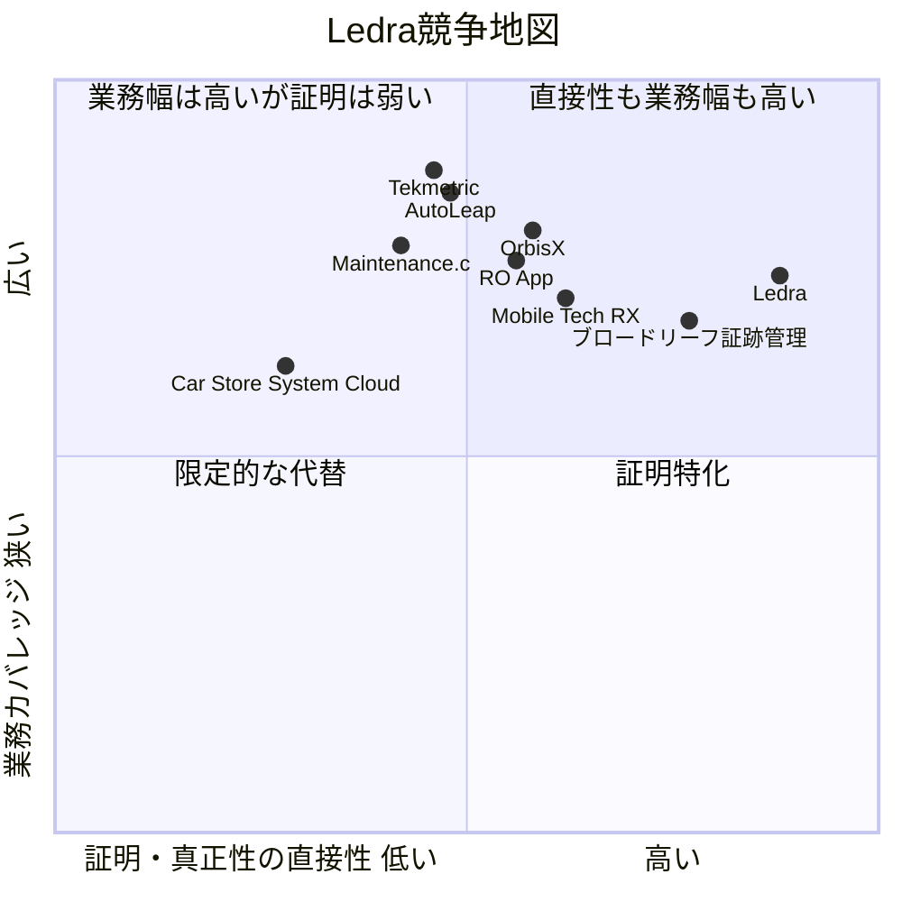
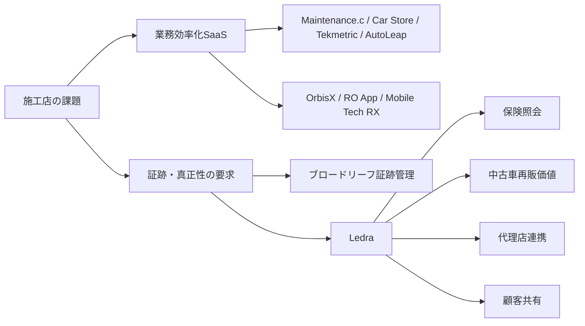

# Ledra競合調査レポート

> 作成: 2026-06-20
> 用途: 競合ポジショニング把握 + プロダクト/GTM戦略の検討資料
> 対象: ブロードリーフ（証跡管理サービス / Maintenance.c）/ Car Store System Cloud / OrbisX / RO App / Mobile Tech RX / Tekmetric / AutoLeap
> 出典: 各社公式サイト・公開価格・公開事例等のWebリサーチに基づく（一次ソース優先）。具体的なURLは末尾の「主要出典」を参照。価格・認証・レビュー件数等は変動するため、最終確認日（2026-06-20）時点の値です。

---

## エグゼクティブサマリー

Ledraは、自動車アフターマーケット向けの**WEB施工証明書SaaS**として、施工写真・施工内容・施工日時をデジタル証明書化し、**改ざん検知、保険会社向け照会、顧客共有、POS・予約・請求までを一体化**している点が最大の特徴です。公式には「**記録を、業界の共通言語にする。**」を掲げ、施工店・代理店・保険会社・顧客向けの**四つのポータル**を初期リリース機能として提示しています。価格は**無料プランから月額49,800円のプロプラン**まで公開されており、施工証明の発行件数、テンプレート自由度、監査ログ、API連携、サポートレベルで差が設けられています。もっとも重要な留意点は、**2026年4月22日に正式サービス開始したばかりで、公開済みの顧客事例・実績値はまだ乏しく、公式の「お客様の声」欄も募集段階**であることです。したがって、現時点の評価は「機能ポテンシャルは高いが、実証の厚みはこれから」というのが妥当です。

競合は、大きく二つに分かれます。第一に、**証跡・透明性・保険査定との接続**でLedraに近い直接競合として、ブロードリーフの**証跡管理サービス**が最も近い存在です。第二に、**施工店の基幹業務を押さえる隣接競合**として、国内では**Maintenance.c**や**Car Store System Cloud**、海外では**OrbisX、RO App、Mobile Tech RX、Tekmetric、AutoLeap**が有力です。これらは、施工証明そのものよりも、**予約、見積、顧客管理、入出金、検査、写真記録、レビュー獲得、マルチ拠点管理**といったワークフローの広さで競争しています。Ledraが勝てるのは、単なる「業務効率化ツール」ではなく、**真正性証明と関係者間の信頼インフラ**として市場を定義し直せる場合です。

競争上の結論は明確です。**運用SaaSとしての成熟度では海外勢・既存大手に分があり、真正性証明の独自性ではLedraに分がある**、という構図です。TekmetricはSOC 2 Type IIとISO/IEC 27001を明示し、70以上の連携と15,000超の導入実績を打ち出しています。AutoLeapは2,500件超の検証済みレビュー、詳細なオンボーディング、DVIを中心とした成長ストーリーが厚いです。OrbisXやRO App、Mobile Tech RXは、ディテーリング・PPF・モバイル施工の現場要件に寄せた機能密度が高く、特に**写真記録、保証、顧客コミュニケーション**で強みがあります。Ledraは、これらの成熟プレイヤーに対し、**「写真を残せる」ではなく「後から検証できる」**という一段強い価値訴求を、保険会社・中古車流通・代理店経由案件で先に勝ち筋化する必要があります。

短期的な推奨アクションは、**保険・査定ユースケースへの集中、事例獲得、第三者認証ロードマップの前倒し**です。中期では、**中古車評価・流通との接続、認定施工店ネットワークの形成、保証・クレーム管理の標準化**が必要です。長期では、LedraはSaaSではなく、**施工履歴の真正性レイヤー**として振る舞うべきです。もしこの方向に成功すれば、競争軸は「店舗向け業務システム」から「車両価値の信頼証明基盤」へ移り、一般的な整備SaaSとの直接価格競争を避けられます。

## 調査対象と選定基準

本レポートでは、Ledraを**「自動車アフターマーケットにおける施工証明・真正性証明・業務ワークフロー統合SaaS」**として定義し、その競合を次の基準で選定しました。第一に、**施工店・整備工場・鈑金工場・ディテーリング/PPF/ラッピング事業者**を顧客として重複して取り合う可能性があること。第二に、**写真記録、検査、証跡、保証、顧客共有**のいずれかでLedraの代替的価値を持つこと。第三に、**予約、見積、請求、顧客管理、マルチ店舗管理**などで、Ledra導入前の予算を吸収しうること。第四に、**公式一次ソースで製品・価格・事例が一定程度確認できること**です。

その結果、競合として次の七社（製品ベースでは八製品）を採択しました。**ブロードリーフ、Car Store System Cloud、OrbisX、RO App、Mobile Tech RX、Tekmetric、AutoLeap**を対象とし、ブロードリーフ内ではLedraに最も近い**証跡管理サービス**を中心比較対象としたうえで、隣接する**Maintenance.c**も別製品として加えています（このため社数は七社、製品数は八製品となります）。国内勢と海外勢の両方を含めています。なお、Ledraに真正面から一致する「改ざん検知付き施工証明+保険会社ポータル+施工店業務SaaS」の公開製品はまだ多くなく、市場は**直接競合が少ない代わりに、強力な隣接競合が多い**構造です。これは新規市場形成型プロダクトに典型的なパターンです。

以下の一覧では、**直接競合**と**隣接競合**を分けて示します。

| 企業 / 製品 | 国 | 競合タイプ | Ledraとの重なり | 採択理由 |
|---|---|---|---|---|
| ブロードリーフ / 証跡管理サービス | 日本 | 直接競合 | 高い | 画像管理・修正記録・事後検証性・保険会社への透明性が近い |
| ブロードリーフ / Maintenance.c | 日本 | 隣接競合 | 中程度 | 整備工場の基幹業務、顧客車両管理、伝票、LINE連携 |
| Car Store System Cloud | 日本 | 隣接競合 | 中程度 | 低価格で顧客/車両/整備/販売管理を包括 |
| OrbisX | カナダ | 隣接競合 | 高め | ディテーリング/PPF/コーティング特化、保証・CARFAX・予約・決済 |
| RO App | 欧州 | 隣接競合 | 高め | ディテーリングの記録・写真・請求・マルチ拠点・クレーム抑止 |
| Mobile Tech RX | 米国 | 隣接競合 | 高め | Before/After写真、見積、価格ロジック、顧客共有、PPF/Detail対応 |
| Tekmetric | 米国 | 隣接競合 | 中程度 | DVI、顧客信頼、CRM、価格公開、強いセキュリティ・拡張性 |
| AutoLeap | カナダ/米国 | 隣接競合 | 中程度 | DVI、顧客承認、レビュー、オンボーディング、成長実績 |

## Ledraの事業概要

Ledraは、「**WEB施工証明書SaaS**」として2026年4月22日に正式サービスを開始しました。公式リリースでは、自動車の**コーティング、フィルム、ラッピング、板金、整備**にまたがる現場記録を、**改ざん不可能なデジタル証明書**として発行し、施工店・顧客・保険会社・代理店の間で共有できるようにする、と説明しています。初期リリース機能として、**デジタル施工証明書、Polygon anchoring、C2PA画像署名、四ポータル設計、POS会計・請求・予約管理**が明示されています。

Ledraの重要な差別化は、単に写真を保存するのではなく、**ハッシュ化・ブロックチェーンアンカー・監査ログ・OTP二段階認証・テナント分離**まで含めて、「後から検証できる」ことにあります。保険会社向けページでは、紙証明書やPDFの限界に対し、**Public ID検索、改変検知、案件共有、操作ログ出力**を訴求しています。施工店向けページでは、**車検証OCR、案件ワークフロー、Google Calendar双方向同期、POS会計・Tap to Pay**まで含めたオペレーション支援を示しています。つまりLedraは、**真正性証明レイヤー**と**現場ワークフローSaaS**を同時に持つ設計です。

一方で、現時点の最大の弱点は、**公開導入実績がまだ初期段階**であることです。公式サイトの「お客様の声」欄には「**第1号事例 募集中**」と明記され、保険照会ゼロ化や証明書発行5分以下といった数値も、**「先行設計値・想定値」**とされています。したがって、Ledraは公式に多機能で価格も明快ですが、**実ユーザーによる再現性のあるKPI証明はこれから**です。競合比較では、この点を厳密に割り引く必要があります。

### Ledraの要点整理

| 項目 | 内容 |
|---|---|
| 事業領域 | 自動車アフターマーケット向けWEB施工証明書SaaS |
| 主対象 | 施工店、代理店、保険会社、施工を依頼する法人 |
| 中核価値 | 施工事実をデジタル証明書化し、改ざん検知・共有・照会可能にする |
| 主要機能 | デジタル施工証明書、Polygon anchoring、C2PA画像署名、車検証OCR、案件ワークフロー、予約管理、POS会計、保険会社ポータル、API |
| 価格 | フリー0円、スターター9,800円/月、スタンダード24,800円/月、プロ49,800円/月。初期費用は0〜49,800円 |
| サポート | 4〜6週間のオンボーディング、CSVインポート支援、現場教育、本番定着支援 |
| セキュリティ/法令 | APPI、電子帳簿保存法、インボイス制度、電子署名法、特商法に対応。ISO/IEC 27001・SOC 2 Type II・Pマークは取得予定 |
| 導入事例 | 公開事例は未成熟。公式には第1号事例を募集中 |

### Ledraの公式ソースから見える評価

Ledraの価格公開、無料プラン、ブラウザのみで使える導入性、保険会社ポータル同梱は、**導入障壁を下げつつネットワーク効果を狙う設計**として評価できます。他方、ISO/SOC2/Pマークがまだ「取得予定」であり、また実導入事例が未成熟なため、**大手保険会社や大規模施工チェーンに対する安心材料はまだ弱い**といえます。これは製品が悪いというより、**ローンチ直後のスタートアップ特有の信頼ギャップ**です。

## 競合比較表

### 競合比較マトリクス

以下の表では、比較の軸を**機能、価格帯、導入難易度、サポート体制、セキュリティ/コンプライアンス、差別化要素**に揃えています。なお、**導入難易度は公開されたオンボーディング情報、価格構成、機能範囲に基づく推定**であり、分析上の評価です。価格は**現地通貨・公開スタータープラン基準**であり、税・追加ユーザー・オプションは各社で異なります。

| 製品 | 主機能 | 価格帯 | 導入難易度 | サポート体制 | セキュリティ/コンプライアンス | 差別化要素 |
|---|---|---:|---|---|---|---|
| **Ledra** | 施工証明、改ざん検知、保険会社ポータル、予約、POS、API | 0〜49,800円/月 | 中 | 4〜6週間伴走、CSV移行、教育 | APPI/電帳法/インボイス/電子署名法対応、ISO/SOC2は取得予定 | **真正性証明+保険照会+施工店業務の一体化** |
| **ブロードリーフ 証跡管理サービス** | 画像管理、修正記録、事後検証性、工程撮影ナビ、顧客共有 | 未指定 | 中〜高 | 資料請求型、既存.cシリーズ前提 | クラウド安全運用を訴求。詳細認証は本比較対象ページでは未指定 | **日車協連推奨、既存整備/鈑金ソフト基盤との接続** |
| **Maintenance.c** | 顧客車両管理、見積/請求、申請書類、LINE連携、車検支援 | 6,700円〜/月+従量 | 中 | 資料請求、料金シミュレート、導入事例多数 | ブロードリーフ全社の情報セキュリティ方針あり。製品ページで認証明細は未指定 | **国内整備業務の深さと制度対応** |
| **Car Store System Cloud** | 整備/販売/顧客/車両/会計管理、QR読取、書類印刷 | 4,980円/月/店舗 | 低 | 30日無料トライアル、FAQ/問い合わせ | 未指定 | **非常に低価格、追加料金なし、複数端末追加費用なし** |
| **OrbisX** | 予約、請求、決済、VIN/ナンバー読取、CARFAX、保証、在庫、AI、ルート管理 | 100米ドル/月 | 中 | 電話/メール、プレミアムセットアップ、30日無料 | 正式な第三者認証の公開確認は未指定 | **ディテーリング/PPF/コーティング特化、保証機能とCARFAX連携** |
| **RO App** | 予約、見積、請求、Stripe/Mollie決済、写真、VIN自動入力、AI、在庫、CRM、マルチ拠点 | 29〜99ユーロ/月（基本のHobby版は15ユーロ/月） | 低〜中 | 電話/チャット/メール、個別オンボーディング | 認証の公開確認は未指定 | **写真とジョブ記録でクレーム抑止まで訴求** |
| **Mobile Tech RX** | 見積、価格ロジック、Before/After写真、支払、QuickBooks、ポータル、ワークフロー | 39米ドル〜/月/管理者 | 中 | デモ、5日無料トライアル、ケーススタディ・チュートリアル | 公開認証は未指定 | **auto recon/PPF/detail向け価格ロジックの強さ** |
| **Tekmetric** | DVI、見積、在庫、決済、オンライン予約、レビュー、CRM、マルチ拠点 | 179米ドル〜/月/店舗 | 中 | 無制限サポート、データ移行、ヘルプセンター | **SOC 2 Type II、ISO/IEC 27001、PCI DSS対応** | **成熟度、導入実績、連携数、信頼性** |
| **AutoLeap** | DVI、部品発注、顧客承認、レビュー、CRM、AI受付、マルチ拠点 | 179米ドル〜/月 | 中 | 実践研修、1on1、ナレッジベース、2週間立上げ目安 | 公開製品ページで詳細認証確認は未指定 | **手厚いオンボーディングとレビューの厚み** |

### 各競合の強み・弱み・価格モデル・導入事例

| 製品 | 強み | 弱み | 価格モデル | 導入事例・レビュー要約 |
|---|---|---|---|---|
| **ブロードリーフ 証跡管理** | 国内制度・事業慣行への適合度が高い。事後検証性、顧客/保険会社への透明性がLedraに近い | 価格の公開性が低く、単体SaaSというより既存.cシリーズ前提 | 未指定、資料請求型 | 証跡管理単独の公開事例は限定的だが、Maintenance.c導入企業ではLINE活用で顧客接点や生産性向上の実績あり |
| **Maintenance.c** | 顧客/車両/伝票/LINE/車検支援まで国内整備業務に深い | Ledraのような真正性証明や保険照会の設計が主軸ではない | 6,700円〜/月+従量 | 愛地モータースはLINE連携で顧客登録増加、寺田商会は接点強化・リピート率/客単価改善に取り組む |
| **Car Store** | 圧倒的低価格。追加費用なし。車両/顧客/整備/販売を一通り網羅 | 証跡・保険照会・真正性証明は弱い。公開事例の厚みも限定的 | 4,980円/月/店舗、初期費用なし | 30日無料トライアルで全機能利用可。導入事例は本調査で明確な公開事例を確認できず |
| **OrbisX** | ディテーリング/PPF/コーティングに直結。CARFAX、保証、決済、在庫、AI、ルート管理が強い | セキュリティ認証の公開情報は薄い。日本対応も未指定 | 100米ドル/月、初期設定は250米ドル〜 | 保証クレームフォーム埋め込み、CARFAX連携、無制限予約/顧客/見積/請求が特徴 |
| **RO App** | 写真・記録・請求・CRMが一体。クレーム抑止や遠隔管理の訴求が具体的 | 重厚な真正性証明や第三者認証の公開は薄い | Startup 29〜Enterprise 99ユーロ/月（限定版のHobbyは15ユーロ/月） | Longmile Roadは記録の一元化で紛争・請求リスク低減、Venenoは業務要件充足と可視化を評価 |
| **Mobile Tech RX** | 見積精度、標準化価格、写真証跡、QuickBooks、ポータルが強い | 日本市場向け制度適合の公開情報はない | 39米ドル〜/管理者、追加ユーザー課金 | UltraShineは「もっと稼げて、よりプロに見える」と評価。Dan O Dentsは価格ロジックで保険調整に強み |
| **Tekmetric** | セキュリティの厚さ、導入実績、連携、DVI、サポートの成熟度 | 価格は低廉ではなく、ディテーリング特化ではない | 179米ドル〜/店舗 | S&Sは紙レス化とコロナ期の遠隔/安全運用に寄与。600件超レビューでも機能統合が評価される |
| **AutoLeap** | オンボーディング、レビュー数、DVIの営業効果が強い | 認証公開情報はTekmetricほど厚くない | 179米ドル〜/月 | Frontline Automotiveでは検査時間を1時間から30分へ短縮。レビューでは使いやすさと研修品質が高評価 |

### オンラインレビューと導入事例の抜粋要約

**日本語の導入事例要約**では、ブロードリーフの愛地モータース事例が示唆的です。利用企業は、顧客が電話よりLINEを好み、友だち登録が増えたことを強調しており、**整備工場における顧客接点のデジタル化**が実運用価値になっていることが分かります。また寺田商会の事例は、**LINE連携を使った接点強化がリピート率と顧客単価の改善に結びつく**ことをテーマにしています。Ledraにとって重要なのは、こうした既存整備SaaSの「接点改善」よりも一段上の、**真正性・査定・中古車価値への波及**を示せるかどうかです。

**英語のレビュー/事例要約**では、RO AppのVeneno Auto Care Centerが、**作業割当、在庫、販売レポート、顧客DBの管理が一つのシステムで整理できた**と述べています。Mobile Tech RXのユーザーは、**「より稼げる、よりプロらしく見える」**こと、さらに価格ロジックが**保険アジャスターや顧客との価格交渉を感情論から専門的説明に変えた**ことを評価しています。AutoLeapでは、**使いやすさ、研修の質、チャットサポートの即応性**が高く評価され、Frontline AutomotiveではDVIにより**検査時間が1時間から30分へ短縮**したと報告されています。これらはすべて、Ledraが今後事例化すべき内容の参考になります。

## 各競合の詳細分析

市場構造を一言で言えば、**Ledraは「施工の証明」を売っているのに対し、多くの競合は「施工店の業務効率」を売っている**、という違いがあります。ブロードリーフの証跡管理サービスは、この中で最もLedraに近く、画像管理を「事後検証性」に転換する発想、保険会社や顧客への透明性、工程ごとの撮影ナビゲーションまで含めて、Ledraの主戦場に接近しています。Ledraがブロードリーフと違うのは、**保険会社用の独立ポータル、Polygon anchoring、C2PA、Public ID照会、無料プランからの拡散性**です。逆に不利なのは、既存整備・鈑金ソフトの導入基盤と国内チャネルの厚みです。

OrbisX、RO App、Mobile Tech RXは、Ledraにとって**実務現場で最も危険な隣接競合**です。理由は、ディテーリング、PPF、コーティングの現場に必要な、**予約、見積、写真、請求、在庫、顧客連絡、保証、車両情報入力**をかなり深く押さえているからです。特にOrbisXは**保証システム**と**CARFAX連携**を持ち、RO Appは**写真記録によるクレーム抑止**を前面に出し、Mobile Tech RXは**標準化価格と価格交渉の合理化**に強みがあります。Ledraがこれらに勝つには、単に写真・保証・請求を備えるだけでは足りず、**改ざん検知と外部検証可能性を業務価値として定着**させる必要があります。これは、PPFや高単価コーティングのように、**施工後の信頼コストが高い領域**ほど有効です。

TekmetricとAutoLeapは、Ledraの直接競合というより、**予算争奪上の強敵**です。両社はDVIを中核に、顧客承認、写真/動画共有、部品発注、CRM、レビュー管理、マルチ拠点、オンボーディングまで整っており、特にTekmetricは**SOC 2 Type II、ISO/IEC 27001、PCI DSS**を公表している点で、Ledraより信頼面で先行しています。AutoLeapも、**2週間以内の立ち上げ目安、1on1研修、数千件のレビュー**によって、導入不安を大きく下げています。つまり、この二社は「証明書SaaS」ではないものの、**写真付き検査レポートと顧客承認で一定の信頼を作れてしまう**ため、Ledraの独自性が十分伝わらないと置き換え対象になりません。

Car Store System Cloudは機能深度やブランド力では世界勢に及びませんが、Ledraにとっては**価格破壊的なローカル代替**として無視できません。月額4,980円で、顧客・車両・整備・販売・会計までを包括し、追加料金もなく、複数端末にも追加課金しない設計は、**小規模事業者にとって非常に分かりやすい**です。Ledraのスターター9,800円/月は依然として合理的ですが、Car Storeと比較される局面では、**単純な業務管理ではないこと**を明示しない限り割高に見えます。このためLedraは、価格説明ではなく、**「査定」「再販」「クレーム」「監査」コストを減らす**と説明する必要があります。

## 市場機会と脅威

### SWOT的整理

| 観点 | 内容 |
|---|---|
| **強み** | 改ざん検知、Public ID照会、保険会社ポータル、四ポータル設計、無料プラン、価格公開 |
| **弱み** | 公開事例不足、認証が取得予定段階、導入実績の厚み不足 |
| **機会** | 電子車検証・車両データ活用の進展、日本アフターマーケット市場の拡大、整備現場の人材不足によるDX需要、保険/中古車での透明性需要 |
| **脅威** | 既存整備SaaSの顧客基盤、海外ディテーリングSaaSの成熟度、価格競争、機能模倣 |

日本の自動車アフターマーケット市場は、矢野経済研究所の公表ベースで、**2024年に22兆1,235億円**と推計されており、車齢長期化や価格上昇、中古車需要などが市場拡大を後押ししています。また、国土交通省は**令和5年1月から電子車検証を導入**しており、軽自動車を含むデータ活用も進んでいます。こうした流れは、**紙証明からデジタル証憑への移行**を後押しするため、Ledraには明確な追い風です。

さらに、国土交通省は自動車整備要員の確保・育成を継続的課題として扱っており、整備現場の**人手不足と技術高度化**は継続しています。この環境では、Ledraのように**OCR、テンプレート、ワークフロー、即時共有**で事務負担を下げるSaaSは価値を持ちやすいです。ただし、それだけなら既存SaaSでも満たせるため、Ledraは「効率化」だけでなく、**監査対応、保険照会、再販時信頼、証拠保全**までを一体価値として一気通貫で説明しなければなりません。

最大の脅威は、Ledraのカテゴリーが理解される前に、顧客が「うちには既に整備システムがある」「写真は他のアプリでも残せる」と判断してしまうことです。つまり競争相手は"別の証明書SaaS"ではなく、**既存の業務システム、写真管理、メッセージアプリ、保証紙、保険会社との電話運用**そのものです。Ledraはこの現実を前提に、**「代替不可能な証明レイヤー」**としてポジショニングしなければ、隣接競合に埋もれる可能性があります。

## 推奨アクション

**短期**では、Ledraは顧客獲得より先に**勝てるユースケースの圧縮**を行うべきです。具体的には、コーティング全般ではなく、**高単価コーティング、PPF、保険査定が絡む外装施工**に注力することが妥当です。これらの領域は、施工後のトラブルコストや証明ニーズが高く、Ledraの真正性価値が伝わりやすいからです。同時に、公開事例不足が最大の弱点なので、**先行導入企業3〜5社で、査定時間短縮、問い合わせ削減、再販時提示率などの実測KPI**を早急に作るべきです。公式でも事例化伴走を掲げているため、この方針と整合します。

**中期**では、Ledraは機能拡張よりも**外部接続の標準化**を優先するべきです。具体的には、保険会社向けの照会API、代理店向けの成約/報酬機能、中古車流通向けの証明閲覧フローを整備し、施工後の証明データが**査定・売買・保証・監査**へ再利用される導線を作ることです。これが成立すると、Ledraの証明書は単なるPDF代替ではなく、**車両価値を補強するデータ資産**になります。競合の多くは店舗内業務に強くても、この横断的再利用までは十分に押し出していません。

**長期**では、Ledraは「施工証明書SaaS」という表現から一歩進み、**車両施工履歴の真正性基盤**を目指すべきです。もしISO/IEC 27001、SOC 2 Type II、Pマークを計画通り取得し、さらに保険・中古車・保証会社とのデータ接続を拡大できれば、競争軸はTekmetricやAutoLeapのような運用系SaaSではなく、**信頼インフラそのもの**になります。逆にここまで行けなければ、Ledraは「機能は多いが認知が弱い新興業務ツール」と見なされやすく、価格競争に巻き込まれます。したがって、中長期の最優先KPIは、MRRや店舗数だけでなく、**照会件数、再利用件数、外部検証件数、証明起点の再販・保険活用件数**で設計するのが望ましいです。

## 図表

### 競争地図

この図は、各製品の公式機能説明をもとに、**真正性証明への近さ**と**店舗業務の広さ**を相対評価したものです。Ledraは右上に位置づけられますが、その優位は**公開実績と認証が追いつくこと**が条件です。ブロードリーフ証跡管理は最も近い直接競合で、TekmetricとAutoLeapは業務幅では強い一方、Ledraのような真正性訴求は主軸ではありません。OrbisX、RO App、Mobile Tech RXは、施工現場の解像度が高く、Ledraの導入予算を最も奪いやすい隣接競合です。

### 市場ポジショニングの要約

この整理が示すのは、Ledraが勝負すべき場所が「施工店向け便利ツール市場」だけではない、という点です。多くの競合は**現場の業務効率化**を主戦場にしていますが、Ledraはそこに加えて、**保険・流通・代理店・顧客が参照できる"証明インフラ"**を狙っています。競争戦略としては、業務SaaS市場の正面突破ではなく、**証明レイヤーを軸に周辺ワークフローを巻き取る順序**が、最も合理的です。

## 主要出典

価格・認証・レビュー件数・導入事例などの数値は変動します。以下は各社の一次ソース（公式サイト）で、**最終確認日: 2026-06-20**時点の内容に基づきます。記載値を再確認・更新する際は、まず各公式サイトの料金/機能/事例ページを参照してください。

### 競合（公式サイト）

- ブロードリーフ 証跡管理サービス: https://next.broadleaf.co.jp/product-evidence-management/ （会社: https://www.broadleaf.co.jp/ ）
- ブロードリーフ Maintenance.c（.cシリーズ）: https://next.broadleaf.co.jp/ ・ https://www.broadleaf.co.jp/products/
- Car Store System Cloud（トモズシステム）: https://tomods-car.jp/
- OrbisX: https://orbisx.com/ （旧ドメイン: https://orbisx.ca/ ）
- RO App: https://roapp.io/ ・料金: https://roapp.io/pricing/ ・プラン詳細: https://help.roapp.io/en/articles/75781-ro-app-subscription-plans-features-and-benefits
- Mobile Tech RX: https://www.mobiletechrx.com/
- Tekmetric: https://www.tekmetric.com/
- AutoLeap: https://autoleap.com/

### 市場・制度データ

- 矢野経済研究所「自動車アフターマーケット市場」調査（市場規模はプレスリリースの公表値）: https://www.yano.co.jp/
- 国土交通省 電子車検証 特設サイト（令和5年1月〜の自動車検査証電子化）: https://www.denshishakensho-portal.mlit.go.jp/
- 国土交通省 報道発表「車検証電子化についての周知用ウェブサイトの開設について」: https://www.mlit.go.jp/report/press/jidosha06_hh_000133.html
- 国土交通省 自動車（整備要員の確保・育成等を含む自動車行政の所管セクション）: https://www.mlit.go.jp/jidosha/

> 注: 本ドキュメントは、生成時に用いたリサーチツール固有の引用トークンを除去し、人手で検証可能な公式URLに置き換えています。個別の事例名（愛地モータース、寺田商会、Veneno、Longmile Road、UltraShine、Frontline Automotive 等）は各社公式サイトの導入事例ページに掲載されているものを参照しています。
