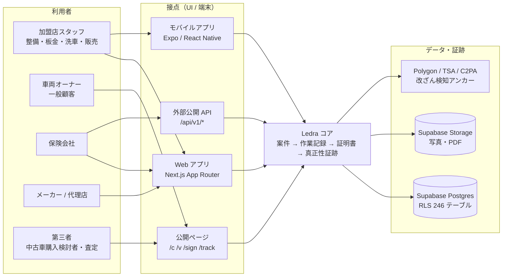
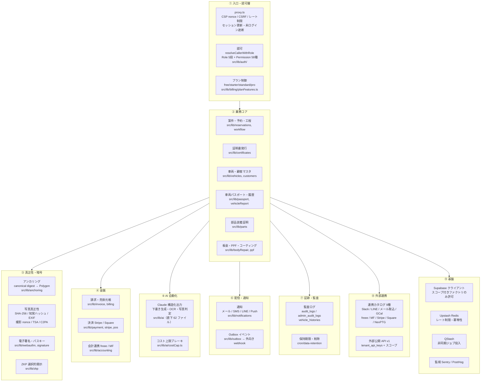
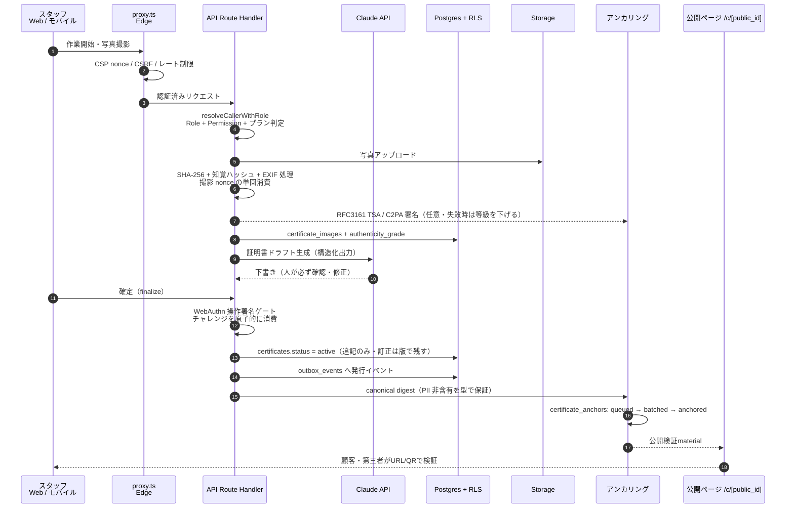
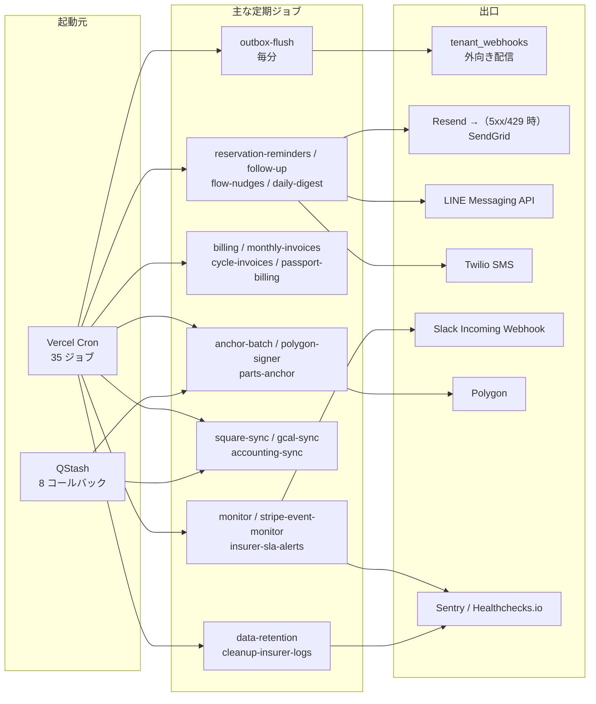
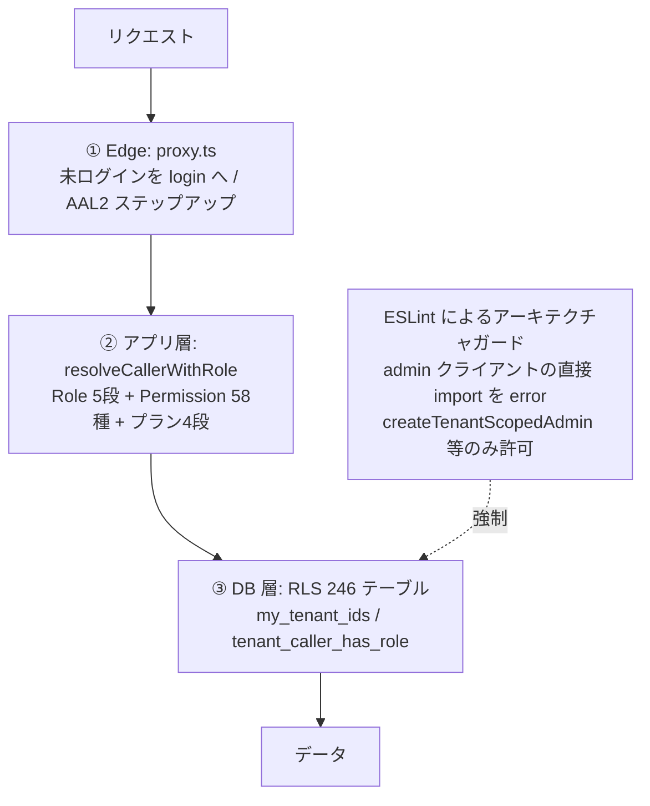
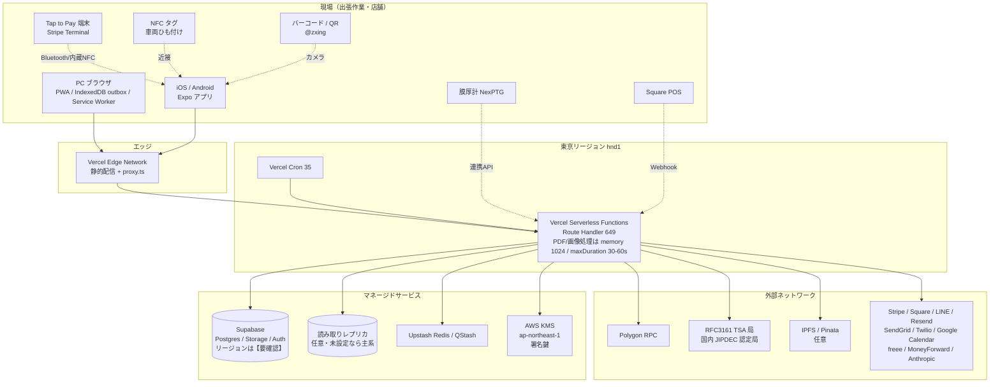

# Ledra システム構成図

- 作成日: 2026-09-12（`date -u` 実行値）/ 対象コミット: `a7f5aab`（branch `main` 同内容）
- 記載原則: 図中の構成要素・件数はすべてこのリポジトリの実査由来。本番環境の設定値など
  リポジトリから確認できない事項は `【要確認】` と明記し、推測で埋めない。
- 関連: 文章版の現状マップは [`docs/implementation/current-architecture.md`](../implementation/current-architecture.md)、
  将来構想は [`docs/architecture-roadmap.md`](../architecture-roadmap.md) /
  [`docs/microservices-architecture.md`](../microservices-architecture.md)。
  本書は「いま動いているものを絵にする」ことだけを扱う。

計測値（2026-09-12 時点、コマンドは §7.3 に併記）:

| 対象 | 実値 |
|---|---|
| 画面（`page.tsx`） | 301 |
| API Route Handler（`route.ts`） | 649 |
| DB マイグレーション | 464 |
| RLS 有効テーブル | 246 |
| cron ジョブ | 35 |
| ユニットテストファイル | 562 |

---

## 1. 概要 — システム全体の俯瞰

誰が、どの入口から、どの中心処理に触るかだけを描く。詳細は §2 以降。



**この図が言いたいこと**: Ledra は「1つの業務アプリ」ではなく、
*同じ作業記録を、立場の違う4種類の相手に、それぞれの権限で見せる*システムである。
中心にあるのは案件（`reservations`）と、そこから生まれる証明書（`certificates`）と写真。
それ以外はすべて、その周りの入口と出口にすぎない。

---

## 2. モジュール定義 — 機能単位のブロック

`src/lib/` 配下のドメインモジュール（直下 105 ディレクトリ）を、責務で9群に束ねたもの。
括弧内は代表的な実装パス。



**分割の原則**（読むとき／足すときの判断基準）:

1. **業務コアの中心は外部 SDK を直接知らない。** `reservations` / `certificates` /
   `vehicles` / `customers` / `workflow` は Stripe・viem・ethers を1件も import していない
   （検証: `grep -rn 'from "stripe"\|from "viem"\|from "ethers"' src/lib/{reservations,certificates,vehicles,customers,workflow}` → 0件）。
   ただし**全体の原則ではない**。これらの SDK を直接 import している lib 群は
   `stripe` / `billing` / `orders` / `agents` / `pos` / `anchoring` / `passport` /
   `academy` / `template-options` の9つで、うち `orders` と `agents` は業務寄りの
   モジュールでありながら Stripe を直接触っている。決済手段の差し替えコストは
   一様ではない、というのが実態。
2. **真正性（③）は業務を止めない。** TSA も C2PA も既定 OFF・fail-open で、
   失敗しても写真の保存は続行し `authenticity_grade` を下げる形で*正直に degrade* する。
3. **状態語彙は1箇所。** Job / Step / Severity / Certificate / Payment / Sync の6軸は
   `src/lib/domain/states.ts` が単一定義源（ADR-0002）。

---

## 3. モジュールの関係 — データと処理の流れ

### 3.1 主系統: 作業記録が証明書と証跡になるまで

Ledra の存在理由そのものの流れ。ここが壊れると事業が壊れる。



**設計上の要点**:

- **AI は下書きまで。確定は人の操作に紐づく。** finalize 直前に WebAuthn の
  操作署名ゲート（ログイン用の生体認証ではなく、*その操作*への署名）が入る。
- **証跡は追記のみ。** 発行済み証明書は書き換えず、訂正は版として積む（ADR-0003 / 0004）。
- **アンカーは非同期。** 即時 Polygon 送信と Merkle バッチの2経路があり、
  cron（`anchor-batch` / `polygon-signer`）が拾う。発行体験はチェーンの遅延に巻き込まれない。

### 3.2 非同期系統: cron と Outbox

同期処理に混ぜると業務を止めるものは、すべてここに逃がしてある。



- cron 認証は `CRON_SECRET` の HMAC または Bearer（`src/lib/cronAuth.ts`）。
  多重起動は `cron_locks` で抑止する。
- **`data-retention` だけは不可逆**。保持期限で実データを削除するため、
  設定変更は復元不能な削除に直結する（§7.2 のリスク台帳）。

### 3.3 テナント分離（マルチテナントの効かせ方）



3層とも独立に効く。アプリ層のガードを1本書き忘れても、DB 層の RLS が最後に止める。
逆に言えば **RLS のポリシー変更は全テナントに即時波及する**ため、最も慎重を要する。

---

## 4. ハードウェア・ネットワーク配置

物理的にどこで動くか。国内リージョンに寄せてある。



**現場に効く設計**:

- 出張作業は電波が保証されない。Web は IndexedDB の outbox キュー + Service Worker で
  オフライン投入を受け、復帰時に送る。**モバイルアプリ側の同期キューは未実装**
  （オフライン検知バナーのみ）。
- 競合（同一レコードの同時更新）の検出・解決機構は Web / モバイルどちらにも無い。
- Vercel の関数は東京（`hnd1`）固定。PDF 生成・画像アップロードのみ個別に
  メモリと実行時間を引き上げてある（`vercel.json`）。

---

## 5. インタフェース

### 5.1 入ってくる側

| 種別 | 経路 | 認証 | 件数 |
|---|---|---|---|
| 画面（Server Component） | `src/app/**/page.tsx` | Supabase Auth / 顧客は独自 cookie | 301 |
| 内部 API | `src/app/api/**/route.ts` | `resolveCallerWithRole` + Permission | 649 |
| 外部公開 API | `/api/v1/*`（ingest 3種 / 事故照合 / パスポート検証 等） | `tenant_api_keys` + スコープ | 7 |
| Webhook 受信 | Stripe、Stripe Connect、Square、Resend、LINE、供給パートナー、受信メール、動画プロバイダ | 署名検証 + 重複排除 | 13 |
| QStash コールバック | `/api/qstash/*` | QStash 署名 | 8 |
| cron | `/api/cron/*` | `CRON_SECRET` HMAC / Bearer | 35 |
| 公開検証 | `/api/cert-verify/[public_id]`、`/api/public/verify` | 無認証・PII 非返却 | 2 |

### 5.2 出ていく側

| 相手 | 用途 | 失敗時の扱い |
|---|---|---|
| Supabase Postgres / Storage | 主データ・写真・PDF | 業務停止（必須依存） |
| Upstash Redis | レート制限・冪等性 | env で fail-open / fail-closed を選択 |
| Upstash QStash | 非同期ジョブ | リトライ後 dead letter |
| Stripe | サブスク・Connect・Terminal | 冪等 claim（`stripe_processed_events`） |
| Square | POS 売上同期 | cron で再同期 |
| Anthropic Claude | 下書き・OCR・判定 | テナント月次コスト上限で自動停止 |
| Polygon | 証明書メタのアンカー | `certificate_anchors.status = failed` で再試行 |
| AWS KMS | 署名鍵の保管 | 署名不可（発行は継続、等級が下がる） |
| RFC3161 TSA | 写真のタイムスタンプ | 未設定なら no-op（fail-open） |
| Resend → SendGrid | メール | 一次が 5xx/429 なら自動フォールバック |
| Twilio / LINE | SMS・メッセージ | 通知欠落（業務は継続） |
| Google Calendar / freee / MoneyForward | 予定・会計同期 | cron で再同期 |
| `tenant_webhooks` | 加盟店の自社システムへ配信 | Outbox が再送 |
| Sentry / PostHog / Healthchecks.io | 監視 | 監視欠落のみ |

### 5.3 データストアの境界

| ストア | 持つもの | 境界の引き方 |
|---|---|---|
| Postgres | 案件・証明書・顧客・車両・請求・監査（`create table` ユニーク名 約260） | RLS 246 テーブル。テナント跨ぎは `my_tenant_ids()` のみ |
| Storage | 証明書写真、PDF、資料、LINE メディア | バケット単位（`certificates` / `assets` / `market` / `market-vehicle-images` / `agent-materials` / `agent-shared-files` / `line-media`）+ 署名付き URL |
| Redis | レート制限カウンタ、冪等キー（24h） | 揮発。消えても正しさは壊れない設計 |
| IndexedDB（端末内） | オフライン投入キュー、読み取りキャッシュ | 端末ローカル。送信成功で破棄 |
| Polygon | 証明書メタのダイジェストのみ | **PII は型で除外**。チェーン上に個人情報は乗らない |

---

## 6. 図に書ききれなかった前提

1. **図の「線」はすべて HTTPS**。社内 VPN も専用線も無い。認証は各線で個別に成立する
   （エッジの一括ゲートに頼り切らない）。
2. **`middleware.ts` は無い。実体は `src/proxy.ts`**（Next.js 16 の命名）。
   文章版の現状マップ（2026-08-19 監査）は「エッジ一括ゲート無し」と書いているが、
   現在の `proxy.ts` は CSRF・CSP nonce・レート制限・セッション更新・未ログイン遮断・
   AAL2 ステップアップまで担っている。**本書の記述が新しい。**
3. **状態はすべて `text` + CHECK 制約**。Postgres の enum 型は 0 件。
   新しい状態値を足す PR は `src/lib/domain/states.ts` と
   `src/lib/domain/__tests__/` を同一 PR で更新しない限りマージしない（ADR-0002）。
4. **真正性機能の既定は OFF**。`CERT_RECORD_ANCHOR_ENABLED=false` が既定で、
   TSA / C2PA も env 未設定なら no-op。**本番環境で実際にどのフラグが ON かは
   リポジトリからは確認できない【要確認】**。
5. **C2PA は本番署名証明書が未取得**。コードは実装・検証済みで、残ブロッカーは
   証明書の取得のみ（`docs/c2pa-production-deployment.md`）。
6. **DB マイグレーションは main への push で本番へ自動適用される**
   （`.github/workflows/db-migrate.yml`）。図の Postgres は「CI が触れる本番」である。
7. **i18n は実質未適用**。`messages/ja.json` / `en.json` の中身は `errors.*` 8キーのみで、
   画面は日本語ハードコード。多言語の箱はあるが中身はこれから。
8. **E2E は CI から外してある**（実 Supabase / Redis / Stripe 依存）。図の検証経路は
   ユニットテスト 562 ファイルと型検査が支えている。

---

## 7. 付録

### 7.1 この図の読み方（更新するとき）

- ①概要 → ②モジュール → ③関係 → ④配置 → ⑤インタフェース の順で粒度が細かくなる。
  変更を入れるときは、**影響する最も粗い図から**直す。②だけ直して①が古いままになるのが
  いちばん事故る。
- 件数は必ず §7.3 のコマンドで取り直す。「前回 240 だったから今回も 240 くらい」で書かない。

### 7.2 触ると戻れない場所（抜粋）

| 領域 | 不可逆性 |
|---|---|
| マイグレーション | main への push で本番適用。適用済みファイルの書き換え禁止 |
| 証明書・写真の証跡 | ハッシュ・TSA・アンカーは改ざん検知に使用中。既存行の再エンコードは検証を壊す |
| RLS | ポリシー変更は全テナント即時波及 |
| 売掛元帳 `payment_entries` | 差額追記型。遡及修正不可 |
| `cron/data-retention` | 保持期限で実データを削除。復元不能 |
| 保険会社への PII 開示 | `is_pii_disclosed()` ゲート + アクセスログ。変更は法令・契約影響 |

### 7.3 計測コマンド

```bash
find src/app -name page.tsx | wc -l                    # 301
find src/app/api -name route.ts | wc -l                # 649
ls supabase/migrations/*.sql | wc -l                   # 464
grep -rhoiE 'alter table [^ ]+ enable row level security' supabase/migrations \
  | awk '{print tolower($3)}' | sed 's/^public\.//' | sort -u | wc -l   # 246
grep -o '/api/cron/[a-z-]*' vercel.json | sort -u | wc -l              # 35
git ls-files 'src/**/*.test.ts' 'src/**/*.test.tsx' | wc -l            # 562
find src/lib -mindepth 1 -maxdepth 1 -type d | wc -l                    # 105
find src/lib/ai -maxdepth 1 -name '*.ts' | wc -l                       # 62
grep -oE '"[a-z_]+:[a-z_]+"' src/lib/auth/permissions.ts | sort -u | wc -l  # 58
```

> **RLS の数え方に注意**: 正規化せずに `awk '{print $3}' | sort -u` とすると **251** になる。
> 同じテーブルが `public.customers` と `customers` の両表記で書かれた migration が5件あり、
> 別テーブルとして二重計上されるため。`docs/implementation/current-architecture.md` の
> 「240」も同じ未正規化コマンド由来で、実数より多い可能性がある。
> 数える前に、**その正規表現が何を1件と見なしているか**を確認すること。
