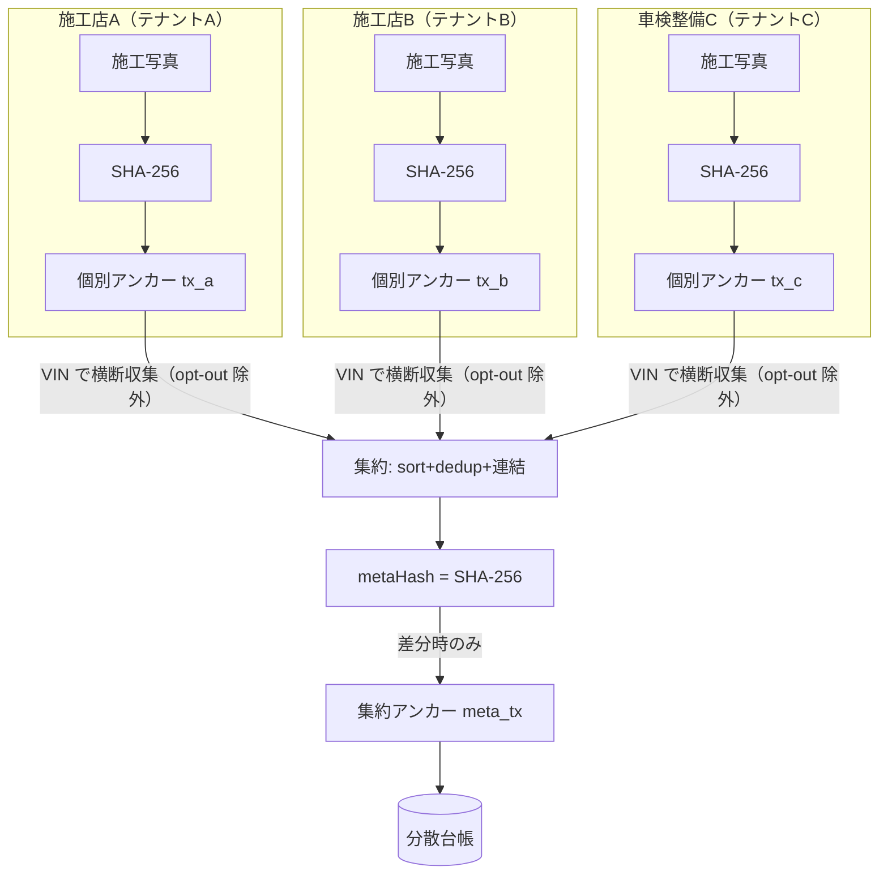
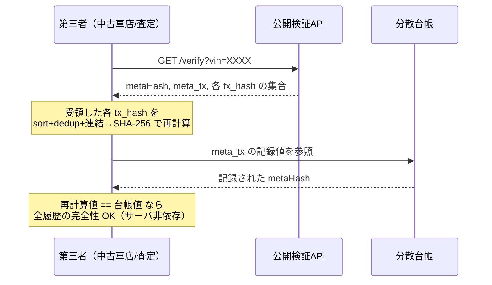

# 発明提案書 01：車両履歴の集約アンカー（メタアンカー）

> 仮称：**複数事業者に分散した車両施工履歴の完全性を単一トランザクションで証明する方法、システム及びプログラム**
> 区分：◎ 本命 / 種別：物・方法・プログラム（ビジネス関連発明＋暗号技術）
> 中核実装：`src/lib/passport/metaAnchor.ts`, `src/lib/passport/upsertVehiclePassport.ts`, `src/lib/passport/api/verify.ts`

---

## 1. 技術分野

ブロックチェーン（分散台帳）を用いた、車両（自動車）の整備・施工履歴の真正性保証技術に関する。特に、**同一車両に対して複数の独立した事業者（整備工場・コーティング店・PPF 施工店等）がそれぞれ別個に記録した施工証跡**を、車両単位で集約し、その完全性を第三者が検証可能にする技術に関する。

## 2. 背景技術

- 施工写真等の証跡データの暗号学的ハッシュ（SHA-256）を分散台帳に記録（アンカリング）し、後からの改ざんを検知する手法は知られている（本システムの Phase 1：`src/lib/anchoring/imageHashing.ts`、`contracts/LedraAnchor.sol`）。
- 車両情報をブロックチェーン／NFT に記録する取り組みも複数存在する（ホンダの NFT 特許出願、トヨタ MON、MOBI DID 等。`docs/research-blockchain-automotive-japan-2026.md`）。

### 従来技術の課題

1. **記録が事業者（テナント）ごとに分断されている。** 同じ 1 台の車が A 店でコーティング → B 店で PPF → C 店で車検整備、と渡り歩くと、施工記録は各事業者のデータ空間に別々に存在し、台帳上の記録も画像ごと・事業者ごとにバラバラのトランザクションになる。「この車の**全履歴**が改ざんされていない」ことを一望・一括検証する手段がない。
2. **検証に多数のトランザクション照合が必要。** 車両の全履歴を検証するには、関与した全事業者の全画像アンカーを個別に辿る必要があり、第三者（中古車買取・保険査定）にとって現実的でない。
3. **検証がサービス事業者のサーバに依存しがち。** 履歴の真正性確認のために結局プラットフォーム側サーバへ問い合わせる構成だと、サーバが改ざん・廃業すれば検証できず、「分散台帳に載せた意味」が薄れる。
4. **プライバシーと完全性の両立。** 顧客名等の個人情報を台帳に載せると削除権（忘れられる権利）と衝突する。

## 3. 課題を解決するための手段（本発明の構成）

本発明は、**画像単位の個別アンカー（既存）の上位に、車両単位の「集約アンカー（メタアンカー）」レイヤーを設ける**ことで上記課題を解決する。構成要素は次の通り。

1. **第1記録（個別アンカー）**：各事業者の端末が、自らの施工に係る画像の暗号学的ハッシュを分散台帳に個別記録し、そのトランザクション識別子（tx hash）を保存する。
2. **正規化車両識別子による横断収集**：車両識別番号（VIN）を正規化（大文字化・全角半角統一・区切り除去）したキー `vin_code_normalized` を用い、**複数の独立事業者が保有する**当該車両の施工記録から、第1記録のトランザクション識別子を**横断的に**収集する（`upsertVehiclePassport.ts` / `recomputeAndMaybeAnchor`）。このとき、事業者がオプトアウト（`passport_opt_out=true`）した記録は集約対象から除外する。
3. **順序非依存の集約ダイジェスト算出**：収集したトランザクション識別子の集合を、小文字化・重複排除・昇順ソートしたうえで、正規化 VIN と改行区切りで連結し、その連結データの SHA-256 を算出する（`computeMetaAnchorHash`）。
   ```
   metaHash = SHA-256( VIN_normalized || "\n" || tx1 || "\n" || tx2 || … || txN )
                       （ tx1..txN は小文字化・重複排除・昇順ソート済み ）
   ```
   ソートにより、施工順・画像追加順に依存せず、**任意の二者が必ず同一のダイジェストに到達する**。
4. **第2記録（集約アンカー）**：算出した集約ダイジェストを、**単一のトランザクション**として分散台帳に記録する（`anchorToPolygon(metaHash)`）。結果（tx hash・ネットワーク・確定時刻・対象画像数・対象証明書数）を車両単位レコード `vehicle_passports` に保存する。
5. **差分時のみ再記録（冪等・コスト最適化）**：再計算した集約ダイジェストが既存の記録済みダイジェストと一致する場合、第2記録を**行わない（no-op）**。新たな施工が増えたとき等、集合が変化したときだけ新トランザクションを発行する（`recomputeAndMaybeAnchor` の `hash_unchanged` 分岐）。
6. **サーバ非依存の第三者検証**：正規化 VIN・集約ダイジェスト・その記録トランザクション・**構成要素である各 tx hash の集合**を公開 API（`GET /api/v1/passport/verify`、`src/lib/passport/api/verify.ts`）で提供する。第三者は、API（または台帳）から得た各 tx hash を同じ規則で連結・ハッシュ化し、台帳に記録された集約ダイジェストと照合するだけで、**プラットフォーム側サーバを信頼せずに**全履歴の完全性を確認できる。
7. **耐障害（リトライ）**：第2記録が失敗した場合、集約ダイジェストのみ保存しトランザクション識別子欄を空のまま残し、後続の定期処理（`retryAnchorForPendingPassport`、毎時 cron）が補完する。
8. **プライバシー両立**：個人情報は一切台帳に載せない。原データ（DB）を削除すれば、台帳上に残るのは 32 バイトのハッシュのみで個人情報を復元できない（実質的なクリプトシュレッディング）。

## 4. 発明の効果

- 車両一台の、**事業者をまたいだ全施工履歴の完全性を、単一トランザクション識別子で証明・検証できる。**
- 検証コストが履歴件数に依存せず一定（1 ハッシュ照合）に近づく。
- 検証がプラットフォーム事業者のサーバに依存しないため、事業者の廃業・改ざんに耐える。
- 集合が変わらない限り台帳書き込みが発生せず、ガス代が極小（実装コメントでメインネット 1 回 ≈ $0.001）。
- 個人情報を台帳に載せないため、削除権と両立する。

## 5. 実施形態（実コードとの対応）

| 構成要素 | 実装 |
|---|---|
| 集約ダイジェスト算出（純関数・DB 非依存・外部再現可能） | `computeMetaAnchorHash()` — `src/lib/passport/metaAnchor.ts` |
| 横断収集＋差分判定＋第2記録＋永続化 | `recomputeAndMaybeAnchor()` — 同上 |
| 個別アンカー成功フックからの起動 | `upsertVehiclePassport()` — `src/lib/passport/upsertVehiclePassport.ts`（画像 1 枚の Polygon アンカー成功後に呼ばれる） |
| オプトアウト除外 | `vehicles.passport_opt_out = false` でフィルタ |
| 失敗時リトライ | `retryAnchorForPendingPassport()` ＋ 毎時 cron |
| 第三者検証サーフェス | `buildPassportVerifyResponse()` — `src/lib/passport/api/verify.ts`（`meta_anchor.hash/tx_hash` ＋ `certificates[].polygon_tx_hash` を返却） |
| 永続列 | `vehicle_passports.meta_anchor_hash / _tx_hash / _network / _anchored_at / _image_count / _cert_count` |

## 6. 新規性・進歩性のポイント（弁理士向け差別化軸）

1. **複数の独立事業者（テナント）をまたいだ集約**：単一事業者が自社記録をまとめるのではなく、**互いに独立した複数事業者の個別台帳記録を、車両識別子を自然キーとして上位レイヤーで集約**する点。多くの先行例（特定 OEM・特定プラットフォーム内）はこの「越境集約」を前提にしていない。
2. **順序非依存の集約ダイジェストによる決定的な第三者再計算**：ソート連結により、誰が計算しても同一値になり、**サーバ非依存で**検証可能。単なる「ハッシュを台帳に載せる」ではなく「**第三者が公開データだけで集約ダイジェストを再構成して照合できる**」検証プロトコルになっている。
3. **差分時のみ再アンカーする冪等制御**：集合不変なら台帳に書き込まない設計が、ガス／コスト面の進歩性を支える。
4. **個別アンカーと集約アンカーの 2 層構造**：画像単位（細粒度・存在証明）と車両単位（粗粒度・全体完全性）を併存させ、API で両方を返す構成。

> ⚠️ **重要（[公開状況の棚卸し 04](./04-disclosure-inventory.md) の知見を反映）**：
> 上記 1 の「複数事業者をまたいだ VIN 集約」という**コンセプト自体は、自社のマーケ／PoC ページで
> 既に公開されている**（`/features/timeline`・`/poc`、2026-05-04〜。棚卸し D5）。したがって
> **「越境集約」を中心に据えた広い独立項は、自社開示により新規性を失っている可能性が高い。**
> 一方、**メタアンカー機構の具体（上記 2・3・5：順序非依存ダイジェスト → 単一Txで集約記録 →
> 集約値を公開データから第三者がサーバ非依存で再計算・照合）は公開面に一切出ていない**（棚卸し U1・U2）。
> → **独立項は「越境集約」ではなく「メタアンカー機構（請求項1の算出・第2記録ステップ＋請求項3の集約値再計算検証）」を中心に構成する。**

## 7. 想定請求項（クレーム）案 — ※たたき台

**【請求項1】（方法）**
互いに独立した複数の事業者端末の各々が、車両に対して行った施工に関する証跡データの暗号学的ハッシュを分散台帳にそれぞれ個別に記録し、当該記録のトランザクション識別子を保持する第1記録ステップと、
正規化された車両識別子に基づき、当該車両に紐づく前記複数の事業者の前記トランザクション識別子を横断的に収集する収集ステップと、
収集した前記トランザクション識別子の集合を、重複排除及び所定順序のソートにより順序非依存に正規化し、前記正規化された車両識別子と連結した連結データの集約ダイジェストを算出する算出ステップと、
前記集約ダイジェストを単一のトランザクションとして前記分散台帳に記録する第2記録ステップと、
を備える、車両施工履歴の完全性証明方法。

**【請求項2】** 請求項1において、前記算出ステップで得た集約ダイジェストが、当該車両について既に記録された集約ダイジェストと一致する場合に、前記第2記録ステップを実行しないことを特徴とする方法。（冪等・コスト最適化）

**【請求項3】** 請求項1または2において、前記正規化された車両識別子と、前記集約ダイジェストと、前記トランザクション識別子の集合とを外部に提供し、第三者が前記算出ステップと同一の手順で集約ダイジェストを再算出して前記分散台帳上の記録と照合可能にすることを特徴とする方法。（サーバ非依存検証）

**【請求項4】** 請求項1〜3において、前記収集ステップは、前記複数の事業者のうち集約対象から除外する旨が設定された事業者の記録を除外することを特徴とする方法。（オプトアウト）

**【請求項5】** 請求項1〜4において、前記証跡データに含まれる個人情報を前記分散台帳に記録せず、前記証跡データの原本の削除により当該個人情報を復元不能化することを特徴とする方法。（プライバシー両立）

**【請求項6】** 請求項1〜5において、前記第2記録ステップが失敗した場合に、前記集約ダイジェストを保持しつつ前記トランザクション識別子を空のまま残し、定期処理により前記第2記録ステップを再試行することを特徴とする方法。（耐障害）

**【請求項7】（システム）** 請求項1〜6のいずれかの各ステップを実行する手段を備える、車両施工履歴完全性証明システム。

**【請求項8】（プログラム）** コンピュータに請求項1〜6のいずれかの各ステップを実行させるためのプログラム。

## 8. 図面

### 図1：システム全体（個別アンカー → 集約アンカー）



### 図2：第三者によるサーバ非依存検証



## 9. 先行技術メモ・留意点

- **必須**：ホンダの NFT 車両情報記録特許（2024 Q1、3 件）、トヨタ MON、MOBI DID、海外の vehicle-history-on-chain（例：各種カーファックス系のブロックチェーン版）を弁理士の有償調査でクリアランスすること。
- 差別化の生命線は「**順序非依存ダイジェストによるサーバ非依存の集約値再計算検証**」＋「**集約を単一Txで記録するメタアンカー機構**」。**「複数事業者をまたいだ集約」コンセプトは自社開示済み（棚卸し D5）なので独立項の中心にはしない。**
- **自社開示に注意**：「VIN横断集約」「車両パスポート」は `/features/timeline`・`/features/nfc`・`/poc` で **2026-05-04 から公開済み**（[棚卸し 04](./04-disclosure-inventory.md) D5・D6）。一方メタアンカー機構（U1・U2）は未公開。請求項を機構に絞ればこの自社開示の影響を避けられる可能性が高い。
- **公開タイミング厳守**：`PASSPORT_PUBLIC_ENABLED=true` 化／HP 掲載／プレス／PoC 資料配布の**前**に出願すること（README の §出願タイミング 参照）。`/poc` ページの noindex 公開が新規性喪失に当たるかは要・弁理士確認（[棚卸し 04 §3](./04-disclosure-inventory.md)）。
- 平 SHA-256 連結（Merkle ではない）である点は「集合全体の完全性」には十分。将来 per-cert 包含証明が要るなら Merkle 化（従属項で別構成として押さえる余地あり）。
</content>
