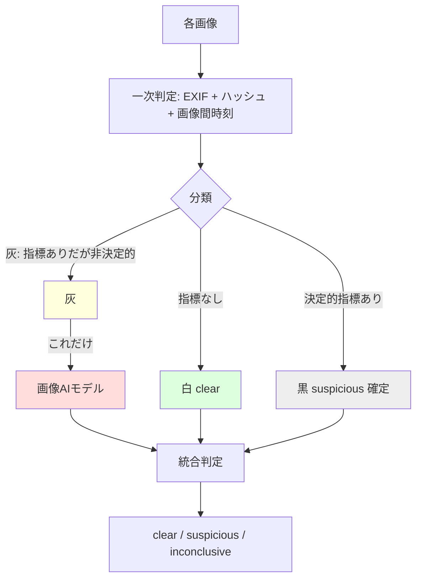

# 発明提案書 02：証拠写真の段階的改ざん検出

> 仮称：**証跡画像群の改ざんを、決定的指標による分類と機械学習モデルの選択的呼び出しにより検出する方法、システム及びプログラム**
> 区分：○ 次点（進歩性が論点） / 種別：方法・プログラム
> 中核実装：`src/lib/ai/photoTamperingCheck.ts`

---

## 1. 技術分野

施工・整備等の作業の証拠として撮影された複数の画像について、改ざん（編集・流用・使い回し・撮影時刻偽装）の有無を、低コストかつ高精度に判定する技術に関する。判定結果は、ブロックチェーンにアンカリングされる施工証明書の真正性判断に用いられる。

## 2. 背景技術と課題

- 画像内容を解析して改ざん／生成を検出する画像 AI（ビジョン LLM 等）は高精度だが、**呼び出しコスト・レイテンシが大きい。** 全証跡写真を無差別に AI へ通すと、件数 × 単価でコストが嵩む。
- 一方、EXIF メタデータやファイルハッシュによるルールベース判定は安価だが、単独では判断がつかない「灰色」ケースが残る。
- 「安価なフィルタ → 高価なモデル」という二段カスケード自体は一般的に知られる（粗フィルタ後に精密判定）。

### 残された課題

従来の二段カスケードは「**安価な一次判定で白（問題なし）と確定したものは精密判定をスキップ**」する形が典型である。しかし証跡写真の改ざん判定では、安価な一次判定だけで**黒（改ざんの疑いが確定）**と言えるケースも相当数存在する（例：編集ソフトの痕跡、完全同一ファイルの重複）。これらを漫然と高価なモデルに通すのは無駄である。**「白」だけでなく「一次判定で黒が確定したもの」も高価なモデルから除外し、モデルを真に曖昧な中間（灰）だけに限定する**仕組みが求められる。

## 3. 課題を解決するための手段（本発明の構成）

1. **一次判定（安価・決定的）**：各画像について、メタデータ及びコンテンツハッシュに基づき所定の改ざん指標を判定する（`detectExifFlags` ＋ ハッシュ重複検出）。指標は例えば：
   - `software_edited`：編集ソフト（Photoshop/Lightroom/GIMP/Snapseed/Facetune 等）の痕跡
   - `duplicate_hash`：画像集合内に完全同一の SHA-256 が存在（使い回し）
   - `timestamp_mismatch`：**画像間**の撮影時刻が同一もしくは逆転（before/after の整合性）
   - `timestamp_future`：撮影時刻が未来（時計改ざん）
   - `gps_extreme`：GPS が無効・極端値
   - `exif_stripped`：EXIF 自体が除去されている
2. **三分類（白／黒／灰）**：各画像を、(a) 指標が無い「白（clear）」、(b) **単独で改ざんの疑いを確定させる決定的指標**（`DECISIVE_TAMPERING_FLAGS = {software_edited, duplicate_hash, timestamp_mismatch}`）を含む「黒（決定的 suspicious）」、(c) 指標はあるが決定的でない「灰（inconclusive）」のいずれかに分類する。
3. **機械学習モデルの選択的呼び出し**：高価な画像解析モデル（`AI_MODEL_CRITICAL`）を、**「灰」の画像に対してのみ**入力する。「白」「黒」、及び「`exif_stripped` 単独（古いスキャナ等で頻出する偽陽性源）」には**呼び出さない**（`visionTargets` フィルタ）。
4. **統合判定**：一次判定の分類とモデルの結果を統合し、各画像を `clear / suspicious / inconclusive` に確定する。決定的指標またはモデルが疑いありとした画像は `suspicious`。
5. **フェイルオープン**：モデル呼び出しやメタ抽出でエラーが生じても判定不能（`inconclusive`）として扱い、**証明書の発行を止めない**（`catch` で握って継続）。
6. **コスト上限連動**：月次 AI コスト上限を超過している等の場合（`useVision=false`）はモデルを一切呼ばず、一次判定のみで確定する（[発明 03](./03-ai-automation-guardrails.md) のコストキャップと連動）。

## 4. 発明の効果

- 高価なモデル呼び出しを「真に曖昧な灰」だけに限定するため、**通常運用では大半の写真で AI 課金が発生しない**（白＝多数、黒＝一次判定で確定）。
- 画像間の時刻整合性・ハッシュ重複という**集合レベルの検査**を一次判定に組み込むことで、単一画像では気付けない使い回し・偽装を安価に捕捉。
- フェイルオープン設計で、検出系の障害が業務（証明書発行）を止めない。

## 5. 実施形態（実コードとの対応）

| 構成要素 | 実装 |
|---|---|
| EXIF/メタ抽出 | `extractExifMeta()` (`exifr`) |
| 一次判定（純関数） | `detectExifFlags()` ＋ SHA-256 重複カウント |
| 決定的指標集合 | `DECISIVE_TAMPERING_FLAGS` |
| 灰のみ抽出 | `auditPhotoTampering()` 内 `visionTargets` フィルタ（0 件 / `exif_stripped` 単独 / 決定的指標を含む を除外） |
| モデル選択呼び出し | `visionTamperingCheck()`（`AI_MODEL_CRITICAL`） |
| 統合判定・要約 | `auditPhotoTampering()` の最終 verdict |
| フェイルオープン | 各 `try/catch` で `inconclusive` / `suspicious:false` |
| コスト上限連動 | `opts.useVision` |

> 補足：同種の「決定的ルールで確定、灰だけ LLM、fail-open」の型は `fraudPatternDetect.ts`（保険請求不正）等にも横展開されている。出願時は本件を上位概念化し、複数ドメインの実施形態として記載する余地あり。

## 6. 新規性・進歩性のポイント（※ここが論点）

- **両側スキップ**：白だけでなく「**一次判定で黒（改ざん確定）も**」高価モデルから除外し、モデルを灰に限定する点が、典型的な二段カスケード（白のみスキップ）との差別化軸。
- **集合レベルの一次指標**：画像間の撮影時刻逆転／同一・集合内ハッシュ重複という**複数画像を横断する**指標を安価な一次判定に組み込む点。
- **ブロックチェーン・アンカリング対象の証跡という応用文脈**：判定結果が台帳記録される証明書の真正性に接続される具体的用途。

> **正直な評価**：二段／カスケード分類は一般的概念のため、独立項を広く取ると進歩性で拒絶されやすい。**「両側スキップ ＋ 集合レベル指標 ＋ コスト上限連動の選択呼び出し」を組み合わせた狭い独立項**にするのが現実的。単独での権利化より、発明 01（メタアンカー）の真正性パイプラインを支える従属的構成として位置づける戦略も検討に値する。

## 7. 想定請求項（クレーム）案 — ※たたき台

**【請求項1】（方法）**
作業の証跡となる複数の画像の各々について、メタデータ及びコンテンツハッシュに基づき所定の改ざん指標を判定する一次判定ステップと、
各画像を、前記指標を含まない第1分類、前記指標のうち単独で改ざんの疑いを確定させる所定の決定的指標を含む第2分類、及び前記指標を含むが前記決定的指標を含まない第3分類のいずれかに分類する分類ステップと、
前記第3分類に属する画像についてのみ、画像内容を解析する機械学習モデルへ当該画像を入力して改ざんの疑いを判定する二次判定ステップと、
前記分類及び前記二次判定の結果を統合して各画像の改ざん判定を出力する出力ステップと、を備え、
前記第1分類及び前記第2分類に属する画像については前記機械学習モデルの呼び出しを行わない、
画像改ざん検出方法。

**【請求項2】** 請求項1において、前記決定的指標が、画像編集ソフトウェアの使用痕跡、前記複数の画像内における同一コンテンツハッシュの重複、及び画像間の撮影時刻の同一もしくは逆転、の少なくとも一つを含むことを特徴とする方法。

**【請求項3】** 請求項1または2において、前記一次判定ステップが、前記複数の画像を横断して撮影時刻の整合性及びコンテンツハッシュの重複を検査することを含むことを特徴とする方法。（集合レベル指標）

**【請求項4】** 請求項1〜3において、所定のコスト条件が満たされない場合に、前記第3分類に属する画像についても前記機械学習モデルの呼び出しを行わず、前記一次判定の結果のみで前記改ざん判定を確定することを特徴とする方法。（コスト上限連動）

**【請求項5】** 請求項1〜4において、前記一次判定または前記二次判定でエラーが生じた場合に、当該画像を判定不能として後続の証明書発行処理を停止しないことを特徴とする方法。（フェイルオープン）

**【請求項6】** 請求項1〜5において、前記改ざん判定が所定の結果である画像のコンテンツハッシュを分散台帳に記録する処理に接続されることを特徴とする方法。

**【請求項7／8】** 上記方法を実行するシステム／プログラム。

## 8. 図面

### 図1：三分類とモデルの選択的呼び出し

## 9. 先行技術メモ・留意点

- カスケード分類器・粗精密二段判定・画像フォレンジック（EXIF 解析、コピームーブ検出）の先行文献は多い。**進歩性は「両側スキップ」と「集合レベル一次指標」の組み合わせに依拠**するため、ここを明確に書き分けること。
- 単独出願か、発明 01 の従属的構成として束ねるかを弁理士と相談（コスト対効果）。
- 公開前出願の原則は本件も同様（HP・PoC 資料でアルゴリズムを説明しないこと）。
</content>
