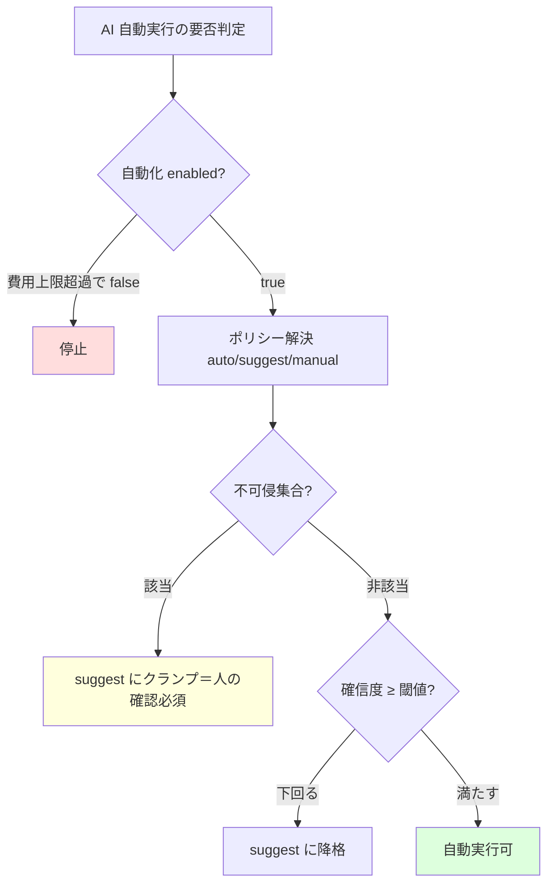
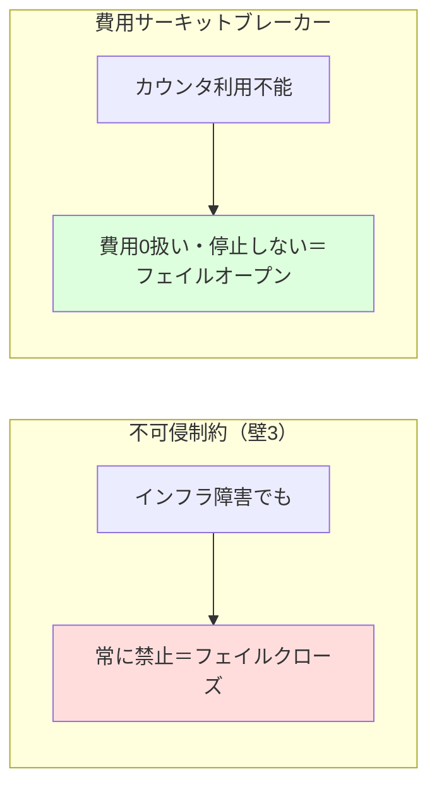

# 発明提案書 03：AI 業務自動化のガードレール制御

> 仮称：**確信度ゲート・不可侵制約・費用遮断を統合した、AI による業務自動実行の制御方法、システム及びプログラム**
> 区分：○ 次点（ビジネス関連発明） / 種別：方法・プログラム
> 中核実装：`src/lib/ai/automation/policy.ts`, `actionCatalog.ts`, `src/lib/ai/costCap.ts`, `orchestrator.ts`

---

## 1. 技術分野

大規模言語モデル（LLM）等の AI を用いて、マルチテナント型 SaaS における業務（受付・下書き生成・起票・分類等）を、人手の操作を介さずに自動実行（オートコミット）する際の、安全性・コスト・信頼度を統合的に制御する技術に関する。

## 2. 背景技術と課題

- LLM を業務フローに組み込み、入力（受信メッセージ・写真・音声・帳票 OCR）から自動で次工程を進める「AI エージェント／自動化」が一般化している。
- 一方で、(a) 誤った自動実行が**法的・金銭的な不可逆結果**（証明書の発行＝法的確定、金額の対外確定、本人確認、外部送信）を招く危険、(b) AI 呼び出しの**従量課金が暴走**する危険、(c) AI の出力が**低確信のまま自動採用**される危険、がある。
- 従来は、これらを個別の if 文やレート制限で散発的に対処しており、**フィールド／アクション単位で一貫したガバナンスを与える統合的な制御層**が欠けていた。

## 3. 課題を解決するための手段（本発明の構成）

フィールド／アクション単位の自動化ポリシーを、次の 3 つの制御を統合した単一の解決経路で評価する。

1. **3 段階ポリシー解決**：各フィールド／アクションに対し、テナント設定値（無ければカタログ既定値）から `auto（自動）/ suggest（提案）/ manual（手動）` を解決する（`resolveFieldPolicy` / `resolveAutoAction`）。auto-action は全て**既定 OFF（opt-in）**であり、テナントが明示的に有効化しない限り自動実行しない（`AUTOMATION_ACTIONS[].defaultEnabled=false`）。
2. **確信度ゲート（降格）**：AI の出力に付随する自己評価値（confidence）が、テナント設定の閾値を下回るフィールド／アクションは、ポリシーが `auto` でも `suggest` に**降格**させる（`resolveFieldPolicy` 内 `confidence < threshold` 分岐）。確信度はフィールド別に与えられるため、同一生成結果中の**曖昧なフィールドだけ**を降格できる（`filterDraftByPolicy`、`draft.fieldConfidence`）。
3. **不可侵制約（壁3・フェイルクローズ）**：法的・金銭的に不可逆な所定アクション集合（`NEVER_AUTO_ACTIONS`／不可侵フィールド `isNeverAutoField`）は、**テナント設定やカタログ既定が `auto` であっても**必ず `suggest`／実行不可にクランプし、人手の最終確認を強制する。例：証明書の発行（draft→active）は `canAutoIssueCertificate` が常に false。この制約は後述のインフラ可用性に関わらず常に有効（フェイルクローズ）。
4. **費用サーキットブレーカー（フェイルオープン）**：テナント当月の AI 利用概算費用をカウンタに累積し（`addMonthlyCostJpy`、Redis に円 ×100 の整数で `incrby`、月キー＋約 40 日 TTL）、上限（テナント個別 > 環境既定 > 無効、の順で解決）を超えると、自動化を**一括停止**（`enabled=false` に倒す）して以降の AI 呼び出しを抑止する（`getCostCapStatus` / `withCostCap`）。カウンタが利用不能（Redis 不在・障害）のときは費用 0 として扱い**停止しない**（フェイルオープン）。
5. **非対称な失敗時挙動**：上記のとおり、**安全制約はフェイルクローズ（常に守る）／費用遮断はフェイルオープン（インフラ障害で業務を止めない）**という、性質に応じて逆向きの failure semantics を同一制御層内で併用する。

## 4. 発明の効果

- 不可逆・高リスクなアクションは設定ミスや AI の暴走によっても自動実行されない（フェイルクローズ）。
- 低確信のフィールドだけを自動採用から外し、人の確認に回せる（粒度の細かい安全側降格）。
- 従量課金の暴走を月次上限で遮断しつつ、監視基盤の障害が業務自体は止めない（フェイルオープン）。
- これらを**フィールド／アクション単位の単一解決経路**で一貫適用でき、新しい自動化アクション追加時もカタログ登録だけでガバナンスが効く。

## 5. 実施形態（実コードとの対応）

| 構成要素 | 実装 |
|---|---|
| ポリシー解決（フィールド） | `resolveFieldPolicy()` — `src/lib/ai/automation/policy.ts` |
| ポリシー解決（アクション） | `resolveAutoAction()` — 同上 |
| 確信度降格・フィールド別 | `resolveFieldPolicy()` ＋ `filterDraftByPolicy()`（`fieldConfidence`） |
| 不可侵集合（壁3） | `NEVER_AUTO_ACTIONS` / `isNeverAutoAction` / `isNeverAutoField`（`actionCatalog.ts` / `fieldCatalog.ts`） |
| 既定 OFF（opt-in） | `AUTOMATION_ACTIONS[].defaultEnabled=false` |
| 費用累積 | `addMonthlyCostJpy()` / `estimateCallCostJpy()` — `costCap.ts` |
| 上限解決・超過判定 | `resolveCapJpy()` / `getCostCapStatus()` |
| 一括停止（enforce） | `withCostCap()`（`exceeded` 時 `enabled=false`） |
| フェイルオープン | Redis 不在・例外時に費用 0 扱い／`enabled` 不変 |
| オーケストレーション判定（純関数） | `orchestrator.ts`（`decideInboundCommit` 等） |

## 6. 新規性・進歩性のポイント

- **3 制御の統合**：確信度ゲート（降格）＋不可侵制約（クランプ）＋費用遮断（ブレーカー）を、**フィールド／アクション単位の単一解決経路**に統合した点。個々の要素技術（信頼度閾値、ガードレール、レート/予算制限）は既知でも、LLM 駆動のマルチテナント業務自動化に**統合適用**する構成は主張余地がある。
- **非対称 failure semantics**：同一制御層内で、安全制約＝フェイルクローズ／費用遮断＝フェイルオープン、と意図的に逆の失敗時挙動を併用する点。
- **粒度**：同一 AI 生成結果内の**フィールド別確信度**で部分降格する点（説明文は auto 維持、材料欄だけ suggest 等）。

> **評価**：ビジネス関連発明として、技術的構成（カウンタ実装・解決アルゴリズム・failure semantics）に紐づけて記載すれば「ソフトウェアによる情報処理がハードウェア資源を用いて具体的に実現」の要件は満たしやすい。ただし各要素の既知性が高いため、**統合と非対称 failure semantics**を進歩性の中心に据える。

## 7. 想定請求項（クレーム）案 — ※たたき台

**【請求項1】（方法）**
AI による出力を、フィールドまたはアクション単位で自動実行・提案・手動のいずれかに対応付けるポリシーを、利用主体ごとの設定値に基づき解決する解決ステップと、
前記出力に付随する自己評価値が所定の閾値を下回るフィールドまたはアクションについて、前記ポリシーが自動実行であっても提案に降格させる降格ステップと、
所定の不可侵集合に属するフィールドまたはアクションについて、前記設定値にかかわらず自動実行を禁止する強制ステップと、
前記利用主体の期間内における AI 利用に係る概算費用を累積し、当該費用が所定の上限を超えた場合に前記自動実行を一括して停止する遮断ステップと、
前記各ステップの結果として自動実行が許容される場合にのみ、人手の操作を介さずに前記 AI による処理を実行する実行ステップと、
を備える AI 自動実行制御方法。

**【請求項2】** 請求項1において、前記不可侵集合が、法的効力の確定、金額の対外的確定、本人確認、及び外部への送信、の少なくとも一つを伴うアクションを含むことを特徴とする方法。

**【請求項3】** 請求項1または2において、前記概算費用の累積を行うカウンタが利用不能であるときは前記費用を所定の最小値として扱い前記遮断を行わない一方、前記強制ステップは当該カウンタの可用性にかかわらず実行されることを特徴とする方法。（非対称 failure semantics）

**【請求項4】** 請求項1〜3において、前記自己評価値がフィールド別に与えられ、同一の AI 生成結果に含まれる一部のフィールドのみを前記降格の対象とすることを特徴とする方法。

**【請求項5】** 請求項1〜4において、前記ポリシーの既定値が自動実行を無効とし、前記利用主体の明示的な有効化操作によってのみ当該アクションが自動実行の対象となることを特徴とする方法。（opt-in）

**【請求項6】** 請求項1〜5において、前記概算費用が、AI 呼び出しのエンドポイント種別ごとの代表単価に基づいて見積もられることを特徴とする方法。

**【請求項7／8】** 上記方法を実行するシステム／プログラム。

## 8. 図面

### 図1：単一解決経路でのガードレール評価

### 図2：非対称 failure semantics

## 9. 先行技術メモ・留意点

- ワークフローエンジン、AI ガードレール（出力フィルタ）、API レート/予算制限、信頼度閾値による棄却（reject option）は各々既知。**独立項は 3 制御の統合＋非対称 failure semantics で構成**し、要素単独で広く取らない。
- 設定 UI は利用者に公開されている（挙動は外から見える）が、内部アルゴリズム（解決経路・失敗時挙動・費用累積方式）は非公開。UI 公開が発明の公開に当たるかは弁理士確認（請求項を内部処理に寄せておくと安全）。
- 「壁3（never-auto）」「confidence 降格」「コストキャップ」は実装コメント・設定ラベルにも現れるため、対外資料での表現に留意。
</content>
