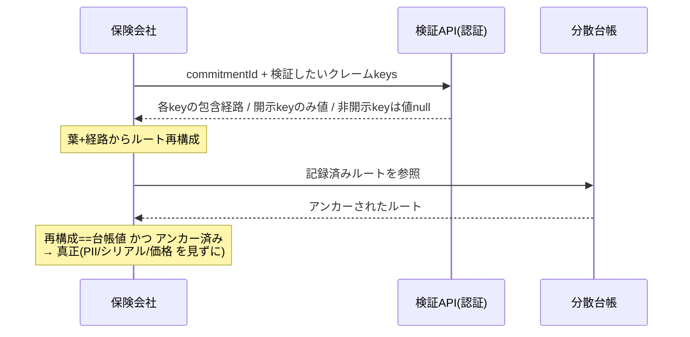

# 発明提案書 06：部品装着クレームの選択的開示証明（ZKP/コミットメント）

> 仮称：**車両部品の装着事実を、個人情報・個体識別子・価格を開示せずに第三者が真正性検証できる選択的開示証明の生成・検証方法、システム及びプログラム**
> 区分：◎ 本命（新規・両軸で最有力） / 種別：方法・システム・プログラム（暗号技術＋ビジネス関連発明）
> 中核実装：`src/lib/zkp/commitment.ts`, `src/lib/zkp/merkleTree.ts`, `src/lib/zkp/verifier.ts`, `src/lib/zkp/types.ts`, `src/app/api/insurer/zkp/verify/route.ts`
> DB：`supabase/migrations/20260603020000_zkp_commitments.sql`（`zkp_commitments`）

---

## 0. なぜ「本命」か（要旨）

- **完全未公開**：選択的開示・コミットメント機構は公開面（marketing/content/public）に一切出ていない（grep 0 件、[棚卸し 04](./04-disclosure-inventory.md) 参照）。→ 発明01の「自社開示ハンデ」がない。
- **技術的性格が明確**：Merkle 木・HMAC nonce・コミットメント・台帳アンカーという**暗号機構**で構成されるため、発明該当性・進歩性の議論が「ビジネス手法すぎる」方向（発明02/03の弱点）に流れにくい。
- **実施可能**：保険会社向け検証 API（`/api/insurer/zkp/verify`）まで動く実装が存在。
- **優位性**：保険会社連携の**検証チョークポイント**（個人情報を渡さず部品真正性をオンチェーン検証）を押さえる。

---

## 1. 技術分野

車両に装着された部品（OEM 純正・認定アフターマーケット等）の装着事実とその属性を、**部品を装着・記録した事業者のサーバを信頼せず**、かつ**顧客の個人情報・部品個体識別子（シリアル番号）・仕入価格・車台番号（VIN）の完全値を開示することなく**、第三者（保険会社・査定者等）が暗号学的に検証できるようにする技術に関する。

## 2. 背景技術と課題

- 施工・部品の証跡ハッシュを分散台帳に記録し改ざんを検知する手法は知られている（本システム Phase 1／発明01）。
- しかし保険金査定・事故対応の場面で、保険会社は「**この車にこのグレードの部品が装着された**」という事実だけを確認したい一方、事業者は顧客情報・部品シリアル（競合に渡したくない仕入情報）・価格・マージンを保険会社に渡したくない。
- 従来の「証跡まるごと開示」や「事業者サーバへの照会」では、(a) 過剰な個人情報・営業秘密の開示、(b) 事業者サーバへの信頼依存（廃業・改ざんで検証不能）、という二律背反が生じる。

### 残された課題

「**必要な属性だけを真正に開示し、不要な属性は秘匿したまま、その秘匿属性も含めて確定時点の内容が固定されている**」ことを、**サーバ非依存で**第三者が検証できる仕組みが必要。単なるアクセス制御（DB で列を出し分ける）では、(i) 事業者サーバを信頼することになり、(ii) 秘匿列が後から書き換えられていないことを第三者が確かめられない。

## 3. 課題を解決するための手段（本発明の構成）

部品装着イベントごとに、**開示属性と秘匿属性を混在させた単一のコミットメント木**を構築し、その**ルートのみを分散台帳に記録**する。第三者は要求した属性について、開示属性は値＋包含証明を、秘匿属性は包含証明のみを受け取り、**台帳記録ルートに対して包含を検証**することで、開示値の真正性と秘匿値の固定（改ざん不能）を同時に確認する。構成は次の通り。

1. **クレーム生成（開示／非開示の分類）**：装着イベントから複数のクレーム（属性）を生成し、各々に開示可否を付す（`buildClaims`）。
   - 開示クレーム：`part_category`（部品カテゴリ）、`brand_tier`（ブランド等級：`oem`/`aftermarket_certified`/…）、`part_assurance_level`（本人性保証グレード）、`installation_period`（装着時期）。
   - 非開示（コミットのみ）クレーム：`quantity_committed`（数量）、`serial_proven`（シリアル指紋の保有証明）、`customer_verified`（顧客本人確認の有無＝発明07の確定状態）。
2. **時期の粗粒度化**：装着時刻 ISO 値を**月単位バケット**（`toInstallationPeriod` → `"2026-06"`）に丸めてからコミットする。日時の精細値を晒さず「いつ頃」だけを開示可能にする（粒度低減によるプライバシー）。
3. **決定的・シークレット依存 nonce による葉コミットメント**：各クレームの葉を `leaf = SHA-256(key | value | nonce)`（`computeClaimLeaf`）で計算する。`nonce` は**サーバ秘密ソルトを鍵とする HMAC**で決定的に導出する（`deriveNonce = HMAC-SHA256(ZKP_CLAIM_SALT, commitmentId | key | plainValue)`）。
   - 決定的であるため、装着事業者は後から同一の葉・包含証明を再生成できる。
   - 一方、ソルト（`ZKP_CLAIM_SALT`）を知らない第三者は、**低エントロピーの秘匿値（数量・真偽値等）を葉ハッシュから辞書攻撃で逆算できない**。コミットメントの秘匿性を担保する要。
4. **Merkle 木の構築とルートのアンカー**：全クレームの葉から Merkle ルートを算出し（`computeMerkleRoot`、奇数葉は末尾複製でパディング）、**ルートのみを分散台帳に記録**する（`anchorToPolygon(merkleRoot)`）。台帳には個別の属性値もハッシュ前の値も載らない。
5. **選択的開示証明の生成（装着事業者側）**：第三者が要求した属性について、葉インデックスとルートまでの兄弟ノード列（Merkle パス）を返す（`generateSelectiveDisclosureProof`）。開示属性は平文値を、非開示属性は値 `null`（パスのみ）を付す。
6. **サーバ非依存の検証（第三者側）**：第三者は、受領した葉・パスから Merkle ルートを再構成し、**台帳に記録されたルートと一致するか**を検証する（`verifyMerklePath`）。一致すれば、(a) 開示属性値はその木に確かに含まれていた真正値であり、(b) 非開示属性も**確定時点で固定**されている（後から差し替え不能）ことが、**事業者サーバを信頼せずに**確認できる。検証 API は個人情報・シリアル・価格を一切返さない（`verifyZkpClaims` → `value:null` for 非開示、`overallValid` はアンカー済みも条件）。
7. **存在・時刻証明の併存**：検証は「包含（メンバーシップ）」に加え、**ルートが台帳にアンカー済みである**ことを要求する（`isAnchored`）。これにより属性の存在と固定時刻を同時に保証する。

## 4. 発明の効果

- 保険会社等は、**顧客の個人情報・部品シリアル（営業秘密）・仕入価格・VIN 完全値を一切受け取らずに**、「規定グレードの部品が当該時期に装着された」事実を数学的に検証できる。
- 検証は**事業者サーバ非依存**（台帳ルートとの照合のみ）。事業者の廃業・改ざんに耐える。
- 秘匿属性も含めて確定時点で固定されるため、開示属性だけを都合よく後付け・差し替えする不正を防ぐ。
- 台帳にはルート（32 バイト）しか載らないため、個人情報・営業秘密がオンチェーンに残らず、削除権・秘密保持と両立。
- 月単位粗粒度化により、必要最小限の時間粒度だけを開示できる。

## 5. 実施形態（実コードとの対応）

| 構成要素 | 実装 |
|---|---|
| クレーム生成（開示/非開示の分類） | `buildClaims()` — `src/lib/zkp/commitment.ts` |
| 時期の月バケット粗粒度化 | `toInstallationPeriod()` — 同上 |
| シークレット依存 nonce（HMAC） | `deriveNonce()` — 同上（`ZKP_CLAIM_SALT`） |
| 葉コミットメント `SHA-256(key|value|nonce)` | `computeClaimLeaf()` — `src/lib/zkp/merkleTree.ts` |
| Merkle ルート算出（奇数葉パディング） | `computeMerkleRoot()` — 同上 |
| ルートの台帳アンカー | `createZkpCommitment()` → `anchorToPolygon()` |
| 選択的開示証明の生成（事業者側） | `generateSelectiveDisclosureProof()` — `commitment.ts` |
| Merkle パス算出・検証 | `computeMerklePath()` / `verifyMerklePath()` — `merkleTree.ts` |
| 第三者検証（保険会社側・値出し分け＋アンカー確認） | `verifyZkpClaims()` — `src/lib/zkp/verifier.ts` |
| 検証サーフェス（PII/シリアル/価格を返さない） | `POST /api/insurer/zkp/verify` — `src/app/api/insurer/zkp/verify/route.ts`（保険会社認証の背後） |
| 永続化（ルート・葉スナップショット・アンカー結果） | `zkp_commitments`（`merkle_root` / `claims_snapshot` / `polygon_tx_hash` …） |
| 開示粒度の型定義（開示可能な等級・期間のみ） | `BrandTier` / `InstallationPeriod` / `ZkpClaimKey` — `src/lib/zkp/types.ts` |

> 補足：`types.ts` は将来の真の ZK 回路（Groth16/PLONK、snarkjs/Circom/Noir）への移行を Phase 2 として明記。本件の独立項は「**選択的開示＋コミットメント＋台帳アンカーによるサーバ非依存検証**」という上位概念で構成し、Merkle 実装／ZK 回路実装の双方を実施形態として包含できるよう従属項で押さえる。

## 6. 新規性・進歩性のポイント（弁理士向け差別化軸）

1. **開示・非開示・粗粒度を混在させた単一コミットメント木**：同一イベントについて、(i) そのまま開示する属性、(ii) 値は秘匿し固定だけ証明する属性、(iii) 精細値を丸めて開示する属性、を**1 本の Merkle 木**に束ね、要求に応じて属性単位で出し分ける。単なる selective disclosure（全項目を平文で開示するか否かの二択）より細かい。
2. **シークレット依存 nonce による低エントロピー秘匿値の保護**：数量・真偽値のような辞書攻撃に弱い属性を、サーバ秘密ソルト鍵の HMAC で nonce 化して葉に封入する。コミットだけして値を隠す構成で、第三者が葉から値を逆算できない。
3. **車両部品×保険という適用と「サーバ非依存」**：検証が台帳ルート照合のみで完結し、装着事業者サーバを信頼しない。保険会社は PII・シリアル・価格・VIN 完全値を受け取らずに部品真正性を確認する、という具体的用途。
4. **存在＋包含の二重検証**：メンバーシップ証明に加え「ルートがアンカー済み」を `overallValid` の条件にし、属性の固定と存在時刻を同時に保証。
5. **発明01・07との接続**：`customer_verified` クレームは発明07（本人所持証明に束ねた確定）の状態を、`installation_period` 等は発明01（車両単位メタアンカー）の集約対象を、それぞれコミット対象に取り込み、3 発明で一貫した真正性パイプラインを成す。

## 7. 想定請求項（クレーム）案 — ※たたき台

**【請求項1】（方法）**
車両に装着された部品に関する複数のクレームを生成するクレーム生成ステップであって、各クレームに開示又は非開示の別を付与するステップと、
各クレームについて、当該クレームの値と、秘密値を鍵とする決定的関数により導出したノンスとに基づく葉コミットメントを算出する算出ステップと、
前記葉コミットメントから木構造のルートを算出し、当該ルートを分散台帳に記録する記録ステップと、
検証者から指定されたクレームについて、前記木構造における包含経路を提供するとともに、前記開示の別が開示であるクレームについてのみ当該クレームの値を提供する開示ステップと、を備え、
前記検証者が、提供された前記包含経路から再構成したルートを前記分散台帳に記録された前記ルートと照合することにより、前記部品の装着に関する真正性を、前記非開示のクレームの値及び前記方法を実行する主体のサーバに依存せずに検証可能とする、
選択的開示証明方法。

**【請求項2】** 請求項1において、前記クレームが、装着時刻を所定期間単位に丸めた粗粒度の時期クレームを含むことを特徴とする方法。（粒度低減）

**【請求項3】** 請求項1または2において、前記ノンスが、サーバ秘密のソルトを鍵とし、コミットメント識別子・クレーム種別・当該クレームの値を入力とする鍵付きハッシュにより導出され、当該ソルトを知らない第三者が前記葉コミットメントから前記値を逆算できないことを特徴とする方法。（低エントロピー秘匿値の辞書攻撃耐性）

**【請求項4】** 請求項1〜3において、前記複数のクレームが、開示されるクレーム（部品カテゴリ・ブランド等級等）と、値を秘匿したまま固定のみを証明するクレーム（数量・個体識別子の保有・本人確認の有無等）とを単一の前記木構造内に混在して含むことを特徴とする方法。（開示／非開示の混在）

**【請求項5】** 請求項1〜4において、前記検証は、前記包含経路の検証に加え、前記ルートが前記分散台帳に記録済みであることを条件として全体の有効性を判定することを特徴とする方法。（存在＋包含）

**【請求項6】** 請求項1〜5において、前記検証者へ応答する際に、個人情報・部品個体識別子・価格・車両識別子の完全値を提供しないことを特徴とする方法。

**【請求項7】** 請求項1〜6において、前記非開示のクレームが、別途、利用者本人の所持証明に束ねて確定された装着確認の状態を表すクレームを含むことを特徴とする方法。（発明07との接続）

**【請求項8／9】（システム／プログラム）** 請求項1〜7のいずれかの各ステップを実行する手段を備えるシステム／コンピュータに実行させるプログラム。

## 8. 図面

### 図1：コミットメント生成 → ルートのみアンカー

```mermaid
flowchart TD
    EV[部品装着イベント] --> CL[クレーム生成 開示/非開示/粗粒度]
    CL --> N[nonce=HMAC ソルト, id|key|value]
    N --> LF[葉=SHA256 key|value|nonce]
    LF --> MT[Merkle ルート算出]
    MT --> AN[ルートのみ分散台帳へ]
    AN --> CH[(台帳: ルート32B のみ)]
    style CH fill:#eef
```

### 図2：保険会社によるサーバ非依存・選択的開示検証



## 9. 先行技術メモ・留意点

- **必須**：選択的開示・検証可能クレデンシャルの先行領域（W3C Verifiable Credentials、SD-JWT、BBS+ 署名、Merkle 型選択的開示、Certificate Transparency 等）、及び車両×ブロックチェーン（ホンダ NFT 特許、トヨタ MON、MOBI）を弁理士の有償調査でクリアランスすること。
- **差別化の生命線**：「**開示／非開示／粗粒度を混在させた単一コミットメント木**」＋「**シークレット依存 nonce による低エントロピー秘匿値保護**」＋「**車両部品×保険でのサーバ非依存検証（PII・シリアル・価格・VIN 完全値を渡さない）**」の組み合わせ。selective disclosure 単独で広く取らない。
- **未公開維持**：本機構は現状未公開。出願までブログ・登壇・PoC 追補・保険会社向け資料で「Merkle 選択的開示／コミットメント／nonce 設計」を語らない（[棚卸し 04](./04-disclosure-inventory.md) §5、[05 §F](./05-attorney-consultation-request.md)）。検証 API は保険会社認証の背後にあり一般公開されていない。
- 現状は SHA-256 Merkle 実装（`types.ts` の Phase 1）。将来の真の ZK 回路（Groth16/PLONK 等）への移行に備え、独立項は実装非依存の上位概念で構成し、Merkle／ZK 回路を従属項で実施形態化する。
