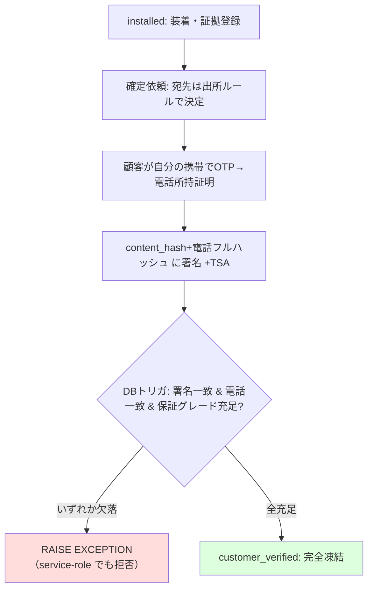
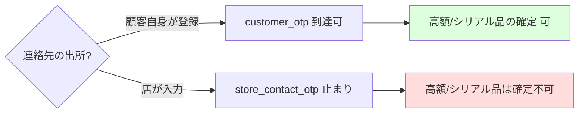

# 発明提案書 07：装着部品の本人所持証明に束ねた確定ゲートと相互矛盾検知

> 仮称：**整備・部品交換記録の確定を、利用者本人の連絡先所持証明に束ねてデータベース層で強制し、運営者も覆せない不変記録とする方法、システム及びプログラム**
> 区分：◎ 本命（新規・優位性＝防御の堀） / 種別：方法・システム・プログラム（情報セキュリティ＋ビジネス関連発明）
> 中核実装：`supabase/migrations/20260603000001_part_installations_guard.sql`（DBトリガ）, `src/lib/parts/confirmationPolicy.ts`, `phoneIdentity.ts`, `partSigning.ts`, `metaAnchor.ts`, `tsa.ts`/`rfc3161.ts`, `integrityChecks.ts`, `reconciliation.ts`
> 設計：`docs/parts-installation-integrity-design.md`

---

## 0. なぜ「防御の堀」か（要旨）

- **完全未公開**：本機構は公開面に一切出ていない（grep 0 件、[棚卸し 04](./04-disclosure-inventory.md)）。設計書も社内資料。→ 新規性がクリーン。
- **設計を超えて実装済み**：DB トリガ（完全凍結ゲート）・テナント横断シリアル照合・確定ポリシー純関数・RFC3161 TSA 連携・車両メタアンカーまで本番マイグレーション＋純関数で存在。実施可能性が高い。
- **優位性**：保険会社・OEM への実際の売り（**部品すり替え・なりすまし確定の抑止**）そのもの。多層で構成され、設計回避が難しい。

---

## 1. 技術分野

自動車の整備・板金・コーティング等における部品交換記録について、(a) 入力データの偽造・使い回し、(b) **納車時の部品すり替え**、(c) **店による顧客なりすまし確定**、を抑止・検知し、確定後の記録を運営者を含め誰も改変できない不変記録とする、情報セキュリティ技術に関する。

## 2. 背景技術と課題

- 証跡写真のハッシュを台帳に記録して改ざんを検知する手法（発明01）、電子署名（電子署名法準拠）、ワンタイムパスワード（OTP）、RFC3161 タイムスタンプ、追記専用トリガによる不変台帳は、各々個別には知られている。
- しかし整備・部品交換の現場では、**記録を作成・確定する主体（店）自身が不正主体になり得る**という特有の脅威がある。店は車・部品・端末・時間を支配するため、(i) 顧客の代わりに「顧客確認」を押して勝手に確定する（なりすまし）、(ii) 顧客欄に店の番号を登録して OTP/署名リンクを店が受信し自署する（連絡先支配）、(iii) 撮影後・納車前に純正を社外品へすり替える（TOCTOU）、といった攻撃が可能。
- 従来の電子署名・OTP は「**メール到達**」や「アプリ層の判定」を信頼の根拠にしており、(i)(ii) のように**確定する主体＝店**が攻撃者である状況では、アプリを迂回した直接 DB 書き込みや連絡先のすり替えで突破され得る。

### 残された課題

「**確定（法的・経済的に不可逆な状態遷移）を、店も運営者も代行・偽造できないよう、利用者本人の物理的所持に束ね、かつアプリ層ではなくデータベース層で強制する**」仕組みが必要。さらに、物理すり替え（iii）は単一の印では必ず破られるため、**複数の独立した記録の相互矛盾**として検知する仕組みが要る。

## 3. 課題を解決するための手段（本発明の構成）

### 3-1. 本人所持証明に束ねた確定（中核）

1. **サーバ計算の内容ハッシュ**：装着内容（部品名・GTIN・lot・シリアル指紋・数量・金額）＋全証拠の SHA-256 一覧＋顧客識別＋確定時刻＋nonce を正準化し、`content_hash` を**サーバ側で**算出する（クライアント送信値を信用しない）。
2. **電話所持証明（フル番号ハッシュ）**：確定リンク/OTP の宛先で、利用者本人が当該電話番号を所持することをワンタイムコードで検証し、**生番号を保存せず** `phoneFullHash = SHA-256("fullphone|v1|tenantId|E164|PEPPER")` を照合主キーとする（`src/lib/parts/phoneIdentity.ts`）。下4桁ハッシュは衝突空間 10⁴ で弱いため主キーにしない。
3. **内容ハッシュに本人を束ねた署名**：`content_hash` ＋ `phoneFullHash` ＋ 装着 ID ＋ 署名 ID を決定的に連結したペイロードに事業者鍵で署名する（`buildPartSigningPayload`/`signPartConfirmation`、`src/lib/parts/partSigning.ts`）。さらに **RFC3161 TSA トークン**を付与して存在・時刻を第三者（TS局）に証明させる（`src/lib/parts/tsa.ts`/`rfc3161.ts`、国内 JIPDEC 認定 TS局）。
4. **データベース層での確定ゲート（運営者も例外なし）**：`installed → customer_verified` への遷移を、`BEFORE UPDATE` トリガ（`part_installations_guard()`、`supabase/migrations/20260603000001_part_installations_guard.sql`）が次を**すべて満たさなければ `RAISE EXCEPTION`**：
   - (a) 確認署名が `status='signed'` かつ当該装着に紐づき、その `document_hash = 現在の content_hash`（確定後内容不変）、
   - (b) 署名の `signer_phone_full_hash = 顧客の phone_full_hash`（本人所持一致）、
   - (c) 署名の保証グレードが、部品リスクから導出した必要グレードを満たす（`part_meets_required_assurance`）。
   - 重要：このトリガは `auth.uid() IS NULL`（service-role＝運営）を**例外にしない**。アプリを迂回して PostgREST を直叩きしても、**運営者自身でも**本人署名・電話一致・保証グレードが揃わなければ確定できない（完全凍結）。

### 3-2. 連絡先出所による格下げ（なりすまし封じ）

5. **達成可能グレードを連絡先の出所で制限**：確定方式決定（`resolveConfirmation`、`src/lib/parts/confirmationPolicy.ts`）は、宛先連絡先の出所（`customer`＝顧客自身が登録／`store`＝店が入力）により**到達可能な保証グレードを制限**する。高額・シリアル品が要求する `customer_otp` は、**店が入力した連絡先では満たせない**（`achievable = store_contact_otp` 止まり）。これにより「店が自分の番号を顧客欄に入れて代行」を封じる。LINE 優先→SMS フォールバック、顧客不在時の店頭タブレットは低リスク品（`required='any'`）限定。

### 3-3. テナント横断のプライバシー保全シリアル照合

6. **生シリアルを晒さない使い回し検知**：シリアル品は `serial_fingerprint`（識別子＋シリアルの鍵付きハッシュ）を**プラットフォーム全体で UNIQUE**に登録する。照合は `SECURITY DEFINER` 関数 `part_register_serial()` 経由で、返り値は `'registered'`（新規）／`'reused'`（既存衝突＝使い回し疑い）のみ。**生シリアルや所有テナントを他テナントへ開示しない**。レジストリは追記専用トリガで保護。

### 3-4. 不変性と相互矛盾検知

7. **完全凍結＋取消のみ＋追記専用**：確定後は内容・署名・identity 列を一切変更不可。許されるのは `customer_verified → voided`（理由必須・不変列据え置き）への遷移のみで、訂正は**新規レコード再発行＋顧客の再署名**でしか表現できない（店が原本を取り消して改ざん版を出しても再署名が要るので隠せない）。証拠・署名・シリアルレジストリは UPDATE/DELETE 常時拒否（append-only トリガ群）。
8. **二重時刻アンカー**：`content_hash` を RFC3161 TSA（中央・一次手段）に加え、**車両単位メタアンカー**（`computePartsMetaHash`、VIN/車両キー＋ソート済みハッシュ群の SHA-256、発明01の集約に合流）として分散台帳にも束ねる。高額品は個別アンカーも付与。
9. **現場工数ゼロの相互矛盾検知（L7）**：装着写真を既存の改ざん検出（発明02）に通し、シリアル使い回し・写真重複/編集・三方照合不一致（納品 ↔ 請求 ↔ 装着、`reconciliation.ts`）・数量突合・時刻異常を `part_integrity_findings` に自動記録する（`integrityChecks.ts`）。単一の物理的印ではなく**複数の独立記録の矛盾**として物理すり替えを抑止する。

## 4. 発明の効果

- 確定が利用者本人の**物理的所持（SIM/電話）**に束ねられ、かつ**DB 層で強制**されるため、店も**運営者（service-role）も**なりすまし確定・改ざんができない。
- 連絡先出所の格下げにより「店が自分の番号で代行確定」を封じる。
- テナント間で営業秘密（生シリアル・取引先）を漏らさずに、横断的な部品使い回しを検知。
- 物理すり替えは確率的だが、複数の独立記録の相互矛盾と経済責任により**割に合わなく**する。
- TSA＋メタアンカーの二重時刻証明で、署名日時の事後改ざんも防ぐ。

## 5. 実施形態（実コードとの対応）

| 構成要素 | 実装 |
|---|---|
| 確定ゲート（本人署名・電話一致・保証グレードを DB で強制／運営も例外なし） | `part_installations_guard()` — `supabase/migrations/20260603000001_part_installations_guard.sql` |
| 保証グレード充足判定 | `part_meets_required_assurance()` / `part_assurance_rank()` — 同上 |
| 電話フル番号ハッシュ（本人所持照合主キー） | `phoneFullHash()` / `normalizeE164JP()` — `src/lib/parts/phoneIdentity.ts` |
| OTP 所持証明（生コード非保存） | `otp_code_hash`（`sha256(partotp|v1|token|code|PEPPER)`）— `supabase/migrations/20260603000003_part_confirmation_otp.sql` |
| 内容ハッシュに本人を束ねた署名 | `buildPartSigningPayload()` / `signPartConfirmation()` — `src/lib/parts/partSigning.ts` |
| RFC3161 TSA タイムスタンプ | `src/lib/parts/tsa.ts` / `rfc3161.ts`（JIPDEC 認定 TS局、env で有効化） |
| 連絡先出所による格下げ（なりすまし封じ） | `resolveConfirmation()` — `src/lib/parts/confirmationPolicy.ts` |
| テナント横断シリアル照合（生値非開示） | `part_register_serial()`（`SECURITY DEFINER`）＋ `part_serial_registry`（UNIQUE・append-only） |
| 完全凍結／取消のみ／追記専用 | `part_installations_guard` / `part_evidence_append_only` / `part_confirmation_signatures_guard` / `part_serial_registry_append_only` |
| 車両単位メタアンカー（発明01へ合流） | `computePartsMetaHash()` — `src/lib/parts/metaAnchor.ts`、`supabase/migrations/20260603000005_part_vehicle_meta_anchors.sql` |
| 相互矛盾検知（L7） | `integrityChecks.ts`（改ざん検出再利用）＋ `reconciliation.ts`（三方照合） |
| API / 画面 | `src/app/api/parts/installations/route.ts`、`src/app/api/cron/parts-anchor`、`src/app/admin/parts-integrity/[installationId]/page.tsx` |

## 6. 新規性・進歩性のポイント（弁理士向け差別化軸）

1. **記録作成主体＝攻撃者モデルでの「運営者も覆せない確定ゲート」**：確定の正当性条件（本人署名・電話所持一致・保証グレード）を**アプリ層ではなくデータベーストリガで強制**し、特権アカウント（service-role＝運営）にすら例外を設けない。「プラットフォーム運営者自身も偽造できない、利用者の物理的所持に束ねた法的確定」は、通常の電子署名・ワークフロー（運営は万能）と一線を画す。
2. **連絡先出所による達成可能グレードの上限制御**：本人性の根拠を「誰がその連絡先を登録したか（出所）」で格付けし、店が登録した連絡先では高リスク品の必要グレードに**原理的に到達できない**ようにする、なりすまし封じの具体機構。
3. **プライバシー保全の横断的個体照合**：生シリアル・所有テナントを開示せず、鍵付きハッシュの UNIQUE 衝突として使い回しのみを返す `SECURITY DEFINER` 照合。
4. **多層の相互矛盾検知＋二重時刻アンカー**：単一の物理的印に頼らず、本人確定（L5）・個体/数量（L2）・三方照合（L3）・AI 矛盾（L7）の独立記録が互いに矛盾しないことを要求し、TSA（中央）＋メタアンカー（分散）で時刻を二重化する。
5. **発明01・06との接続**：`content_hash` は発明01の車両メタアンカーに合流し、確定状態（`customer_verified`）は発明06のコミットメントに秘匿クレームとして取り込まれ、3 発明で一貫した真正性パイプラインを成す。

> **正直な評価**：OTP・電子署名・RFC3161・追記専用トリガ・ハッシュアンカーは各々既知。独立項は要素単独で広く取らず、**「記録作成主体が攻撃者である前提で、本人の物理的所持に束ねた確定を DB 層で運営者にも例外なく強制し、連絡先出所で格下げする」という組み合わせ**を進歩性の中心に据える。DB トリガ・鍵付きハッシュ・署名という技術的構成に紐づくため、発明該当性（情報処理のハードウェア資源を用いた具体的実現）は満たしやすい。

## 7. 想定請求項（クレーム）案 — ※たたき台

**【請求項1】（方法）**
車両に装着された部品の記録について、装着内容及び証拠のハッシュからサーバ側で内容ハッシュを算出する算出ステップと、
確認要求の宛先において、ワンタイムコードにより確認者が利用者の登録電話番号を所持することを検証し、当該電話番号の正規化値の鍵付きハッシュを所持証明値として得る所持検証ステップと、
前記内容ハッシュを前記所持証明値に束ねた電子署名を取得する署名ステップと、
前記記録を確定状態へ遷移させる確定ステップであって、データベース層の制約により、アプリケーションとは独立に、(a) 署名が当該記録に紐づき署名対象ハッシュが現在の内容ハッシュに一致すること、(b) 署名の所持証明値が前記利用者の登録所持証明値に一致すること、(c) 署名の保証グレードが当該部品のリスクから導出した必要グレードを満たすこと、を検証し、いずれかを欠く場合に前記遷移を拒否するステップと、を備え、
前記データベース層の制約は、特権を有するサービスアカウントに対しても前記検証の例外を設けない、
部品装着記録の確定方法。

**【請求項2】** 請求項1において、前記宛先となる連絡先の出所が前記記録の作成主体によるものである場合に到達可能な前記保証グレードを制限し、所定リスク以上の部品については前記利用者自身が登録した連絡先によらなければ前記必要グレードを満たせないことを特徴とする方法。（連絡先出所による格下げ・なりすまし封じ）

**【請求項3】** 請求項1または2において、前記確定状態への遷移後は、内容・署名・本人識別に係るデータの変更を一切許さず、理由を伴う取消状態への遷移のみを許し、訂正は新たな記録の発行と利用者の再署名によってのみ表現されることを特徴とする方法。（完全凍結＋取消のみ）

**【請求項4】** 請求項1〜3において、個体識別子を有する部品について、識別子と個体番号との鍵付きハッシュをプラットフォーム横断で一意に登録し、既存衝突の有無のみを返し、個体番号及び消費主体を他の主体へ開示しないことを特徴とする方法。（プライバシー保全の横断個体照合）

**【請求項5】** 請求項1〜4において、前記必要グレードが部品の種別又は金額閾値から導出されることを特徴とする方法。

**【請求項6】** 請求項1〜5において、前記内容ハッシュに対し、第三者タイムスタンプ局による時刻トークンと、車両単位で複数の内容ハッシュを束ねた集約値の分散台帳への記録と、の双方を付与することを特徴とする方法。（二重時刻アンカー・発明01との接続）

**【請求項7】** 請求項1〜6において、装着に係る複数の独立した記録（写真・個体/数量・調達照合・機械学習による異常）の相互の矛盾を検知して記録するステップをさらに備えることを特徴とする方法。（相互矛盾検知）

**【請求項8／9】（システム／プログラム）** 請求項1〜7のいずれかの各ステップを実行する手段を備えるシステム／コンピュータに実行させるプログラム。

## 8. 図面

### 図1：本人所持証明に束ねた確定ゲート（DB 層・運営も例外なし）

### 図2：連絡先出所による格下げ（なりすまし封じ）

## 9. 先行技術メモ・留意点

- **必須**：電子署名プラットフォーム（DocuSign 等）、サプライチェーン真贋（GS1 シリアライゼーション、医薬品トレサビ）、RFC3161 長期署名（PAdES-LTV）、車両整備記録系を弁理士の有償調査でクリアランスすること。
- **差別化の生命線**：「**記録作成主体が攻撃者である前提**」での「**本人の物理的所持に束ねた確定を DB 層で運営者にも例外なく強制**」＋「**連絡先出所による格下げ**」＋「**生値を晒さない横断個体照合**」の組み合わせ。各要素を単独で広く取らない。
- **未公開維持**：本機構は現状未公開（設計書・実装とも社内）。出願までブログ・登壇・PoC 追補・保険会社向け資料で確定ゲート/格下げ/横断照合の詳細を語らない（[棚卸し 04](./04-disclosure-inventory.md) §5、[05 §F](./05-attorney-consultation-request.md)）。
- 物理すり替え（T4）の抑止は確率的であり、ゼロにはできない旨を明細書でも誇張しない（設計書 §9 の残存リスクと整合）。測定器入口（L1）は装置署名が原理的に不可のため対象外（延期）。
- 単独出願か、発明01（メタアンカー）・発明06（ZKP）と束ねた 1 出願（複数独立項）かは費用対効果で弁理士と相談。3 発明は実装上 `content_hash` を媒介に連結している。
