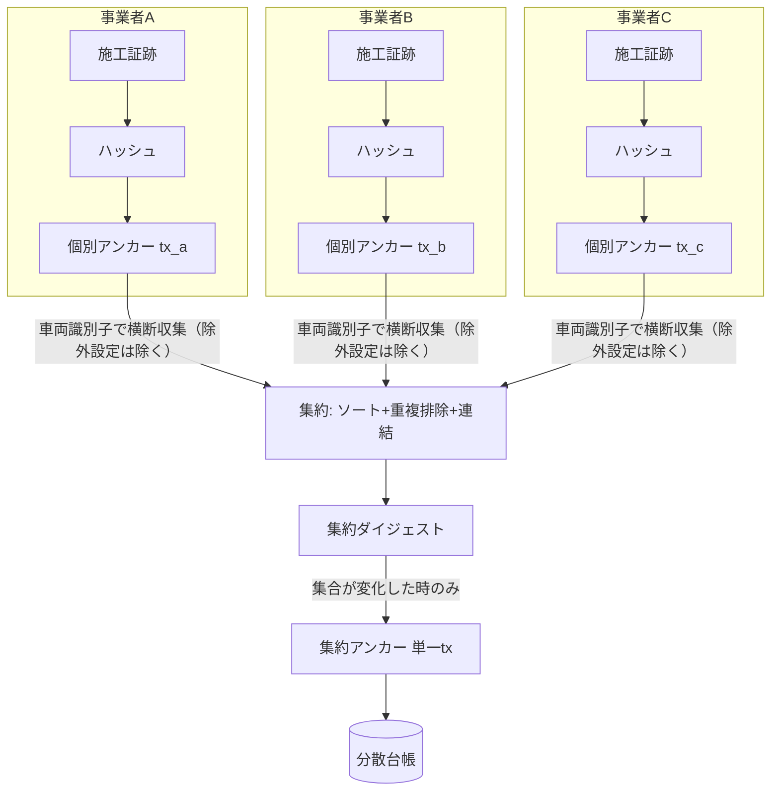
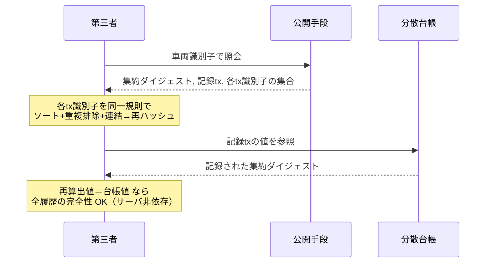

# 【明細書ドラフト】発明01：車両履歴の集約アンカー（メタアンカー）

> ⚠️ **出願前ドラフト（たたき台）**。請求項の最終確定・先行技術クリアランスは弁理士へ。
> ⚠️ **本件は上位コンセプト（VIN横断集約）を自社開示済み**（[04](../04-disclosure-inventory.md) D5/D6）。独立項は**未公開の機構（順序非依存ダイジェスト→単一Tx→第三者再計算）に絞る**こと。30条の扱いは [10](../10-art30-novelty-exception.md) と弁理士判断による。
> 対応：発明提案書 [01](../01-vehicle-passport-meta-anchor.md)／実装 `src/lib/passport/metaAnchor.ts`。

---

## 【書類名】明細書

### 【発明の名称】
複数事業者に分散した車両施工履歴の完全性証明方法、システム及びプログラム

### 【技術分野】
【0001】
　本発明は、同一の車両に対して互いに独立した複数の事業者がそれぞれ別個に記録した施工等の証跡について、その全履歴の完全性を、車両単位で集約して第三者が検証可能とする技術に関する。

### 【背景技術】
【0002】
　施工写真等の証跡データの暗号学的ハッシュを分散台帳に記録（アンカリング）し、後の改ざんを検知する手法（個別アンカー）が知られている。また、車両情報を分散台帳に記録する取り組みも複数存在する。

#### 【先行技術文献】
【0003】
　【特許文献１】車両記録のための分散台帳プラットフォームに関する文献（例：WO2018014123A1）。

### 【発明の概要】

#### 【発明が解決しようとする課題】
【0004】
　従来は、(1) 記録が事業者ごとに分断され、同一車両の全履歴を一括検証する手段がない、(2) 全履歴の検証に多数のトランザクション照合が必要で第三者にとって現実的でない、(3) 検証がプラットフォーム事業者のサーバに依存しがちで、当該事業者の廃業や改ざんにより検証できなくなる、という課題があった。

#### 【課題を解決するための手段】
【0005】
　本発明は、画像等の単位の個別アンカーの上位に、車両単位の集約アンカーの層を設ける。すなわち、互いに独立した複数の事業者端末の各々が、車両に対して行った施工に関する証跡データの暗号学的ハッシュを分散台帳にそれぞれ個別に記録し、当該記録のトランザクション識別子を保持する第１記録ステップと、正規化された車両識別子に基づき、当該車両に紐づく前記複数の事業者の前記トランザクション識別子を横断的に収集する収集ステップと、収集した前記トランザクション識別子の集合を、重複排除及び所定順序のソートにより順序非依存に正規化し、前記正規化された車両識別子と連結した連結データの集約ダイジェストを算出する算出ステップと、前記集約ダイジェストを単一のトランザクションとして前記分散台帳に記録する第２記録ステップと、を備える。

【0006】
　好ましくは、前記算出ステップで得た集約ダイジェストが、当該車両について既に記録された集約ダイジェストと一致する場合に、前記第２記録ステップを実行しない（冪等・コスト最適化）。

【0007】
　好ましくは、前記正規化された車両識別子と、前記集約ダイジェストと、前記トランザクション識別子の集合とを外部に提供し、第三者が前記算出ステップと同一の手順で集約ダイジェストを再算出して前記分散台帳上の記録と照合可能とする（サーバ非依存検証）。

#### 【発明の効果】
【0008】
　車両一台の、事業者をまたいだ全施工履歴の完全性を、単一のトランザクション識別子で証明・検証できる。検証コストは履歴件数に依存せず一定に近づく。検証がプラットフォーム事業者のサーバに依存しないため、当該事業者の廃業や改ざんに耐える。集合が変わらない限り台帳書込みが発生せず費用が極小である。個人情報を台帳に記録しないため削除権と両立する。

### 【図面の簡単な説明】
【0009】
　【図１】個別アンカーから集約アンカーへの全体構成を示す図。
　【図２】第三者によるサーバ非依存検証の流れを示す図。

### 【発明を実施するための形態】
【0010】
　各事業者の端末は、自らの施工に係る画像等の暗号学的ハッシュを分散台帳に個別記録し、そのトランザクション識別子を保存する。

【0011】
　収集ステップでは、車両識別番号を正規化（大文字化、全角半角統一、区切り除去）したキーを用い、互いに独立した複数の事業者が保有する当該車両の施工記録から、トランザクション識別子を横断的に収集する。集約対象から除外する旨が設定された事業者の記録は除外する。

【0012】
　算出ステップでは、収集したトランザクション識別子の集合を、小文字化・重複排除・昇順ソートしたうえで、正規化された車両識別子と所定の区切りで連結し、その連結データの暗号学的ハッシュを集約ダイジェストとして算出する。ソートにより、施工順や画像追加順に依存せず、任意の二者が必ず同一のダイジェストに到達する。

【0013】
　第２記録ステップでは、算出した集約ダイジェストを、単一のトランザクションとして分散台帳に記録する。再計算した集約ダイジェストが既に記録済みのダイジェストと一致する場合は記録を行わない。第２記録が失敗した場合は、集約ダイジェストを保持しつつトランザクション識別子を空のまま残し、定期処理により再試行する。

【0014】
　検証においては、正規化された車両識別子、集約ダイジェスト、その記録トランザクション、及び構成要素である各トランザクション識別子の集合を公開し、第三者が、得た各トランザクション識別子を同一の規則で連結・ハッシュ化し、台帳に記録された集約ダイジェストと照合することで、プラットフォーム事業者のサーバを信頼せずに全履歴の完全性を確認できる。

【0015】
　個人情報は分散台帳に一切記録しない。原データを削除すれば、台帳上に残るのは固定長のハッシュのみであり、個人情報を復元できない。

### 【符号の説明】
【0016】
　出願時に図面の符号を付す（個別アンカー、トランザクション識別子、正規化車両識別子、集約ダイジェスト、集約アンカー 等）。

---

## 【書類名】特許請求の範囲

> ⚠️ 独立項は「越境集約」コンセプト（自社開示済み）ではなく、**未公開の機構（順序非依存ダイジェスト→単一Tx→第三者再計算）**を中心に構成する（[01提案書 §6](../01-vehicle-passport-meta-anchor.md)、[10](../10-art30-novelty-exception.md)）。

### 【請求項１】
　互いに独立した複数の事業者端末の各々が、車両に対して行った施工に関する証跡データの暗号学的ハッシュを分散台帳にそれぞれ個別に記録し、当該記録のトランザクション識別子を保持する第１記録ステップと、
　正規化された車両識別子に基づき、当該車両に紐づく前記複数の事業者の前記トランザクション識別子を横断的に収集する収集ステップと、
　収集した前記トランザクション識別子の集合を、重複排除及び所定順序のソートにより順序非依存に正規化し、前記正規化された車両識別子と連結した連結データの集約ダイジェストを算出する算出ステップと、
　前記集約ダイジェストを単一のトランザクションとして前記分散台帳に記録する第２記録ステップと、を備える、
　車両施工履歴の完全性証明方法。

### 【請求項２】
　前記算出ステップで得た集約ダイジェストが、当該車両について既に記録された集約ダイジェストと一致する場合に、前記第２記録ステップを実行しないことを特徴とする、請求項１に記載の方法。

### 【請求項３】
　前記正規化された車両識別子と、前記集約ダイジェストと、前記トランザクション識別子の集合とを外部に提供し、第三者が前記算出ステップと同一の手順で集約ダイジェストを再算出して前記分散台帳上の記録と照合可能とする、請求項１又は２に記載の方法。

### 【請求項４】
　前記収集ステップは、前記複数の事業者のうち集約対象から除外する旨が設定された事業者の記録を除外する、請求項１〜３のいずれか一項に記載の方法。

### 【請求項５】
　前記証跡データに含まれる個人情報を前記分散台帳に記録せず、前記証跡データの原本の削除により当該個人情報を復元不能化する、請求項１〜４のいずれか一項に記載の方法。

### 【請求項６】
　前記第２記録ステップが失敗した場合に、前記集約ダイジェストを保持しつつ前記トランザクション識別子を空のまま残し、定期処理により前記第２記録ステップを再試行する、請求項１〜５のいずれか一項に記載の方法。

### 【請求項７】
　請求項１〜６のいずれか一項に記載の各ステップを実行する手段を備える、車両施工履歴完全性証明システム。

### 【請求項８】
　コンピュータに請求項１〜６のいずれか一項に記載の各ステップを実行させるための、プログラム。

---

## 【書類名】要約書

### 【課題】
　互いに独立した複数事業者に分散した同一車両の施工履歴について、全履歴の完全性を車両単位で、かつサーバ非依存で第三者が検証できるようにする。

### 【解決手段】
　各事業者が施工証跡のハッシュを分散台帳に個別記録しトランザクション識別子を保持する。正規化車両識別子で複数事業者のトランザクション識別子を横断収集し、重複排除・昇順ソートにより順序非依存に正規化して車両識別子と連結し、その集約ダイジェストを算出する。集約ダイジェストを単一トランザクションで台帳に記録する。集合不変なら再記録しない。識別子集合と集約ダイジェストを公開し、第三者が同一手順で再算出して台帳記録値と照合することで、サーバ非依存に全履歴の完全性を検証する。

### 【選択図】
　図１

---

## 【書類名】図面

### 【図１】個別アンカー → 集約アンカー

### 【図２】第三者によるサーバ非依存検証

