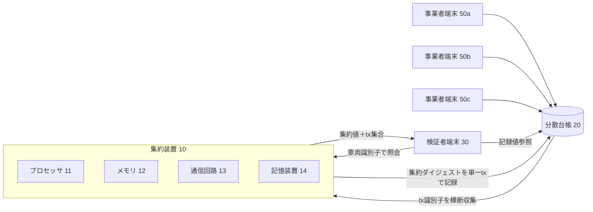
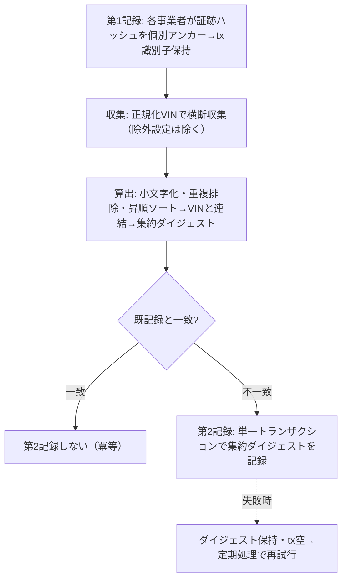
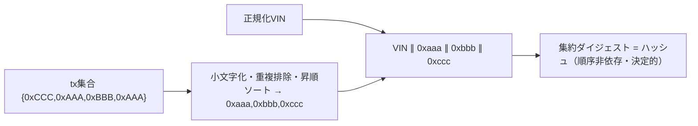
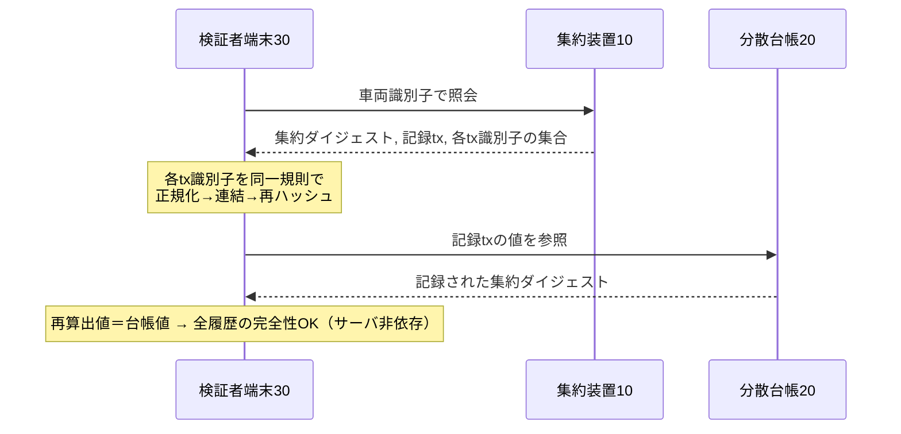

# 明細書：複数事業者に分散した車両施工履歴の完全性証明方法、システム及びプログラム（発明01）

> 区分：**出願基礎ドラフト（弁理士の最終確認を前提とする完成度）**。
> ⚠️ **本件は上位コンセプト（VIN横断集約）を自社開示済み**（[04](../04-disclosure-inventory.md) D5/D6）。独立項は**未公開の機構（順序非依存ダイジェスト→単一トランザクション→第三者再計算）**に限定する。30条の扱いは [10](../10-art30-novelty-exception.md) と弁理士判断による。
> 提出時はJPO様式へ整形・分割（[09 §1](../09-filing-guide.md)）。
> 実装根拠：`src/lib/passport/metaAnchor.ts`（computeMetaAnchorHash, recomputeAndMaybeAnchor）, `normalizeVin.ts`, `api/verify.ts`, `upsertVehiclePassport.ts`。

---

## 【書類名】明細書

### 【発明の名称】
複数事業者に分散した車両施工履歴の完全性証明方法、システム及びプログラム

### 【技術分野】
【0001】
　本発明は、同一の車両に対して互いに独立した複数の事業者がそれぞれ別個に分散台帳へ記録した施工等の証跡について、その全履歴の完全性を、車両単位で集約し、第三者が当該方法を実行する主体のサーバに依存することなく検証可能とする技術に関する。

### 【背景技術】
【0002】
　施工写真等の証跡データの暗号学的ハッシュ値を分散台帳に記録（個別アンカー）し、後の改ざんを検知する手法が知られている。また、車両情報を分散台帳に記録する取り組みも複数存在する。

#### 【先行技術文献】
##### 【特許文献】
【0003】
　【特許文献１】国際公開第2018/014123号（車両記録のための分散台帳プラットフォーム）。

### 【発明の概要】

#### 【発明が解決しようとする課題】
【0004】
　従来は、(1) 記録が事業者ごとに分断され、同一車両の全履歴を一望して一括検証する手段がなく、(2) 全履歴の検証に多数のトランザクションの個別照合を要し第三者にとって現実的でなく、(3) 検証がプラットフォーム事業者のサーバに依存しがちで、当該事業者の廃業やサーバ上のデータ改ざんにより検証が不能となる、という課題があった。

【0005】
　特に、互いに独立した複数の事業者の記録を、いずれの事業者のサーバにも依存することなく、第三者が単一の値の照合によって一括して検証できる手段が求められていた。

#### 【課題を解決するための手段】
【0006】
　本発明は、画像等の単位の個別アンカーの上位に、車両単位の集約アンカー（メタアンカー）の層を設ける。本発明の一態様に係る方法は、少なくとも一つのプロセッサが実行する方法であって、互いに独立した複数の事業者端末の各々が、車両に対して行った施工に関する証跡データの暗号学的ハッシュを分散台帳にそれぞれ個別に記録し、当該記録のトランザクション識別子を保持する第１記録ステップと、正規化された車両識別子に基づき、当該車両に紐づく前記複数の事業者の前記トランザクション識別子を横断的に収集する収集ステップと、収集した前記トランザクション識別子の集合を、重複排除及び所定順序のソートにより順序非依存に正規化し、前記正規化された車両識別子と連結した連結データの集約ダイジェストを算出する算出ステップと、前記集約ダイジェストを単一のトランザクションとして前記分散台帳に記録する第２記録ステップと、を備える。

【0007】
　第２の態様では、前記算出ステップで得た集約ダイジェストが、当該車両について既に記録された集約ダイジェストと一致する場合に、前記第２記録ステップを実行しない（冪等・コスト最適化）。

【0008】
　第３の態様では、前記正規化された車両識別子と、前記集約ダイジェストと、前記トランザクション識別子の集合とを外部に提供し、第三者が前記算出ステップと同一の手順で集約ダイジェストを再算出して前記分散台帳上の記録と照合可能とする（サーバ非依存検証）。

#### 【発明の効果】
【0009】
　車両一台の、事業者をまたいだ全施工履歴の完全性を、単一のトランザクション識別子により証明・検証できる。検証コストは履歴件数に依存せず一定に近づく。検証がプラットフォーム事業者のサーバに依存しないため、当該事業者の廃業やサーバ上の改ざんに対して頑健である。集合が変化しない限り台帳への書込みが発生しないため費用が極小である。個人情報を台帳に記録しないため原本の削除と整合する。

### 【図面の簡単な説明】
【0010】
　【図１】実施形態に係る完全性証明システム１の全体構成を示すブロック図である。
　【図２】個別アンカーから集約アンカーへの処理の流れを示すフロー図である。
　【図３】集約ダイジェストの算出（順序非依存の正規化）を示す模式図である。
　【図４】第三者によるサーバ非依存検証の流れを示すシーケンス図である。

### 【発明を実施するための形態】

#### 〔システム構成〕
【0011】
　図１に示すように、本実施形態に係るシステム１は、集約装置１０と、複数の事業者端末５０（５０ａ、５０ｂ、５０ｃ）と、分散台帳２０と、検証者端末３０とを含む。集約装置１０は、少なくとも一つのプロセッサ１１と、メモリ１２と、通信回路１３と、車両単位のレコードを格納する記憶装置１４とを備える。本発明は、ソフトウェアによる情報処理が、これらのハードウェア資源を用いて具体的に実現されるものである。各事業者端末５０は、互いに独立した事業者（整備工場、コーティング店、PPF施工店等）が運用する。

#### 〔第１記録（個別アンカー）〕
【0012】
　第１記録ステップにおいて、各事業者端末５０は、自らの施工に係る証跡データ（施工写真等）の暗号学的ハッシュを算出し、これを分散台帳２０に個別に記録する。記録の結果として得られるトランザクション識別子は、当該事業者の記録に対応付けて保持される。

#### 〔正規化車両識別子による横断収集〕
【0013】
　収集ステップにおいて、集約装置１０のプロセッサ１１は、車両識別番号（VIN）を正規化したキー（一例として、大文字化、全角から半角への統一、及び区切り文字の除去を施したもの）を用い、当該キーに紐づく、互いに独立した複数の事業者が保有する施工記録から、前記トランザクション識別子を横断的に収集する。このとき、集約の対象から除外する旨が設定された事業者の記録は、収集の対象から除外される。

#### 〔順序非依存の集約ダイジェスト算出〕
【0014】
　算出ステップにおいて、プロセッサ１１は、収集したトランザクション識別子の集合に対し、小文字化、重複排除、及び昇順ソートを施して順序非依存に正規化する。次いで、正規化された車両識別子と、正規化された当該集合とを所定の区切り（一例として改行）で連結し、当該連結データの暗号学的ハッシュ（一例としてSHA-256）を集約ダイジェストとして算出する。図３に示すように、ソートにより、施工の順序や記録の追加順序に依存することなく、当該集合から同一の集約ダイジェストが決定的に得られる。したがって、当該集合を保持する任意の主体は、必ず同一の集約ダイジェストに到達する。

#### 〔第２記録（集約アンカー）と冪等制御〕
【0015】
　第２記録ステップにおいて、プロセッサ１１は、算出した集約ダイジェストを、単一のトランザクションとして分散台帳２０に記録する。記録の結果（トランザクション識別子、ネットワーク識別子、確定時刻、対象とした記録の数等）は、記憶装置１４の車両単位のレコードに保持される。

【0016】
　再計算により得た集約ダイジェストが、当該車両について既に記録済みの集約ダイジェストと一致する場合、プロセッサ１１は第２記録ステップを実行しない。これにより、新たな施工が増えて集合が変化したとき等、集合が変化した場合にのみ新たなトランザクションが発行され、台帳への書込み及びその費用が最小化される。第２記録が失敗した場合、プロセッサ１１は、集約ダイジェストを保持しつつトランザクション識別子の欄を空のまま残し、定期処理により第２記録ステップを再試行する。

#### 〔サーバ非依存検証〕
【0017】
　図４に示すように、集約装置１０は、正規化された車両識別子と、集約ダイジェストと、その記録に係るトランザクション識別子と、構成要素である各トランザクション識別子の集合とを、検証者端末３０に対して提供する。検証者端末３０は、提供された各トランザクション識別子を、前記算出ステップと同一の規則（小文字化・重複排除・昇順ソート・車両識別子との連結・ハッシュ）で処理して集約ダイジェストを再算出し、分散台帳２０に記録された集約ダイジェストと照合する。両者が一致する場合、検証者端末３０は、当該車両の全履歴の完全性を、集約装置１０又は各事業者端末５０のサーバを信頼することなく確認できる。

#### 〔プライバシー〕
【0018】
　個人情報は分散台帳２０に一切記録されない。台帳２０に記録されるのは、固定長のハッシュ（個別アンカーのハッシュ及び集約ダイジェスト）のみである。したがって、原本のデータを削除すれば、台帳上に残る情報からは個人情報を復元できず、実質的に当該個人情報は復元不能となる。

#### 〔具体例〕
【0019】
　一例として、事業者Ａが記録したトランザクション識別子「0xAAA…」、事業者Ｂが記録した「0xBBB…」、事業者Ｃが記録した「0xCCC…」が、正規化車両識別子「JH4…」に紐づくとする。プロセッサ１１は、これらを小文字化・重複排除・昇順ソートし、「JH4…」と当該ソート済み集合とを改行で連結した文字列のSHA-256を集約ダイジェストとして算出し、単一トランザクションで台帳に記録する。後に事業者Ｄの記録「0xDDD…」が追加されると集合が変化するため、新たな集約ダイジェストが算出され、新たな単一トランザクションで記録される。一方、追加がなければ再計算値は前回値と一致するため、記録は行われない。

#### 〔変形例〕
【0020】
　前記暗号学的ハッシュはSHA-256に限られない。集約の正規化は、平の連結によるハッシュに限られず、各トランザクション識別子を葉とするハッシュ木（Merkle 木）のルートを集約ダイジェストとし、個別の包含証明を併せて提供する構成としてもよい。前記分散台帳は特定のブロックチェーンに限られない。前記集約対象には、施工写真の個別アンカーに限らず、部品の装着に係る内容ハッシュ等、当該車両に紐づく他の証跡のハッシュを含めてよい。

### 【符号の説明】
【0021】
　１…完全性証明システム、１０…集約装置、１１…プロセッサ、１２…メモリ、１３…通信回路、１４…記憶装置、２０…分散台帳、３０…検証者端末、５０（５０ａ〜５０ｃ）…事業者端末。

### 【産業上の利用可能性】
【0022】
　本発明は、中古車流通、保険査定、整備履歴の真正性証明等の分野において、複数事業者に分散した車両履歴の完全性を効率的かつ頑健に証明する用途に利用でき、産業上の利用可能性を有する。

---

## 【書類名】特許請求の範囲

> ⚠️ 独立項は「越境集約」コンセプト（自社開示済み）を中心に据えず、**未公開の機構**を中心に構成する（[01提案書 §6](../01-vehicle-passport-meta-anchor.md)、[10](../10-art30-novelty-exception.md)）。

### 【請求項１】
　少なくとも一つのプロセッサが実行する車両施工履歴の完全性証明方法であって、
　互いに独立した複数の事業者端末の各々が、車両に対して行った施工に関する証跡データの暗号学的ハッシュを分散台帳にそれぞれ個別に記録し、当該記録のトランザクション識別子を保持する第１記録ステップと、
　正規化された車両識別子に基づき、当該車両に紐づく前記複数の事業者の前記トランザクション識別子を横断的に収集する収集ステップと、
　収集した前記トランザクション識別子の集合を、重複排除及び所定順序のソートにより順序非依存に正規化し、前記正規化された車両識別子と連結した連結データの集約ダイジェストを算出する算出ステップと、
　前記集約ダイジェストを単一のトランザクションとして前記分散台帳に記録する第２記録ステップと、を備える、
　車両施工履歴の完全性証明方法。

### 【請求項２】
　前記算出ステップで得た集約ダイジェストが、当該車両について既に記録された集約ダイジェストと一致する場合に、前記第２記録ステップを実行しないことを特徴とする、請求項１に記載の方法。

### 【請求項３】
　前記正規化された車両識別子と、前記集約ダイジェストと、前記トランザクション識別子の集合とを外部に提供し、第三者が前記算出ステップと同一の手順で集約ダイジェストを再算出して前記分散台帳上の記録と照合可能とする、請求項１又は２に記載の方法。

### 【請求項４】
　前記収集ステップが、前記複数の事業者のうち集約対象から除外する旨が設定された事業者の記録を除外する、請求項１〜３のいずれか一項に記載の方法。

### 【請求項５】
　前記証跡データに含まれる個人情報を前記分散台帳に記録せず、前記証跡データの原本の削除により当該個人情報を復元不能化する、請求項１〜４のいずれか一項に記載の方法。

### 【請求項６】
　前記第２記録ステップが失敗した場合に、前記集約ダイジェストを保持しつつ前記トランザクション識別子を空のまま残し、定期処理により前記第２記録ステップを再試行する、請求項１〜５のいずれか一項に記載の方法。

### 【請求項７】
　前記集約ダイジェストの算出が、前記トランザクション識別子の各々を葉とするハッシュ木のルートを算出することを含む、請求項１〜６のいずれか一項に記載の方法。

### 【請求項８】
　少なくとも一つのプロセッサと、メモリと、通信回路とを備え、
　前記プロセッサが、互いに独立した複数の事業者が車両に対して行った施工に関する証跡データの暗号学的ハッシュが分散台帳に個別に記録された際のトランザクション識別子を、正規化された車両識別子に基づき横断的に収集し、収集した前記トランザクション識別子の集合を重複排除及び所定順序のソートにより順序非依存に正規化して前記正規化された車両識別子と連結した連結データの集約ダイジェストを算出し、当該集約ダイジェストを単一のトランザクションとして前記分散台帳に記録するよう構成された、
　車両施工履歴完全性証明システム。

### 【請求項９】
　コンピュータに、請求項１〜７のいずれか一項に記載の各ステップを実行させるためのプログラム。

---

## 【書類名】要約書

### 【課題】
　互いに独立した複数事業者に分散した同一車両の施工履歴について、全履歴の完全性を車両単位で、かつサーバ非依存で第三者が検証できるようにする。

### 【解決手段】
　各事業者が施工証跡のハッシュを分散台帳に個別記録しトランザクション識別子を保持する。集約装置は、正規化車両識別子で複数事業者のトランザクション識別子を横断収集し、重複排除・昇順ソートにより順序非依存に正規化して車両識別子と連結し、その集約ダイジェストを算出する。集約ダイジェストを単一トランザクションで台帳に記録する。集合が不変なら再記録しない。識別子集合と集約ダイジェストを公開し、第三者が同一手順で再算出して台帳記録値と照合することで、サーバに依存することなく全履歴の完全性を検証する。台帳にはハッシュのみを記録し原本削除で個人情報を復元不能化する。（約340字）

### 【選択図】
　図２

---

## 【書類名】図面

### 【図１】システム全体構成

### 【図２】個別アンカー→集約アンカー（フロー）

### 【図３】順序非依存の集約ダイジェスト

### 【図４】第三者によるサーバ非依存検証

