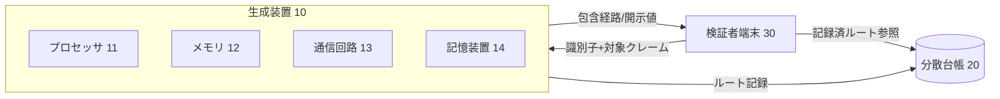
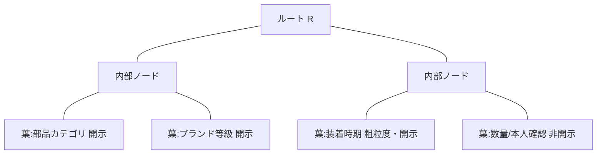
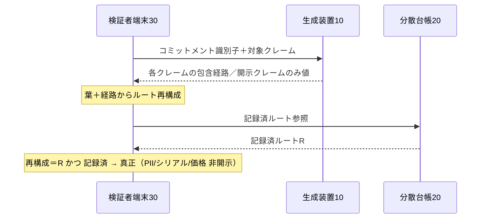

# 明細書：車両部品の装着に関する選択的開示証明方法、システム及びプログラム（発明06）

> 区分：**出願基礎ドラフト（弁理士の最終確認を前提とする完成度）**。本書は本人出願の基礎、又は弁理士へ渡す near-final 原稿として作成。最終的な請求項の権利範囲、発明該当性・進歩性の評価、先行技術クリアランスは弁理士の確認による。
> 提出時はJPO様式（HTML/XML）へ整形し、明細書／特許請求の範囲／要約書／図面の各書類に分割する（[09 §1](../09-filing-guide.md)）。
> 実装根拠：`src/lib/zkp/commitment.ts`, `merkleTree.ts`, `verifier.ts`, `types.ts`, `src/app/api/insurer/zkp/verify/route.ts`, `supabase/migrations/20260603020000_zkp_commitments.sql`。

---

## 【書類名】明細書

### 【発明の名称】
車両部品の装着に関する選択的開示証明方法、システム及びプログラム

### 【技術分野】
【0001】
　本発明は、車両に装着された部品に関する事実を、検証者に対して必要最小限の属性のみを開示しつつ、当該事実の真正性を、当該方法を実行する主体のサーバに依存することなく前記検証者が検証可能とする、選択的開示証明の技術に関する。より具体的には、装着事実を表す複数のクレームのうち一部を平文で開示し、他を秘匿したまま、当該秘匿されたクレームを含む全クレームの所定時点における固定を、分散台帳に記録された単一のコミットメント値に対する包含検証により担保する技術に関する。

### 【背景技術】
【0002】
　施工や部品交換の証跡データの暗号学的ハッシュ値を分散台帳に記録（アンカリング）し、後の改ざんを検知する手法が知られている。また、ハッシュ木や検証可能クレデンシャルを用いて、保持する情報のうち一部の項目のみを相手に開示する選択的開示の手法も一般に知られている。

【0003】
　他方、保険金の査定や事故対応等の場面では、検証者である保険会社等は「当該車両に所定グレードの部品が所定の時期に装着された」という事実のみを確認できれば足り、顧客の氏名・住所等の個人情報、部品の個体識別子（シリアル番号）、仕入価格、及び車両識別番号（VIN）の完全値といった情報まで取得する必要はない。むしろこれらの開示は、個人情報の保護及び事業者の営業秘密の保持の観点から回避すべきである。

#### 【先行技術文献】
##### 【特許文献】
【0004】
　【特許文献１】特開2024-022912号公報（サプライチェーンにおける累積価値を秘匿化する情報秘匿化）。

##### 【非特許文献】
【0005】
　【非特許文献１】ハッシュ木（Merkle 木）を用いた選択的開示に関する技術文献。
　【非特許文献２】分散台帳を用いた存在証明・時刻証明に関する技術文献。

### 【発明の概要】

#### 【発明が解決しようとする課題】
【0006】
　従来の「証跡データの全体開示」による検証では、検証に不要な個人情報及び営業秘密までもが検証者に開示されるという課題があった。

【0007】
　また、検証のために当該方法を実行する主体（プラットフォーム事業者）のサーバへ照会する構成では、(i) 検証が当該サーバへの信頼に依存し、当該主体の廃業や当該サーバ上のデータの改ざんによって検証が不能又は不正確となる、(ii) 秘匿された属性が確定後に改変されていないことを検証者が独立に確認できない、という課題があった。

【0008】
　すなわち、「検証に必要な属性のみを真正に開示し、不要な属性は秘匿したまま、当該秘匿された属性をも含めて所定時点の内容が固定されていること」を、前記主体のサーバに依存することなく第三者が検証できる手段が求められていた。単なるアクセス制御による出し分けでは、上記(i)(ii)の課題は解決されない。

【0009】
　加えて、装着時刻のような連続値や、数量・真偽値のような取り得る値の数が少ない（低エントロピーの）属性を秘匿対象とする場合、コミットメント値からの逆算（辞書攻撃）に対する耐性、及び開示の粒度の制御が課題となる。

#### 【課題を解決するための手段】
【0010】
　上記課題を解決するため、本発明の一態様に係る選択的開示証明方法は、少なくとも一つのプロセッサが実行する方法であって、車両に装着された部品に関する複数のクレームを生成するクレーム生成ステップであって、各クレームに開示又は非開示の別を付与するステップと、各クレームについて、当該クレームの値と、秘密値を鍵とする決定的関数により導出したノンスとに基づく葉コミットメントを算出する算出ステップと、前記葉コミットメントから木構造のルートを算出し、当該ルートを分散台帳に記録する記録ステップと、検証者から指定されたクレームについて、前記木構造における包含経路を提供するとともに、前記開示の別が開示であるクレームについてのみ当該クレームの値を提供する開示ステップと、を備える。そして、前記検証者が、提供された前記包含経路から再構成したルートを前記分散台帳に記録された前記ルートと照合することにより、前記部品の装着に関する真正性を、前記非開示のクレームの値及び前記方法を実行する主体のサーバに依存することなく検証可能とする。

【0011】
　第２の態様では、前記クレームは、装着時刻を所定期間単位に丸めた粗粒度の時期クレームを含む。

【0012】
　第３の態様では、前記ノンスは、サーバ秘密のソルトを鍵とし、コミットメント識別子、クレーム種別及び当該クレームの値を入力とする鍵付きハッシュにより導出され、当該ソルトを知らない第三者が前記葉コミットメントから前記値を逆算できない。

【0013】
　第４の態様では、前記複数のクレームは、開示されるクレームと、値を秘匿したまま固定のみを証明するクレームとを、単一の前記木構造内に混在して含む。

【0014】
　第５の態様では、前記検証は、前記包含経路の検証に加え、前記ルートが前記分散台帳に記録済みであることを条件として全体の有効性を判定する。

#### 【発明の効果】
【0015】
　本発明によれば、検証者は、顧客の個人情報・部品個体識別子・価格・車両識別子の完全値を取得することなく、所定グレードの部品が所定時期に装着された事実を、数学的（暗号学的）に検証できる。検証は当該方法を実行する主体のサーバに依存しないため、当該主体の廃業やサーバ上のデータ改ざんに対して頑健である。秘匿された属性も所定時点で固定されるため、開示属性のみを事後的に差し替える不正を防止できる。分散台帳にはルートのみが記録されるため、個人情報及び営業秘密が台帳上に残存せず、原本の削除と整合する。さらに、時期の粗粒度化により必要最小限の時間粒度のみを開示でき、鍵付きノンスにより低エントロピーの秘匿値の逆算を防止できる。

### 【図面の簡単な説明】
【0016】
　【図１】実施形態に係る選択的開示証明システム１の全体構成を示すブロック図である。
　【図２】コミットメントの生成及び分散台帳への記録の流れを示すフロー図である。
　【図３】クレームの分類（開示／非開示／粗粒度）と木構造の構成例を示す模式図である。
　【図４】検証者によるサーバ非依存の選択的開示検証の流れを示すシーケンス図である。
　【図５】葉コミットメント及びノンスの導出を示す模式図である。

### 【発明を実施するための形態】

#### 〔システム構成〕
【0017】
　図１に示すように、本実施形態に係る選択的開示証明システム１は、生成装置１０と、分散台帳２０と、検証者端末３０とを含む。生成装置１０は、少なくとも一つのプロセッサ１１と、メモリ１２と、通信回路１３と、記憶装置１４とを備えるコンピュータである。プロセッサ１１は、メモリ１２に展開されたプログラムを実行することにより、後述するクレーム生成、葉コミットメントの算出、ルートの算出及び記録、並びに包含経路の提供を実行する。記憶装置１４は、コミットメントの識別子、木構造のルート、各クレームの種別・値・葉コミットメント等を格納する。通信回路１３は、分散台帳２０を構成するノード及び検証者端末３０と通信する。

【0018】
　すなわち本発明は、ソフトウェアによる情報処理が、プロセッサ１１、メモリ１２、通信回路１３及び記憶装置１４というハードウェア資源を用いて具体的に実現されるものである。分散台帳２０は、ブロックチェーン等の、記録の追記後の改ざんが計算量的に困難な台帳であり、一例として複数のノードによりトランザクションを連鎖的に保持する。検証者端末３０は、保険会社等の検証者が操作する装置であり、生成装置１０から包含経路等を取得し、分散台帳２０を参照してルートを照合する。

【0019】
　部品の装着は、互いに独立した複数の事業者（整備工場、コーティング店、PPF施工店等）の各々によって行われ得る。生成装置１０は、各事業者の業務システムの一部、又はこれらが共用するプラットフォームの一部として実現され得る。

#### 〔クレームの生成と分類〕
【0020】
　クレーム生成ステップにおいて、プロセッサ１１は、一の装着イベント（一の部品の装着完了）について、当該装着に関する複数のクレームＣを生成する。各クレームＣは、クレーム種別を示すキーと、値と、開示又は非開示の別とを有する。

【0021】
　開示クレームの例は、部品カテゴリ（例：「ブレーキパッド」）、ブランド等級（例：「OEM」「認定アフターマーケット」「汎用アフターマーケット」「不明」のいずれか）、本人性保証グレード、及び装着時期である。非開示（コミットのみ）クレームの例は、数量、部品の個体識別子の保有を示す指紋、及び本人確認の有無を示す真偽値である。

【0022】
　図３に示すように、装着時期のクレームは、装着時刻のISO形式の値を月単位のバケット（例：「2026-06」）に丸めてから生成する。これにより、日・時・分等の精細な時刻を開示することなく「いつ頃」のみを開示可能とする（粗粒度化）。バケットの単位は、月に限らず、四半期、年、又は任意の期間としてよい。

#### 〔ノンス及び葉コミットメントの算出〕
【0023】
　図５に示すように、算出ステップにおいて、プロセッサ１１は、各クレームＣについて、まずノンスＮを決定的関数により導出する。一例として、ノンスＮは、サーバ秘密のソルトＳを鍵とし、コミットメント識別子と、クレーム種別と、当該クレームの値とを連結した文字列を入力とする鍵付きハッシュ（HMAC）として算出される（Ｎ＝HMAC_S(コミットメント識別子∥種別∥値)）。

【0024】
　次いで、プロセッサ１１は、各クレームＣの葉コミットメントＬを、当該クレームの種別、値及び前記ノンスＮを所定の区切りで連結した文字列の暗号学的ハッシュ（例：SHA-256）として算出する（Ｌ＝H(種別∥値∥Ｎ)）。

【0025】
　ノンスＮが上記のとおり決定的に導出されるため、生成装置１０は、後の時点においても同一の葉コミットメントＬ及び包含経路を再生成できる。一方、ソルトＳを知らない第三者は、数量や真偽値のような取り得る値の数が少ない秘匿値であっても、葉コミットメントＬから当該値を逆算（辞書攻撃）することができない。これにより、低エントロピーの秘匿値の秘匿性が担保される。

#### 〔木構造のルートの算出と記録〕
【0026】
　記録ステップにおいて、プロセッサ１１は、全クレームの葉コミットメントＬから木構造（二分ハッシュ木）のルートＲを算出する。一例として、各内部ノードは左右の子ノードのハッシュ値を連結したものの暗号学的ハッシュとして算出され、葉の数が奇数の場合は最後の葉を複製して数を偶数に整える。

【0027】
　プロセッサ１１は、算出したルートＲを、通信回路１３を介して分散台帳２０に記録する。台帳２０には、個別のクレームの値も、ハッシュ前の値も記録されず、固定長のルートＲのみが記録される。記録の結果として得られるトランザクション識別子、ネットワーク識別子及び確定時刻は、記憶装置１４にコミットメントの識別子と対応付けて格納される。台帳２０への記録が失敗した場合でも、コミットメントの識別子は返却され、後の再試行により記録が補完されてよい。

#### 〔開示と検証〕
【0028】
　開示ステップにおいて、生成装置１０は、検証者端末３０から、コミットメントの識別子と、検証対象のクレーム種別の指定とを受け付ける。プロセッサ１１は、指定された各クレームについて、当該クレームの葉コミットメントから前記ルートＲに至る包含経路Ｐ（経路上の各兄弟ノードのハッシュ値と、当該兄弟が左右いずれの子であるかを示す位置情報との列）を生成する。開示クレームについては当該クレームの値を付し、非開示クレームについては値を付さず包含経路Ｐのみを付して、検証者端末３０へ返す。

【0029】
　図４に示すように、検証者端末３０は、受領した葉コミットメント（又は開示値及びノンスから再計算した葉コミットメント）と包含経路Ｐとから、ルートを再構成する。具体的には、葉コミットメントに対し、包含経路Ｐ上の各兄弟ノードを位置情報に従って順次連結及びハッシュしてゆき、最終的に得られた値を再構成ルートとする。検証者端末３０は、分散台帳２０を参照して記録済みのルートＲを取得し、再構成ルートと記録済みルートＲとが一致するか否かを判定する。

【0030】
　一致する場合、検証者端末３０は、開示クレームの値が当該木構造に確かに含まれていた真正の値であり、かつ非開示クレームも当該所定時点で固定されていることを、生成装置１０のサーバに照会することなく確認できる。さらに、検証者端末３０は、当該ルートＲが分散台帳２０に記録済みであること（存在）を全体の有効性の条件とする。これにより、属性の固定と、当該固定がなされた時刻の存在とが同時に保証される。検証者端末３０へは、個人情報、部品個体識別子、価格及び車両識別子の完全値は提供されない。

#### 〔具体的なデータ例〕
【0031】
　一例として、一の装着イベントについて、開示クレームとして{種別＝部品カテゴリ, 値＝"brake_pad_oem", 開示}, {種別＝ブランド等級, 値＝"oem", 開示}, {種別＝保証グレード, 値＝"customer_otp", 開示}, {種別＝装着時期, 値＝"2026-06", 開示}が生成され、非開示クレームとして{種別＝数量, 値＝"2", 非開示}, {種別＝個体指紋の保有, 値＝(指紋値又は"none"), 非開示}, {種別＝本人確認の有無, 値＝"true", 非開示}が生成される。検証者が「ブランド等級」と「装着時期」と「本人確認の有無」を指定した場合、検証者には、ブランド等級の値"oem"及び装着時期の値"2026-06"が、それぞれの包含経路とともに返される一方、本人確認の有無については値が返されず、包含経路のみが返される。検証者は三者の包含経路から再構成したルートを台帳記録値と照合し、いずれも真正であることを確認する。

#### 〔変形例〕
【0032】
　前記木構造はSHA-256によるハッシュ木に限られず、他の暗号学的ハッシュ関数を用いてよい。また、選択的開示の機構は、ハッシュ木による包含証明に限られず、ゼロ知識証明回路（例えばGroth16、PLONK又はNoir等）を用いた実装によっても実現してよい。すなわち、特許請求の範囲に記載の「葉コミットメント」「木構造のルート」「包含経路」は、これらと均等な役割を果たすコミットメント、集約値及び証明として把握される。

【0033】
　前記分散台帳２０は、特定のブロックチェーンに限られず、複数のノードにより記録の改ざん耐性を担保する任意の台帳であってよい。前記秘密値を鍵とする決定的関数は、HMACに限られず、鍵付きハッシュ又は擬似乱数関数として実現してよい。前記開示クレーム及び非開示クレームの組合せ、並びに粗粒度化の単位は、用途に応じて任意に設定してよい。

【0034】
　非開示クレームの一として、別途、利用者本人の所持証明に束ねて確定された装着確認の状態を表すクレーム（例えば本人確認の有無）を含めてよい。当該確定の機構は、利用者の物理的な所持に束ねた確定をデータベース層で強制するもの（別途の発明）であってよく、本発明はその確定状態をコミットメント対象として取り込む。

【0035】
　本発明の適用は車両部品に限られず、装着・取付・施工の対象物一般に適用してよいが、車両部品及びその保険検証の文脈において特に有用である。

#### 〔処理フロー〕
【0036】
　図２に示すように、生成装置１０は、装着イベントの発生（Ｓ１）に応じて、複数のクレームを生成し（Ｓ２）、各クレームの値と決定的ノンスとから葉コミットメントを算出し（Ｓ３）、木構造のルートを算出し（Ｓ４）、当該ルートを分散台帳に記録する（Ｓ５）。その後、検証者からの要求（Ｓ６）に応じて、指定クレームの包含経路を生成し、開示クレームの値とともに提供する（Ｓ７）。

### 【符号の説明】
【0037】
　１…選択的開示証明システム、１０…生成装置、１１…プロセッサ、１２…メモリ、１３…通信回路、１４…記憶装置、２０…分散台帳、３０…検証者端末、Ｃ…クレーム、Ｌ…葉コミットメント、Ｎ…ノンス、Ｓ…ソルト、Ｒ…ルート、Ｐ…包含経路。

### 【産業上の利用可能性】
【0038】
　本発明は、車両の整備・部品交換に係る記録の真正性を、個人情報及び営業秘密を保護しつつ第三者（保険会社、査定者、購入者等）に証明する用途に利用できる。中古車流通、保険査定、リコール対応等の分野において産業上の利用可能性を有する。

---

## 【書類名】特許請求の範囲

### 【請求項１】
　少なくとも一つのプロセッサが実行する選択的開示証明方法であって、
　車両に装着された部品に関する複数のクレームを生成するクレーム生成ステップであって、各クレームに開示又は非開示の別を付与するステップと、
　各クレームについて、当該クレームの値と、秘密値を鍵とする決定的関数により導出したノンスとに基づく葉コミットメントを算出する算出ステップと、
　前記葉コミットメントから木構造のルートを算出し、当該ルートを分散台帳に記録する記録ステップと、
　検証者から指定されたクレームについて、前記木構造における包含経路を提供するとともに、前記開示の別が開示であるクレームについてのみ当該クレームの値を提供する開示ステップと、を備え、
　前記検証者が、提供された前記包含経路から再構成したルートを前記分散台帳に記録された前記ルートと照合することにより、前記部品の装着に関する真正性を、前記非開示のクレームの値及び前記方法を実行する主体のサーバに依存することなく検証可能とする、
　選択的開示証明方法。

### 【請求項２】
　前記クレームが、装着時刻を所定期間単位に丸めた粗粒度の時期クレームを含む、請求項１に記載の選択的開示証明方法。

### 【請求項３】
　前記ノンスが、サーバ秘密のソルトを鍵とし、コミットメント識別子、クレーム種別及び当該クレームの値を入力とする鍵付きハッシュにより導出され、前記ソルトを知らない第三者が前記葉コミットメントから当該値を逆算できないことを特徴とする、請求項１又は２に記載の選択的開示証明方法。

### 【請求項４】
　前記複数のクレームが、開示されるクレームと、値を秘匿したまま固定のみを証明するクレームとを、単一の前記木構造内に混在して含む、請求項１〜３のいずれか一項に記載の選択的開示証明方法。

### 【請求項５】
　前記検証者による検証が、前記包含経路の検証に加え、前記ルートが前記分散台帳に記録済みであることを条件として全体の有効性が判定されるものである、請求項１〜４のいずれか一項に記載の選択的開示証明方法。

### 【請求項６】
　前記開示ステップにおいて、個人情報、部品個体識別子、価格及び車両識別子の完全値を前記検証者へ提供しない、請求項１〜５のいずれか一項に記載の選択的開示証明方法。

### 【請求項７】
　前記非開示のクレームが、別途、利用者本人の所持証明に束ねて確定された装着確認の状態を表すクレームを含む、請求項１〜６のいずれか一項に記載の選択的開示証明方法。

### 【請求項８】
　前記木構造が二分ハッシュ木であり、各内部ノードが左右の子ノードのハッシュ値に基づき算出され、葉の数が奇数の場合に最後の葉が複製される、請求項１〜７のいずれか一項に記載の選択的開示証明方法。

### 【請求項９】
　少なくとも一つのプロセッサと、メモリと、通信回路とを備え、
　前記プロセッサが、車両に装着された部品に関する複数のクレームを各クレームに開示又は非開示の別を付与して生成し、各クレームについて当該クレームの値と秘密値を鍵とする決定的関数により導出したノンスとに基づく葉コミットメントを算出し、前記葉コミットメントから木構造のルートを算出して当該ルートを分散台帳に記録し、検証者から指定されたクレームについて前記木構造における包含経路を提供するとともに開示の別が開示であるクレームについてのみ当該クレームの値を提供するよう構成され、
　前記検証者が、提供された前記包含経路から再構成したルートを前記分散台帳に記録された前記ルートと照合することにより、前記部品の装着に関する真正性を前記非開示のクレームの値及び当該システムのサーバに依存することなく検証可能とする、
　選択的開示証明システム。

### 【請求項１０】
　コンピュータに、請求項１〜８のいずれか一項に記載の各ステップを実行させるためのプログラム。

---

## 【書類名】要約書

### 【課題】
　車両部品の装着事実を、個人情報・部品個体識別子・価格・車両識別子の完全値を開示せず、かつ当該方法を実行する主体のサーバに依存することなく第三者が検証できるようにする。

### 【解決手段】
　生成装置は、装着イベントから開示・非開示の別を付した複数のクレームを生成し、各クレームの値と秘密値を鍵とする決定的ノンスとから葉コミットメントを算出する。葉から木構造のルートを算出し、当該ルートのみを分散台帳に記録する。検証者には、指定クレームの包含経路を提供し、開示クレームのみ値を付す。検証者は包含経路から再構成したルートを台帳記録値と照合し、開示属性の真正性と非開示属性の固定とをサーバ非依存で検証する。装着時期は所定期間単位に粗粒度化し、鍵付きノンスにより低エントロピー秘匿値の逆算を防止する。ルートが台帳に記録済みであることを有効性の条件とする。（約330字）

### 【選択図】
　図１

---

## 【書類名】図面

### 【図１】システム全体構成


### 【図２】生成・記録フロー
```mermaid
flowchart TD
    A[S1 装着イベント] --> B[S2 クレーム生成 開示/非開示/粗粒度]
    B --> C[S3 葉=H 種別|値|nonce ／ nonce=HMAC_S]
    C --> D[S4 木構造ルート算出]
    D --> E[S5 ルートのみ台帳記録]
    E --> F[S6 検証要求受領]
    F --> G[S7 包含経路提供＋開示クレームのみ値]
```

### 【図３】クレーム分類と木構造


### 【図４】サーバ非依存検証（シーケンス）


### 【図５】ノンス・葉の導出
```mermaid
flowchart LR
    K[種別] --> H[葉 L = H 種別|値|nonce]
    Vv[値] --> H
    S[ソルト S] --> NN[nonce = HMAC_S 識別子|種別|値]
    NN --> H
```
