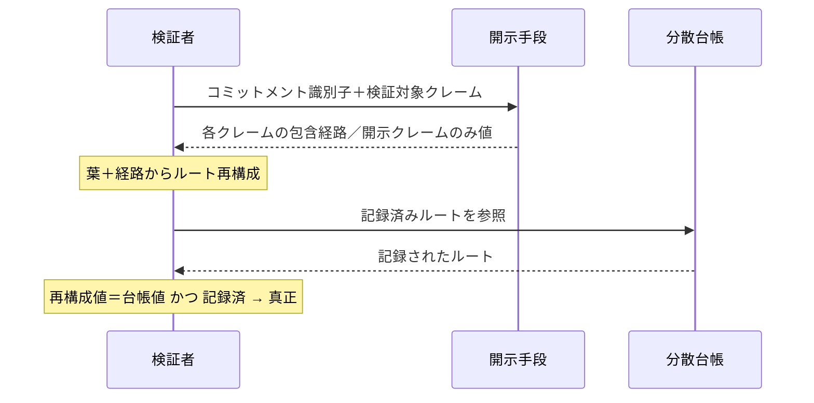

# 【明細書ドラフト】発明06：部品装着クレームの選択的開示証明

> ⚠️ **出願前ドラフト（たたき台）**。請求項の最終確定・先行技術クリアランス・30条判断は弁理士へ。
> 提出時は本MarkdownをJPO様式（HTML/XML）へ整形し、明細書・特許請求の範囲・要約書・図面の各書類に分割すること（[09 §1](../09-filing-guide.md)）。
> 対応：発明提案書 [06](../06-zkp-selective-disclosure.md)／実装 `src/lib/zkp/`。

---

## 【書類名】明細書

### 【発明の名称】
車両部品の装着に関する選択的開示証明方法、システム及びプログラム

### 【技術分野】
【0001】
　本発明は、車両に装着された部品に関する事実を、検証者に対して必要最小限の属性のみ開示しつつ、検証者が当該事実の真正性を、前記方法を実行する主体のサーバに依存せずに検証可能とする、選択的開示証明の技術に関する。

### 【背景技術】
【0002】
　施工や部品交換の証跡データの暗号学的ハッシュを分散台帳に記録（アンカリング）し、後の改ざんを検知する手法が知られている。また、検証可能クレデンシャルやハッシュ木を用いて、保持する情報の一部のみを開示する選択的開示の手法も一般に知られている。

【0003】
　一方、保険金査定や事故対応等の場面では、検証者（保険会社等）は「当該車両に所定グレードの部品が所定時期に装着された」という事実のみを確認できれば足り、顧客の個人情報、部品の個体識別子（シリアル番号）、仕入価格、車両識別番号の完全値といった情報まで取得する必要はない。むしろこれらの開示は、個人情報保護や営業秘密保持の観点から避けるべきである。

#### 【先行技術文献】
【0004】
　【非特許文献１】Merkle 木による選択的開示に関する技術文献。
　【特許文献１】サプライチェーンにおける累積価値を秘匿化する情報秘匿化に関する文献（特開2024-022912）。

### 【発明の概要】

#### 【発明が解決しようとする課題】
【0005】
　従来の「証跡データの全体開示」や「方法実行主体のサーバへの照会」による検証では、(1) 過剰な個人情報・営業秘密の開示、(2) 当該サーバへの信頼依存（当該主体の廃業や改ざんにより検証不能となる）、という課題があった。

【0006】
　すなわち、「必要な属性のみを真正に開示し、不要な属性は秘匿したまま、当該秘匿された属性も含めて所定時点の内容が固定されていること」を、サーバに依存せずに第三者が検証できる手段が求められていた。単なるアクセス制御では、方法実行主体のサーバを信頼することとなり、かつ秘匿された属性が後から改変されていないことを第三者が確認できない。

#### 【課題を解決するための手段】
【0007】
　本発明に係る選択的開示証明方法は、車両に装着された部品に関する複数のクレームを生成するクレーム生成ステップであって、各クレームに開示又は非開示の別を付与するステップと、各クレームについて、当該クレームの値と、秘密値を鍵とする決定的関数により導出したノンスとに基づく葉コミットメントを算出する算出ステップと、前記葉コミットメントから木構造のルートを算出し、当該ルートを分散台帳に記録する記録ステップと、検証者から指定されたクレームについて、前記木構造における包含経路を提供するとともに、前記開示の別が開示であるクレームについてのみ当該クレームの値を提供する開示ステップと、を備える。

【0008】
　前記検証者は、提供された前記包含経路から再構成したルートを、前記分散台帳に記録された前記ルートと照合することにより、前記部品の装着に関する真正性を、前記非開示のクレームの値、及び前記方法を実行する主体のサーバに依存せずに検証する。

【0009】
　好ましくは、前記クレームは、装着時刻を所定期間単位に丸めた粗粒度の時期クレームを含む（粒度低減）。

【0010】
　好ましくは、前記ノンスは、サーバ秘密のソルトを鍵とし、コミットメント識別子・クレーム種別・当該クレームの値を入力とする鍵付きハッシュにより導出され、当該ソルトを知らない第三者が前記葉コミットメントから前記値を逆算できない（低エントロピー秘匿値の辞書攻撃耐性）。

【0011】
　好ましくは、前記複数のクレームは、開示されるクレームと、値を秘匿したまま固定のみを証明するクレームとを、単一の前記木構造内に混在して含む。

#### 【発明の効果】
【0012】
　本発明によれば、検証者は、顧客の個人情報・部品個体識別子・価格・車両識別子の完全値を取得することなく、所定グレードの部品が所定時期に装着された事実を数学的に検証できる。検証は方法実行主体のサーバに依存せず、当該主体の廃業や改ざんに耐える。秘匿された属性も所定時点で固定されるため、開示属性のみを事後的に差し替える不正を防止できる。分散台帳にはルートのみが記録されるため、個人情報・営業秘密が台帳上に残らない。

### 【図面の簡単な説明】
【0013】
　【図１】コミットメント生成及びルートの記録の流れを示す図。
　【図２】検証者による選択的開示検証の流れを示す図。

### 【発明を実施するための形態】
【0014】
　本実施形態では、部品装着イベントごとに、開示属性と秘匿属性とを混在させた単一のコミットメント木を構築し、そのルートのみを分散台帳に記録する。

【0015】
　クレーム生成ステップでは、装着イベントから複数のクレームを生成し、各々に開示可否を付す。開示クレームは例えば、部品カテゴリ、ブランド等級、本人性保証グレード、及び装着時期である。非開示（コミットのみ）クレームは例えば、数量、個体識別子の保有を示す指紋、及び本人確認の有無である。

【0016】
　装着時期は、装着時刻のISO値を月単位のバケットに丸めてからコミットする。これにより、日時の精細値を開示することなく「いつ頃」のみを開示可能とする。

【0017】
　算出ステップでは、各クレームの葉を、当該クレームの種別、値及びノンスを連結したものの暗号学的ハッシュとして算出する。ノンスは、サーバ秘密のソルトを鍵とし、コミットメント識別子・クレーム種別・当該クレームの値を入力とする鍵付きハッシュにより決定的に導出する。決定的であるため、方法実行主体は後から同一の葉及び包含経路を再生成できる一方、ソルトを知らない第三者は、数量や真偽値のような低エントロピーの秘匿値を葉から逆算できない。

【0018】
　記録ステップでは、全クレームの葉から木構造のルートを算出し、当該ルートのみを分散台帳に記録する。奇数の葉については最後の葉を複製してバランスを取る。台帳には個別の属性値もハッシュ前の値も記録されない。

【0019】
　開示ステップでは、検証者が指定した属性について、葉インデックス及びルートまでの兄弟ノードの列（包含経路）を提供する。開示属性については平文値を付し、非開示属性については値を付さず包含経路のみを提供する。

【0020】
　検証においては、検証者は、受領した葉及び包含経路からルートを再構成し、分散台帳に記録されたルートと一致するかを検証する。一致すれば、開示属性値はその木に確かに含まれていた真正値であり、非開示属性も所定時点で固定されていることが、方法実行主体のサーバに依存せずに確認できる。さらに、当該ルートが分散台帳に記録済みであることを全体の有効性の条件とすることにより、属性の存在及び固定時刻を同時に保証する。

【0021】
　本方法は、ハッシュ木による選択的開示として実施できるほか、ゼロ知識回路（例えば Groth16 や PLONK 等）を用いた実装にも適用できる。すなわち、特許請求の範囲に記載の構成は実装方式に依存しない上位概念として把握される。

### 【符号の説明】
【0022】
　該当する図面の符号を出願時に付す（クレーム＝個別/非開示の別、木構造のルート、包含経路、分散台帳 等）。

---

## 【書類名】特許請求の範囲

### 【請求項１】
　車両に装着された部品に関する複数のクレームを生成するクレーム生成ステップであって、各クレームに開示又は非開示の別を付与するステップと、
　各クレームについて、当該クレームの値と、秘密値を鍵とする決定的関数により導出したノンスとに基づく葉コミットメントを算出する算出ステップと、
　前記葉コミットメントから木構造のルートを算出し、当該ルートを分散台帳に記録する記録ステップと、
　検証者から指定されたクレームについて、前記木構造における包含経路を提供するとともに、前記開示の別が開示であるクレームについてのみ当該クレームの値を提供する開示ステップと、を備え、
　前記検証者が、提供された前記包含経路から再構成したルートを前記分散台帳に記録された前記ルートと照合することにより、前記部品の装着に関する真正性を、前記非開示のクレームの値及び前記方法を実行する主体のサーバに依存せずに検証可能とする、
　選択的開示証明方法。

### 【請求項２】
　前記クレームが、装着時刻を所定期間単位に丸めた粗粒度の時期クレームを含む、請求項１に記載の方法。

### 【請求項３】
　前記ノンスが、サーバ秘密のソルトを鍵とし、コミットメント識別子、クレーム種別及び当該クレームの値を入力とする鍵付きハッシュにより導出され、当該ソルトを知らない第三者が前記葉コミットメントから前記値を逆算できないことを特徴とする、請求項１又は２に記載の方法。

### 【請求項４】
　前記複数のクレームが、開示されるクレームと、値を秘匿したまま固定のみを証明するクレームとを、単一の前記木構造内に混在して含む、請求項１〜３のいずれか一項に記載の方法。

### 【請求項５】
　前記検証が、前記包含経路の検証に加え、前記ルートが前記分散台帳に記録済みであることを条件として全体の有効性を判定する、請求項１〜４のいずれか一項に記載の方法。

### 【請求項６】
　前記検証者へ応答する際に、個人情報、部品個体識別子、価格及び車両識別子の完全値を提供しない、請求項１〜５のいずれか一項に記載の方法。

### 【請求項７】
　前記非開示のクレームが、利用者本人の所持証明に束ねて確定された装着確認の状態を表すクレームを含む、請求項１〜６のいずれか一項に記載の方法。

### 【請求項８】
　請求項１〜７のいずれか一項に記載の各ステップを実行する手段を備える、選択的開示証明システム。

### 【請求項９】
　コンピュータに請求項１〜７のいずれか一項に記載の各ステップを実行させるための、プログラム。

---

## 【書類名】要約書

### 【課題】
　車両部品の装着事実を、個人情報・個体識別子・価格・車両識別子の完全値を開示せず、かつ方法実行主体のサーバに依存せずに第三者が検証できるようにする。

### 【解決手段】
　部品装着イベントから、開示・非開示の別を付した複数のクレームを生成し、各クレームの値と秘密値を鍵とする決定的ノンスとから葉コミットメントを算出する。葉から木構造のルートを算出し、当該ルートのみを分散台帳に記録する。検証者には、指定クレームの包含経路を提供し、開示クレームのみ値を付す。検証者は包含経路から再構成したルートを台帳記録値と照合し、開示属性の真正性と非開示属性の固定とを、サーバ非依存で検証する。装着時期は粗粒度化し、ノンスにより低エントロピー秘匿値の逆算を防ぐ。

### 【選択図】
　図１

---

## 【書類名】図面

### 【図１】コミットメント生成 → ルートのみ記録
```mermaid
flowchart TD
    EV[部品装着イベント] --> CL[クレーム生成 開示/非開示/粗粒度]
    CL --> N[nonce=鍵付きハッシュ ソルト, id|種別|値]
    N --> LF[葉=ハッシュ 種別|値|nonce]
    LF --> MT[木構造ルート算出]
    MT --> AN[ルートのみ分散台帳へ記録]
    AN --> CH[(分散台帳: ルートのみ)]
```

### 【図２】検証者によるサーバ非依存・選択的開示検証

