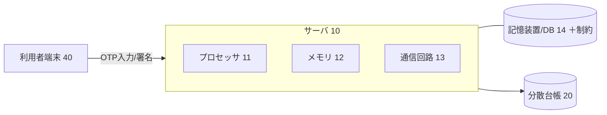
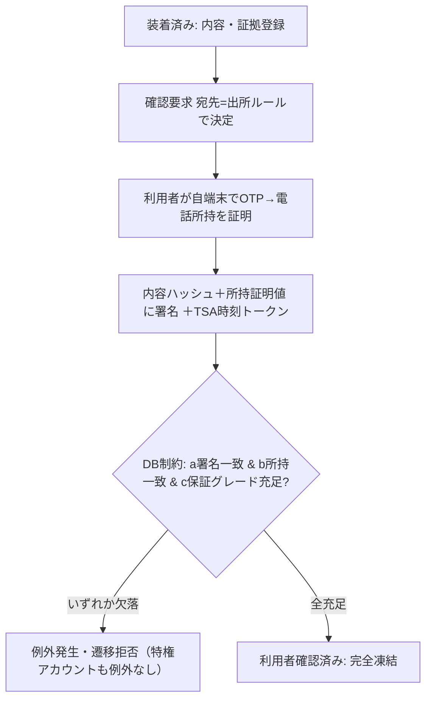
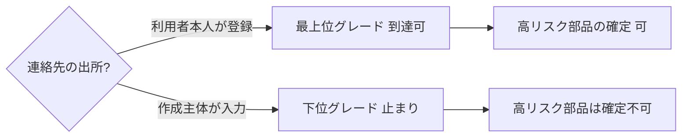
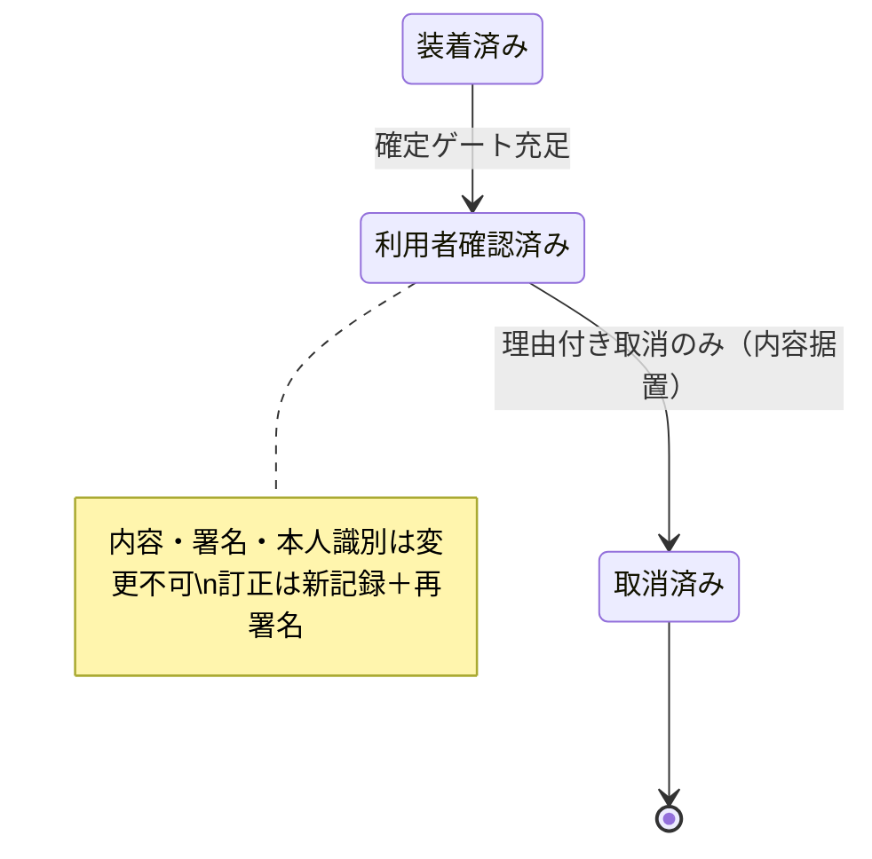
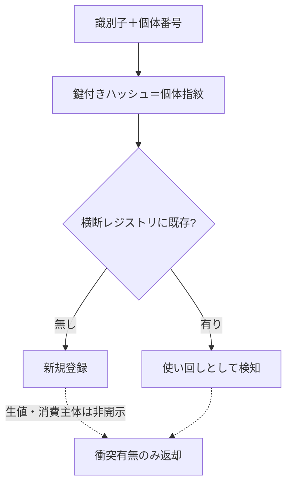

# 明細書：部品装着記録の確定方法、システム及びプログラム（発明07）

> 区分：**出願基礎ドラフト（弁理士の最終確認を前提とする完成度）**。最終的な請求項の権利範囲、発明該当性・進歩性の評価、先行技術クリアランスは弁理士の確認による。
> 提出時はJPO様式へ整形・分割（[09 §1](../09-filing-guide.md)）。
> 実装根拠：`src/lib/parts/`（phoneIdentity.ts, partSigning.ts, confirmationPolicy.ts, tsa.ts, rfc3161.ts, metaAnchor.ts, integrityChecks.ts, reconciliation.ts）, `supabase/migrations/20260603000001_part_installations_guard.sql`, `20260603000003_part_confirmation_otp.sql`。設計：`docs/parts-installation-integrity-design.md`。

---

## 【書類名】明細書

### 【発明の名称】
部品装着記録の確定方法、システム及びプログラム

### 【技術分野】
【0001】
　本発明は、車両等に装着された部品の記録について、当該記録を作成する主体自身による不正（なりすましによる確定、内容の改変）を抑止し、確定後の記録を、当該システムの運営者を含めて誰も改変できない不変記録とする、情報セキュリティの技術に関する。

### 【背景技術】
【0002】
　証跡データのハッシュ値を分散台帳に記録して改ざんを検知する手法、電子署名、ワンタイムパスワード（OTP）による本人確認、第三者タイムスタンプ局（TSA）による時刻証明、及び追記専用の制約による不変記録は、各々個別には知られている。また、部品の個体識別子を用いてサプライチェーン上の真贋を担保する手法も知られている。

#### 【先行技術文献】
##### 【特許文献】
【0003】
　【特許文献１】米国特許出願公開第2021/0119771号（ブロックチェーンを用いた部品の出所証明・真贋判定）。

##### 【非特許文献】
【0004】
　【非特許文献１】RFC3161（タイムスタンププロトコル）に関する技術文献。

### 【発明の概要】

#### 【発明が解決しようとする課題】
【0005】
　整備や部品交換の現場では、記録を作成し確定する主体（店舗）自身が不正の主体となり得るという特有の脅威がある。当該主体は、対象物・端末・時間を支配するため、(1) 利用者本人の代わりに確認操作を行って勝手に記録を確定する（なりすまし確定）、(2) 利用者の連絡先欄に自らの連絡先を登録し、確認用のコードや署名要求を自ら受信して自署する（連絡先の支配）、といった攻撃が可能である。

【0006】
　従来の電子署名やOTPは、電子メールの到達、又はアプリケーション層での判定を信頼の根拠とするため、確定する主体自身が攻撃者である状況では、アプリケーションを迂回した記録の直接の書換えや、連絡先のすり替えによって突破され得るという課題があった。

【0007】
　すなわち、確定という法的・経済的に不可逆な状態遷移を、記録作成主体も運営者も代行・偽造できないように、利用者の物理的な所持に束ね、かつアプリケーション層ではなくデータベース層で強制する仕組みが求められていた。

#### 【課題を解決するための手段】
【0008】
　上記課題を解決するため、本発明の一態様に係る部品装着記録の確定方法は、少なくとも一つのプロセッサが実行する方法であって、装着内容及び証拠のハッシュからサーバ側で内容ハッシュを算出する算出ステップと、確認要求の宛先において、ワンタイムコードにより確認者が利用者の登録電話番号を所持することを検証し、当該電話番号の正規化値の鍵付きハッシュを所持証明値として得る所持検証ステップと、前記内容ハッシュを前記所持証明値に束ねた電子署名を取得する署名ステップと、前記記録を確定状態へ遷移させる確定ステップと、を備える。前記確定ステップは、データベース層の制約により、アプリケーションとは独立に、(a) 署名が当該記録に紐づき署名対象ハッシュが現在の内容ハッシュに一致すること、(b) 署名の所持証明値が前記利用者の登録所持証明値に一致すること、(c) 署名の保証グレードが当該部品のリスクから導出した必要グレードを満たすこと、を検証し、いずれかを欠く場合に前記遷移を拒否する。そして、前記データベース層の制約は、特権を有するサービスアカウントに対しても前記検証の例外を設けない。

【0009】
　第２の態様では、前記宛先となる連絡先の出所が前記記録の作成主体によるものである場合に到達可能な前記保証グレードを制限し、所定リスク以上の部品については前記利用者自身が登録した連絡先によらなければ前記必要グレードを満たせない。

【0010】
　第３の態様では、前記確定状態への遷移後は、内容、署名及び本人識別に係るデータの変更を一切許さず、理由を伴う取消状態への遷移のみを許し、訂正は新たな記録の発行と利用者の再署名によってのみ表現される。

【0011】
　第４の態様では、個体識別子を有する部品について、識別子と個体番号との鍵付きハッシュをプラットフォーム横断で一意に登録し、既存の衝突の有無のみを返し、個体番号及び消費主体を他の主体へ開示しない。

#### 【発明の効果】
【0012】
　本発明によれば、確定が利用者の物理的な所持に束ねられ、かつデータベース層で強制されるため、記録作成主体も運営者も、なりすまし確定や内容の改変ができない。連絡先の出所による保証グレードの制限により、作成主体が自らの連絡先を用いて代行確定することを防止できる。横断的な個体照合により、営業秘密を漏らすことなく個体の使い回しを検知できる。第三者タイムスタンプ局による時刻証明と分散台帳への記録を併用することで、署名日時の事後的な改変も防止できる。

### 【図面の簡単な説明】
【0013】
　【図１】実施形態に係る部品装着記録の確定システム１の全体構成を示すブロック図である。
　【図２】本人の所持証明に束ねたデータベース層の確定ゲートの処理を示すフロー図である。
　【図３】連絡先の出所による保証グレードの制限を示す状態遷移図である。
　【図４】確定後の不変性（取消のみ・再発行）を示す状態遷移図である。
　【図５】横断的な個体照合（生値非開示）の流れを示す図である。

### 【発明を実施するための形態】

#### 〔システム構成〕
【0014】
　図１に示すように、本実施形態に係る確定システム１は、サーバ１０と、記憶装置（データベース）１４と、分散台帳２０と、利用者端末４０とを含む。サーバ１０は、少なくとも一つのプロセッサ１１と、メモリ１２と、通信回路１３とを備える。記憶装置１４は、装着記録、確認署名、証拠、及び個体レジストリを格納するリレーショナルデータベースであり、後述する制約（トリガ）が定義される。本発明は、ソフトウェアによる情報処理が、これらのハードウェア資源及びデータベース管理システムを用いて具体的に実現されるものである。

【0015】
　装着記録は、状態として少なくとも「装着済み」「利用者確認済み」「取消済み」を取り得る。確認署名は、署名値、署名対象ハッシュ、署名者の所持証明値、保証グレード、及び署名の状態（保留・署名済み等）を有する。

#### 〔内容ハッシュの算出〕
【0016】
　算出ステップにおいて、プロセッサ１１は、装着内容（部品名、識別子、ロット、個体識別子の指紋、数量、金額）と、当該装着に紐づく全証拠のハッシュ値の一覧と、利用者識別と、確定時刻と、ノンスとを正準化（所定の順序・形式での連結）し、その暗号学的ハッシュを内容ハッシュとして算出する。内容ハッシュはサーバ側で算出され、クライアントから送信される値は信用されない。

#### 〔所持証明〕
【0017】
　所持検証ステップにおいて、サーバ１０は、確認要求の宛先（利用者の登録連絡先、又は所定の場合に作成主体が入力した連絡先）に対し、単回・短期限・回数制限付きのワンタイムコードを送信する。利用者端末４０において利用者がワンタイムコードを入力することにより、利用者が当該電話番号を所持することが検証される。

【0018】
　生の電話番号は保存及び送信されず、その正規化値（例えばE.164形式）に対し、テナント識別子及びペッパー（秘密値）を加味した鍵付きハッシュを算出した所持証明値のみが、照合に用いられる。下位桁のみのハッシュは取り得る値の数が小さく単独では弱いため、確定の照合の主鍵には、正規化された電話番号全体の鍵付きハッシュを用いる。

#### 〔署名と時刻証明〕
【0019】
　署名ステップにおいて、プロセッサ１１は、所定のバージョン識別子と、前記内容ハッシュと、署名時刻と、記録識別子と、署名識別子と、前記所持証明値とを決定的に連結した署名対象ペイロードを構築し、署名鍵により電子署名する。さらに、当該署名又は内容ハッシュに対し、第三者タイムスタンプ局（一例として国内の認定タイムスタンプ局）からRFC3161準拠の時刻トークンを取得し、当該トークン、発行局識別及び時刻を記憶装置１４に格納する。これにより、当該時刻に当該内容が存在し、以後改変されていないことを第三者が証明可能となる。

#### 〔データベース層の確定ゲート〕
【0020】
　確定ステップにおいて、装着記録を「装着済み」から「利用者確認済み」へ遷移させる更新は、記憶装置１４に定義された制約（更新前トリガ）によって横取りされる。当該制約は、以下の(a)〜(c)を全て満たす場合にのみ当該遷移を許可し、いずれかを欠く場合は例外を発生させて当該更新を拒否する。
　(a) 当該記録に紐づく確認署名が署名済みの状態にあり、かつ当該署名の署名対象ハッシュが当該記録の現在の内容ハッシュに一致すること。
　(b) 当該署名の所持証明値が、当該記録に紐づく利用者の登録所持証明値に一致すること。
　(c) 当該署名の保証グレードが、当該部品の種別又は金額の閾値から導出される必要グレード以上であること。

【0021】
　重要な点として、当該制約は、認証された利用者を伴わない特権的なサービスアカウント（運営者）による更新であっても、上記検証の例外を設けない。したがって、アプリケーションを迂回してデータベースへ直接アクセスする場合であっても、また運営者自身による操作であっても、本人の署名・所持の一致・保証グレードの充足が揃わない限り、記録を確定することはできない。図２に当該確定ゲートの処理を示す。

#### 〔連絡先の出所による格下げ〕
【0022】
　図３に示すように、確認要求の宛先となる連絡先には、当該連絡先を利用者本人が登録したものか（出所＝利用者）、記録作成主体が入力したものか（出所＝作成主体）の別が対応付けられる。確定方式を決定するにあたり、出所が作成主体である連絡先を介して到達可能な保証グレードは、上限が制限される。例えば、高額部品や個体識別子を有する部品が要求する最上位の保証グレードは、作成主体が入力した連絡先では満たせず、利用者自身が登録した連絡先を介した所持証明によらなければ満たせない。これにより、作成主体が自らの連絡先を利用者の連絡先として登録し代行確定する攻撃が封じられる。なお、確認の経路は、第１の経路（例：メッセージングアプリ）を優先し、当該経路が利用不能な場合に第２の経路（例：SMS）へ退避してよい。

#### 〔不変性と取消〕
【0023】
　図４に示すように、確定状態への遷移後は、内容・署名・本人識別に係る各データの変更及び記録の削除は、前記制約により一律に拒否される。唯一許容されるのは、理由を伴う取消状態への遷移であり、この場合も内容・署名・本人識別の各データは据え置かれることが要求される。誤りの訂正は、新たな装着記録を発行し、当該新記録について利用者の再署名を取得することによってのみ表現される。これにより、作成主体が原本を取り消して改変版を提出しようとしても、再発行には利用者の再署名が必要となるため、改変を秘匿できない。証拠及び署名は、生成後の更新・削除が常時拒否される（追記専用）。

#### 〔横断的な個体照合〕
【0024】
　図５に示すように、個体識別子を有する部品については、識別子と個体番号とを入力とする鍵付きハッシュ（個体指紋）を、プラットフォーム全体で一意制約のもとに登録する。照合は、定義者権限で実行される関数を介して行われ、当該関数は、既存の指紋との衝突の有無のみ（例えば「新規登録」又は「使い回し」）を返し、生の個体番号及び当該個体を消費した主体を、他の主体へ開示しない。これにより、テナント間で営業秘密を秘匿しつつ、個体の使い回し（同一個体の二重計上等）を検知できる。当該レジストリも追記専用とする。

#### 〔時刻アンカーの併用〕
【0025】
　内容ハッシュに対しては、前記第三者タイムスタンプ局による時刻トークンに加え、車両単位で複数の内容ハッシュを束ねた集約値を分散台帳２０に記録してもよい。当該集約値は、車両識別子と、当該車両に係る確定済みの内容ハッシュの集合を重複排除及び所定順序のソートにより正規化したものとを連結した値のハッシュとして算出され、単一のトランザクションとして記録される。高リスクの部品については、当該集約に加え個別のアンカーを付与してもよい。

#### 〔相互矛盾検知〕
【0026】
　さらに、装着に係る複数の独立した記録、すなわち装着写真、個体・数量、調達書類との三方照合、及び機械学習による異常検知の各結果について、相互の矛盾（個体識別子の使い回し、写真の重複又は編集、数量の不一致、撮影時刻の不整合等）を検知し、検知結果を記録してもよい。これにより、単一の物理的な印に依存することなく、複数の独立した記録の矛盾として、物体のすり替えを抑止する。

#### 〔変形例〕
【0027】
　所持証明の手段は電話番号の所持に限られず、利用者が物理的に占有する要素（携帯端末のセキュアエレメント、公的個人認証等）に束ねてよい。データベース層の制約は、トリガに限られず、ストアドプロシージャ、ビュー権限、行レベルセキュリティ等、アプリケーションから独立して強制される任意の機構であってよい。分散台帳への記録、タイムスタンプ局の利用、横断個体照合、及び相互矛盾検知は、いずれも任意に組み合わせてよい。本発明の適用は車両部品に限られず、装着・取付・施工の対象物一般に適用してよい。

### 【符号の説明】
【0028】
　１…確定システム、１０…サーバ、１１…プロセッサ、１２…メモリ、１３…通信回路、１４…記憶装置（データベース）、２０…分散台帳、４０…利用者端末。

### 【産業上の利用可能性】
【0029】
　本発明は、車両の整備・部品交換における不正（なりすまし確定、内容の改変、部品のすり替え、個体の使い回し）の抑止に利用でき、整備業、保険業、自動車流通の分野において産業上の利用可能性を有する。

---

## 【書類名】特許請求の範囲

### 【請求項１】
　少なくとも一つのプロセッサが実行する部品装着記録の確定方法であって、
　装着内容及び証拠のハッシュからサーバ側で内容ハッシュを算出する算出ステップと、
　確認要求の宛先において、ワンタイムコードにより確認者が利用者の登録電話番号を所持することを検証し、当該電話番号の正規化値の鍵付きハッシュを所持証明値として得る所持検証ステップと、
　前記内容ハッシュを前記所持証明値に束ねた電子署名を取得する署名ステップと、
　前記記録を確定状態へ遷移させる確定ステップであって、データベース層の制約により、アプリケーションとは独立に、(a) 署名が当該記録に紐づき署名対象ハッシュが現在の内容ハッシュに一致すること、(b) 署名の所持証明値が前記利用者の登録所持証明値に一致すること、(c) 署名の保証グレードが当該部品のリスクから導出した必要グレードを満たすこと、を検証し、いずれかを欠く場合に前記遷移を拒否するステップと、を備え、
　前記データベース層の制約は、特権を有するサービスアカウントに対しても前記検証の例外を設けない、
　部品装着記録の確定方法。

### 【請求項２】
　前記確認要求の宛先となる連絡先の出所が前記記録の作成主体によるものである場合に到達可能な前記保証グレードを制限し、所定リスク以上の部品については前記利用者自身が登録した連絡先によらなければ前記必要グレードを満たせないことを特徴とする、請求項１に記載の部品装着記録の確定方法。

### 【請求項３】
　前記確定状態への遷移後は、内容、署名及び本人識別に係るデータの変更を一切許さず、理由を伴う取消状態への遷移のみを許し、訂正が新たな記録の発行と前記利用者の再署名によってのみ表現される、請求項１又は２に記載の部品装着記録の確定方法。

### 【請求項４】
　個体識別子を有する部品について、識別子と個体番号との鍵付きハッシュをプラットフォーム横断で一意に登録し、既存の衝突の有無のみを返し、当該個体番号及び消費した主体を他の主体へ開示しない、請求項１〜３のいずれか一項に記載の部品装着記録の確定方法。

### 【請求項５】
　前記必要グレードが、部品の種別又は金額の閾値から導出される、請求項１〜４のいずれか一項に記載の部品装着記録の確定方法。

### 【請求項６】
　前記内容ハッシュに対し、第三者タイムスタンプ局による時刻トークンと、車両単位で複数の内容ハッシュを束ねた集約値の分散台帳への記録と、の双方を付与する、請求項１〜５のいずれか一項に記載の部品装着記録の確定方法。

### 【請求項７】
　前記確認要求の経路が、第１の経路を優先し、当該第１の経路が利用不能な場合に第２の経路へ退避するものである、請求項１〜６のいずれか一項に記載の部品装着記録の確定方法。

### 【請求項８】
　装着に係る複数の独立した記録の相互の矛盾を検知して記録するステップを更に備える、請求項１〜７のいずれか一項に記載の部品装着記録の確定方法。

### 【請求項９】
　少なくとも一つのプロセッサと、メモリと、通信回路と、データベースを格納する記憶装置とを備え、
　前記プロセッサが、装着内容及び証拠のハッシュからサーバ側で内容ハッシュを算出し、確認要求の宛先においてワンタイムコードにより確認者が利用者の登録電話番号を所持することを検証して当該電話番号の正規化値の鍵付きハッシュを所持証明値として取得し、前記内容ハッシュを前記所持証明値に束ねた電子署名を取得するよう構成され、
　前記記憶装置に定義された制約が、アプリケーションとは独立に、(a) 署名が当該記録に紐づき署名対象ハッシュが現在の内容ハッシュに一致すること、(b) 署名の所持証明値が前記利用者の登録所持証明値に一致すること、(c) 署名の保証グレードが当該部品のリスクから導出した必要グレードを満たすこと、を検証して、いずれかを欠く場合に記録の確定状態への遷移を拒否し、かつ特権を有するサービスアカウントに対しても当該検証の例外を設けない、
　部品装着記録の確定システム。

### 【請求項１０】
　コンピュータに、請求項１〜８のいずれか一項に記載の各ステップを実行させるためのプログラム。

---

## 【書類名】要約書

### 【課題】
　記録を作成する主体自身が不正主体になり得る状況で、確定という不可逆な遷移を、運営者を含め誰も代行・偽造できないようにする。

### 【解決手段】
　装着内容と証拠のハッシュからサーバ側で内容ハッシュを算出し、ワンタイムコードで利用者の電話所持を検証して、電話正規化値の鍵付きハッシュを所持証明値として得る。内容ハッシュを所持証明値に束ねて電子署名し、確定状態への遷移を、データベース層の制約により、署名一致・所持一致・保証グレード充足の全てを満たす場合にのみ許可する。当該制約は特権サービスアカウントにも例外を設けない。連絡先の出所により到達可能な保証グレードを制限し、確定後は理由付きの取消のみを許す。個体識別子は鍵付きハッシュで横断照合し生値を開示しない。第三者タイムスタンプと分散台帳の集約記録を併用する。（約350字）

### 【選択図】
　図２

---

## 【書類名】図面

### 【図１】システム全体構成

### 【図２】DB層の確定ゲート（運営も例外なし）

### 【図３】連絡先出所による格下げ

### 【図４】確定後の不変性（取消のみ・再発行）

### 【図５】横断的個体照合（生値非開示）

