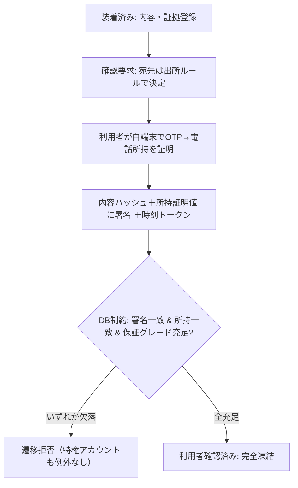
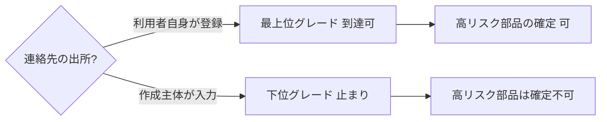

# 【明細書ドラフト】発明07：本人所持証明に束ねた確定ゲート

> ⚠️ **出願前ドラフト（たたき台）**。請求項の最終確定・先行技術クリアランスは弁理士へ。提出時はJPO様式へ整形・分割（[09 §1](../09-filing-guide.md)）。
> 対応：発明提案書 [07](../07-parts-installation-integrity.md)／設計 `docs/parts-installation-integrity-design.md`／実装 `src/lib/parts/`・`supabase/migrations/20260603000001_part_installations_guard.sql`。

---

## 【書類名】明細書

### 【発明の名称】
部品装着記録の確定方法、システム及びプログラム

### 【技術分野】
【0001】
　本発明は、車両等に装着された部品の記録について、記録を作成する主体自身による不正（なりすまし確定、内容の改変）を抑止し、確定後の記録を、当該システムの運営者を含め誰も改変できない不変記録とする、情報セキュリティの技術に関する。

### 【背景技術】
【0002】
　証跡データのハッシュを分散台帳に記録して改ざんを検知する手法、電子署名、ワンタイムパスワード（OTP）による本人確認、第三者タイムスタンプ局による時刻証明、及び追記専用の制約による不変記録は、各々個別には知られている。また、部品の個体識別子を用いてサプライチェーン上の真贋を担保する手法も知られている。

#### 【先行技術文献】
【0003】
　【特許文献１】ブロックチェーン技術を用いた部品の出所証明・真贋判定に関する文献（例：US20210119771A1）。

### 【発明の概要】

#### 【発明が解決しようとする課題】
【0004】
　整備や部品交換の現場では、記録を作成・確定する主体（店舗）自身が不正主体になり得るという特有の脅威がある。当該主体は対象物・端末・時間を支配するため、(1) 利用者の代わりに確認操作を行って勝手に記録を確定する（なりすまし確定）、(2) 利用者の連絡先欄に自らの連絡先を登録し、確認用のコードや署名要求を自ら受信して自署する（連絡先の支配）、といった攻撃が可能である。

【0005】
　従来の電子署名やOTPは、電子メールの到達やアプリケーション層での判定を信頼の根拠とするため、確定する主体自身が攻撃者である状況では、アプリケーションを迂回した直接のデータ書換えや、連絡先のすり替えにより突破され得る。

【0006】
　すなわち、確定という不可逆な状態遷移を、記録作成主体も運営者も代行・偽造できないよう、利用者の物理的な所持に束ね、かつアプリケーション層ではなくデータベース層で強制する仕組みが求められていた。

#### 【課題を解決するための手段】
【0007】
　本発明に係る部品装着記録の確定方法は、装着内容及び証拠のハッシュからサーバ側で内容ハッシュを算出する算出ステップと、確認要求の宛先において、ワンタイムコードにより確認者が利用者の登録電話番号を所持することを検証し、当該電話番号の正規化値の鍵付きハッシュを所持証明値として得る所持検証ステップと、前記内容ハッシュを前記所持証明値に束ねた電子署名を取得する署名ステップと、前記記録を確定状態へ遷移させる確定ステップと、を備える。

【0008】
　前記確定ステップは、データベース層の制約により、アプリケーションとは独立に、(a) 署名が当該記録に紐づき署名対象ハッシュが現在の内容ハッシュに一致すること、(b) 署名の所持証明値が前記利用者の登録所持証明値に一致すること、(c) 署名の保証グレードが当該部品のリスクから導出した必要グレードを満たすこと、を検証し、いずれかを欠く場合に前記遷移を拒否する。前記データベース層の制約は、特権を有するサービスアカウントに対しても前記検証の例外を設けない。

【0009】
　好ましくは、前記宛先となる連絡先の出所が前記記録の作成主体によるものである場合に到達可能な前記保証グレードを制限し、所定リスク以上の部品については前記利用者自身が登録した連絡先によらなければ前記必要グレードを満たせないようにする（連絡先出所による格下げ）。

【0010】
　好ましくは、前記確定状態への遷移後は、内容・署名・本人識別に係るデータの変更を一切許さず、理由を伴う取消状態への遷移のみを許し、訂正は新たな記録の発行と利用者の再署名によってのみ表現される（完全凍結・取消のみ）。

【0011】
　好ましくは、個体識別子を有する部品について、識別子と個体番号との鍵付きハッシュをプラットフォーム横断で一意に登録し、既存の衝突の有無のみを返し、個体番号及び消費主体を他の主体へ開示しない（プライバシー保全の横断個体照合）。

#### 【発明の効果】
【0012】
　本発明によれば、確定が利用者の物理的な所持に束ねられ、かつデータベース層で強制されるため、記録作成主体も運営者もなりすまし確定や改変ができない。連絡先出所による格下げにより、作成主体が自らの連絡先を用いて代行確定することを防止できる。横断個体照合により、営業秘密を漏らさずに個体の使い回しを検知できる。第三者タイムスタンプ局による時刻証明と分散台帳への記録を併用することで、署名日時の事後改変も防止できる。

### 【図面の簡単な説明】
【0013】
　【図１】本人所持証明に束ねたデータベース層の確定ゲートを示す図。
　【図２】連絡先出所による保証グレードの格下げを示す図。

### 【発明を実施するための形態】
【0014】
　本実施形態では、装着内容（部品名、識別子、ロット、個体識別子の指紋、数量、金額）と、全証拠のハッシュの一覧と、利用者識別と、確定時刻と、ノンスとを正準化し、内容ハッシュをサーバ側で算出する。クライアントから送信される値は信用しない。

【0015】
　所持検証では、確認要求の宛先において、利用者本人がワンタイムコードにより当該電話番号を所持することを検証する。生の電話番号は保存・送信せず、その正規化値の鍵付きハッシュのみを所持証明値として用いる。下位桁のみのハッシュは衝突空間が小さいため、確定の照合主鍵には正規化された電話番号全体のハッシュを用いる。

【0016】
　署名ステップでは、内容ハッシュ、所持証明値、記録識別子及び署名識別子を決定的に連結したペイロードに署名する。さらに、当該署名又は内容ハッシュに対し、第三者タイムスタンプ局から時刻トークンを取得し保存する。

【0017】
　確定ステップでは、記録の状態を「装着済み」から「利用者確認済み」へ遷移させる更新を、データベースのトリガが横取りし、前記(a)〜(c)をすべて満たす場合にのみ許可する。いずれかを欠く場合は例外を発生させて更新を拒否する。当該トリガは、特権を有するサービスアカウントによる更新であっても例外を設けない。したがって、アプリケーションを迂回した直接の書換えによっても、運営者自身によっても、本人署名・所持一致・保証グレードが揃わなければ確定できない。

【0018】
　連絡先出所による格下げでは、宛先連絡先の出所（利用者自身が登録したものか、作成主体が入力したものか）に応じて到達可能な保証グレードを制限する。例えば高額部品や個体識別子を有する部品が要求する最上位の保証グレードは、作成主体が入力した連絡先では満たせないようにする。

【0019】
　横断個体照合では、個体識別子を有する部品について、識別子と個体番号との鍵付きハッシュをプラットフォーム全体で一意制約のもとに登録し、衝突の有無のみを返す定義者権限の関数を介して照合する。これにより、生の個体番号や消費主体を他の主体に開示することなく、個体の使い回しを検知する。

【0020】
　不変性については、確定後の記録は、理由を伴う取消状態への遷移のみを許し、内容・署名・本人識別の各列の変更及び削除を拒否する。証拠及び署名は生成後の更新・削除を常時拒否する（追記専用）。さらに、内容ハッシュに対し、第三者タイムスタンプ局による時刻トークンに加え、車両単位で複数の内容ハッシュを束ねた集約値を分散台帳に記録してもよい。

【0021】
　L7として、装着に係る複数の独立した記録（写真、個体／数量、調達照合、機械学習による異常検知）の相互の矛盾を検知し記録してもよい。これにより、単一の物理的な印に依存せず、複数記録の矛盾として物体のすり替えを抑止する。

### 【符号の説明】
【0022】
　出願時に図面の符号を付す（内容ハッシュ、所持証明値、データベース層の確定ゲート、保証グレード、横断個体レジストリ 等）。

---

## 【書類名】特許請求の範囲

### 【請求項１】
　車両等に装着された部品の記録について、装着内容及び証拠のハッシュからサーバ側で内容ハッシュを算出する算出ステップと、
　確認要求の宛先において、ワンタイムコードにより確認者が利用者の登録電話番号を所持することを検証し、当該電話番号の正規化値の鍵付きハッシュを所持証明値として得る所持検証ステップと、
　前記内容ハッシュを前記所持証明値に束ねた電子署名を取得する署名ステップと、
　前記記録を確定状態へ遷移させる確定ステップであって、データベース層の制約により、アプリケーションとは独立に、(a) 署名が当該記録に紐づき署名対象ハッシュが現在の内容ハッシュに一致すること、(b) 署名の所持証明値が前記利用者の登録所持証明値に一致すること、(c) 署名の保証グレードが当該部品のリスクから導出した必要グレードを満たすこと、を検証し、いずれかを欠く場合に前記遷移を拒否するステップと、を備え、
　前記データベース層の制約は、特権を有するサービスアカウントに対しても前記検証の例外を設けない、
　部品装着記録の確定方法。

### 【請求項２】
　前記宛先となる連絡先の出所が前記記録の作成主体によるものである場合に到達可能な前記保証グレードを制限し、所定リスク以上の部品については前記利用者自身が登録した連絡先によらなければ前記必要グレードを満たせないことを特徴とする、請求項１に記載の方法。

### 【請求項３】
　前記確定状態への遷移後は、内容、署名及び本人識別に係るデータの変更を一切許さず、理由を伴う取消状態への遷移のみを許し、訂正は新たな記録の発行と利用者の再署名によってのみ表現される、請求項１又は２に記載の方法。

### 【請求項４】
　個体識別子を有する部品について、識別子と個体番号との鍵付きハッシュをプラットフォーム横断で一意に登録し、既存の衝突の有無のみを返し、個体番号及び消費主体を他の主体へ開示しない、請求項１〜３のいずれか一項に記載の方法。

### 【請求項５】
　前記必要グレードが、部品の種別又は金額の閾値から導出される、請求項１〜４のいずれか一項に記載の方法。

### 【請求項６】
　前記内容ハッシュに対し、第三者タイムスタンプ局による時刻トークンと、車両単位で複数の内容ハッシュを束ねた集約値の分散台帳への記録と、の双方を付与する、請求項１〜５のいずれか一項に記載の方法。

### 【請求項７】
　装着に係る複数の独立した記録の相互の矛盾を検知して記録するステップを更に備える、請求項１〜６のいずれか一項に記載の方法。

### 【請求項８】
　請求項１〜７のいずれか一項に記載の各ステップを実行する手段を備える、部品装着記録の確定システム。

### 【請求項９】
　コンピュータに請求項１〜７のいずれか一項に記載の各ステップを実行させるための、プログラム。

---

## 【書類名】要約書

### 【課題】
　記録を作成する主体自身が不正主体になり得る状況で、確定という不可逆な遷移を、運営者も代行・偽造できないようにする。

### 【解決手段】
　装着内容と証拠のハッシュからサーバ側で内容ハッシュを算出し、ワンタイムコードで利用者の電話所持を検証して所持証明値（電話正規化値の鍵付きハッシュ）を得る。内容ハッシュを所持証明値に束ねて電子署名し、確定状態への遷移を、データベース層の制約により、署名一致・所持一致・保証グレード充足のすべてを満たす場合にのみ許可する。当該制約は特権サービスアカウントにも例外を設けない。連絡先の出所により到達可能な保証グレードを制限し、確定後は理由付きの取消のみを許す。個体識別子は鍵付きハッシュで横断照合し生値を開示しない。

### 【選択図】
　図１

---

## 【書類名】図面

### 【図１】本人所持証明に束ねた確定ゲート（DB層・運営も例外なし）

### 【図２】連絡先出所による保証グレードの格下げ

