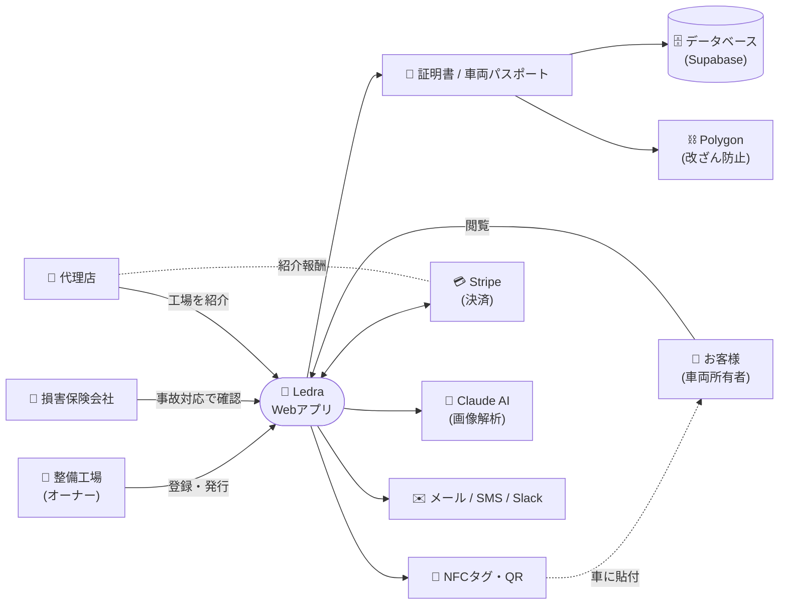

# Ledra システム相関図

ひと目で関係性がわかるシンプル版です。詳細は [architecture-roadmap.md](./architecture-roadmap.md) を参照。

## 登場人物

| 役割 | できること |
|---|---|
| 🏪 **整備工場** | 車両を登録し、整備・点検証明書を発行 |
| 👤 **お客様** | 自分の車の証明書・履歴を閲覧 |
| 🏢 **損害保険会社** | 事故時に整備履歴を確認して査定 |
| 🤝 **代理店** | 整備工場に Ledra を紹介し、紹介料を獲得 |

## 中心にあるもの

**Ledra Webアプリ** が全員のハブ。
発行された **証明書** はデータベースに保存され、**Polygon ブロックチェーン** で改ざん防止。
車には **NFCタグ / QR** が貼られ、スマホでかざすと履歴が読める。

## つながっている外部サービス

- **Stripe** — 月額課金と代理店への紹介料の支払い
- **Claude AI** — 車検証や点検写真から自動で文字を読み取り
- **Polygon** — 証明書を改ざんできないようにブロックチェーンへ記録
- **メール / SMS / Slack** — お知らせ・通知の配信
